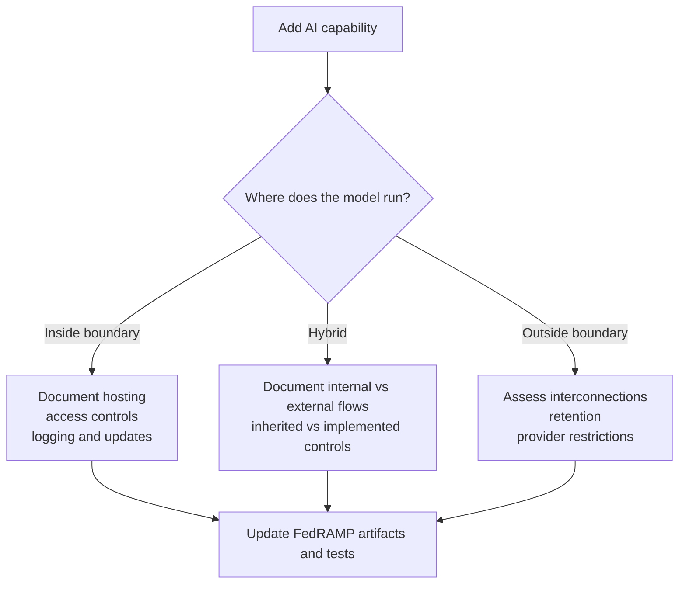

# Chapter 2: FedRAMP Fundamentals for AI Systems

## Contents

- [Purpose](#purpose)
- [2.1 FedRAMP is a control and evidence program](#21-fedramp-is-a-control-and-evidence-program)
- [2.2 The authorization boundary is the first design question](#22-the-authorization-boundary-is-the-first-design-question)
- [2.3 AI features often touch multiple control families at once](#23-ai-features-often-touch-multiple-control-families-at-once)
- [2.4 FedRAMP does not remove privacy or agency-specific obligations](#24-fedramp-does-not-remove-privacy-or-agency-specific-obligations)
- [2.5 NIST guidance that is especially useful for AI-enabled FedRAMP systems](#25-nist-guidance-that-is-especially-useful-for-ai-enabled-fedramp-systems)
- [2.6 Common architectural questions to answer before building](#26-common-architectural-questions-to-answer-before-building)
- [Salesforce example](#salesforce-example)
- [Chapter summary](#chapter-summary)

## Purpose

This chapter connects core FedRAMP concepts to AI-enabled architectures. The main question is not "can we use AI?" The real question is "how does AI affect the authorized system, the control narrative, and the evidence expected by reviewers and agencies?"

## 2.1 FedRAMP is a control and evidence program

FedRAMP builds on NIST security controls and expects a provider to show:

- what the system is,
- where the system boundary begins and ends,
- what components and external services it depends on,
- how required controls are implemented,
- how those controls are assessed,
- and how the system is monitored over time.

For AI systems, that means you should expect reviewers to care about architecture, interconnections, roles, data handling, software supply chain, logging, identity, vulnerability handling, and operational governance.

## 2.2 The authorization boundary is the first design question

When teams add AI, the first architectural question is whether the AI capability is:

- fully inside the assessed system boundary,
- partially inside with external dependencies,
- or largely outside the boundary and consumed through an API.

This distinction changes everything else.

### If the model is inside the boundary

You need to document the model hosting environment, access controls, network flows, model artifacts, training or fine-tuning workflows if applicable, and the operational safeguards around prompt handling, inference, logging, and updates.

### If the model is outside the boundary

You need to analyze interconnections, external service reliance, data disclosure risk, provider restrictions, contractual controls, retention behavior, and whether the dependency is acceptable for the system's authorization posture.

### If the architecture is hybrid

You need precise diagrams and narratives showing which data stays internal, what leaves the system, what returns, what is stored, and which controls are inherited versus implemented directly.

## 2.3 AI features often touch multiple control families at once

Even when the product team thinks of AI as a single feature, it usually affects many control domains at once, including:

- Access control, because prompts, retrieved context, and generated outputs may expose data based on user role.
- Audit and accountability, because you may need logs for prompts, tool calls, moderation decisions, and administrative overrides.
- Configuration management, because model versions, prompt templates, guardrails, and routing rules become managed configuration items.
- Risk assessment, because the threat model changes.
- System and communications protection, because the AI service introduces new flows, endpoints, encryption needs, and trust boundaries.
- System and information integrity, because model misuse, hallucinations, poisoned content, unsafe code generation, and prompt injection become operational concerns.

## 2.4 FedRAMP does not remove privacy or agency-specific obligations

FedRAMP addresses cloud security authorization, but AI-enabled federal systems may also trigger agency privacy, records, legal, accessibility, or mission-specific requirements.

Examples include:

- whether prompts or outputs contain PII,
- whether generated content becomes an official record,
- whether explainability is needed for mission decisions,
- whether accessibility testing must cover generated UI content,
- whether human review is required before operational use.

## 2.5 NIST guidance that is especially useful for AI-enabled FedRAMP systems

The following NIST materials are especially relevant:

- NIST AI RMF 1.0: useful for AI governance and for the Govern, Map, Measure, and Manage functions.
- NIST AI RMF Generative AI Profile: useful for generative-AI-specific risk identification and mitigations.
- NIST SSDF 1.1: useful for embedding security across development.
- NIST SP 800-218A: useful for secure software development practices specific to generative AI and dual-use foundation models.

These documents are not substitutes for FedRAMP artifacts, but they are very strong implementation guides for how to design and operate secure AI processes.

## 2.6 Common architectural questions to answer before building

Every AI architecture intended for federal use should answer these questions early:

1. What exact AI capability is being added?
2. What data is used for prompts, retrieval, inference, output storage, and feedback loops?
3. Which components are in scope for the authorization boundary?
4. Which external providers or services are involved?
5. Is data retained, logged, cached, or reused for training anywhere in the chain?
6. How are identity, authorization, and tenant isolation enforced end to end?
7. How will the team test quality, abuse resistance, and safety?
8. What constitutes a significant change in the lifecycle of the AI feature?

## Salesforce example

Assume a Salesforce application for federal field service operations introduces a generative assistant that drafts case notes from technician updates.

The security architecture team should immediately clarify:

- whether summaries are generated by a model running in a FedRAMP-authorized environment,
- whether Salesforce data leaves the current tenant boundary,
- whether prompts contain sensitive case details,
- whether outputs are stored as official records,
- whether the model provider uses submitted content for training,
- and whether model changes are handled as controlled configuration changes.

If those questions are unresolved, the system is not ready for a compliant implementation plan.

## Chapter summary

- AI design decisions can change the authorization boundary, not just the user experience.
- AI features usually affect multiple FedRAMP control areas simultaneously.
- External model dependencies require careful interconnection and data handling analysis.
- NIST AI RMF, SSDF, and SP 800-218A are practical implementation companions to FedRAMP documentation.

## Navigation

- Previous: [Chapter 1: Foundations, Terms, and Acronyms](01-foundations-terms-and-acronyms.md)
- Next: [Chapter 3: AI Across the Secure SDLC](03-ai-across-the-secure-sdlc.md)