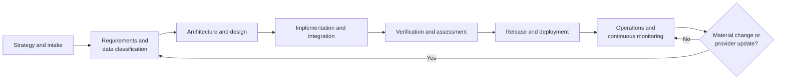

# Chapter 3: AI Across the Secure SDLC

## Contents

- [Purpose](#purpose)
- [3.1 Strategy and intake](#31-strategy-and-intake)
- [3.2 Requirements and data classification](#32-requirements-and-data-classification)
- [3.3 Architecture and design](#33-architecture-and-design)
- [3.4 Implementation and integration](#34-implementation-and-integration)
- [3.5 Verification and assessment](#35-verification-and-assessment)
- [3.6 Release and deployment](#36-release-and-deployment)
- [3.7 Operations and continuous monitoring](#37-operations-and-continuous-monitoring)
- [Chapter summary](#chapter-summary)

## Purpose

This chapter maps AI-specific considerations to the secure software development lifecycle. The goal is to prevent teams from discovering compliance blockers late in testing or during authorization review.

For this guide, the lifecycle is divided into seven phases:

1. Strategy and intake
2. Requirements and data classification
3. Architecture and design
4. Implementation and integration
5. Verification and assessment
6. Release and deployment
7. Operations and continuous monitoring

## 3.1 Strategy and intake

At the start, teams should decide whether the use case is allowed, valuable, and supportable in a regulated environment.

Key questions:

- What mission problem is the AI feature solving?
- Is the feature advisory, assistive, or autonomous?
- What is the acceptable error tolerance?
- Could the feature affect confidentiality, integrity, availability, privacy, or public trust?
- Does the feature need human review before action?

Expected outputs:

- business justification,
- initial risk classification,
- use-case approval,
- early determination of whether legal, privacy, records, or accessibility stakeholders must be involved.

### Salesforce example

A Salesforce service team wants an AI copilot to suggest responses to support agents. During intake, the team should classify it as assistive, not autonomous, and require a human agent to review every generated response before it is sent.

## 3.2 Requirements and data classification

This phase determines which data can be used, how it must be protected, and which behaviors are explicitly forbidden.

Key considerations:

- classify input data, retrieved context, prompts, outputs, logs, and feedback data,
- document whether PII, CUI, PHI, or contractual data may flow into the model,
- define retention and deletion requirements,
- define prohibited uses such as training on customer data without approval,
- define acceptable-use and abuse cases.

Expected outputs:

- security requirements,
- privacy requirements,
- data handling matrix,
- misuse and abuse requirements,
- model/provider requirements.

### Salesforce example

If the Salesforce copilot can see citizen complaint narratives, the team must classify those narratives and explicitly decide whether that text may be sent to a model endpoint, logged, cached, or retained for evaluation.

## 3.3 Architecture and design

This is where most FedRAMP-impacting AI decisions are made.

Key considerations:

- define the authorization boundary impact,
- document end-to-end data flows,
- document identity propagation and authorization checks,
- design prompt handling, content filtering, moderation, and output review,
- define fallback behavior when the model is unavailable,
- decide how to isolate tenants, secrets, embeddings, and vector indexes,
- define logging and observability while minimizing sensitive exposure.

Expected outputs:

- architecture diagrams,
- trust boundary diagrams,
- data flow diagrams,
- threat model,
- control-impact assessment.

### Salesforce example

For a Salesforce-based summarization feature, the design package should show where case text is pulled from, whether it is transformed before inference, where summaries are stored, which users can view them, and how prompt injection from untrusted case content is handled.

## 3.4 Implementation and integration

At this phase, AI controls become engineering tasks.

Key considerations:

- secure API and secret handling,
- prompt template version control,
- infrastructure-as-code for AI endpoints and policies,
- dependency and model provenance tracking,
- safe SDK integration,
- secure feature flags and rollout controls,
- unit and integration tests for policy enforcement.

Expected outputs:

- code with traceable requirements coverage,
- approved dependencies,
- configuration baselines,
- implementation evidence for control narratives.

### Salesforce example

If the Salesforce app invokes an external model API, engineers should store credentials in managed secrets, prohibit direct client-side model calls, sanitize retrieved case context, and version prompt templates like any other security-relevant configuration item.

## 3.5 Verification and assessment

Testing for AI-enabled systems must go beyond normal functional tests.

Key considerations:

- validate role-based access in prompts, retrieval, and outputs,
- test prompt injection resistance,
- test unsafe or prohibited requests,
- test hallucination containment and user disclaimers,
- test abuse paths such as data exfiltration or instruction override,
- test auditability and incident reconstruction,
- evaluate model quality against defined acceptance criteria.

Expected outputs:

- test plans and evidence,
- security test results,
- abuse case results,
- assessment-ready artifacts for security and compliance teams.

### Salesforce example

The team should test whether a malicious support case can inject hidden instructions into the summarization workflow and cause the AI assistant to disclose unrelated case data or ignore system policy.

## 3.6 Release and deployment

Deployment should be treated as a governance event, not only a DevOps event.

Key considerations:

- confirm approved model version and runtime environment,
- confirm production guardrails and moderation settings,
- confirm logging, alerting, and rollback controls,
- confirm documentation updates,
- decide whether the change is normal or significant for authorization purposes.

Expected outputs:

- deployment approval,
- release notes,
- updated risk register,
- updated authorization package inputs as needed.

### Salesforce example

Before enabling the feature for production users, the Salesforce release manager should confirm that the exact model version, prompt set, and filtering rules match the approved configuration and that rollback is possible if unsafe outputs appear.

## 3.7 Operations and continuous monitoring

AI features need ongoing oversight after release.

Key considerations:

- monitor security events and abusive use,
- monitor prompt and output anomalies,
- review model/provider changes,
- track vulnerabilities in AI libraries and supporting services,
- revalidate performance when data or workflows change,
- maintain incident response procedures for AI-specific failures.

Expected outputs:

- operational metrics,
- incident procedures,
- periodic review results,
- change records and updated documentation.

### Salesforce example

If the summarization quality drops after a provider-side model update, the team should detect that through monitoring, pause the feature if needed, record the event as a controlled change, and reassess both quality and security implications before resuming normal use.

## Chapter summary

- AI needs explicit controls in every SSDLC phase, not only during testing.
- The most important early deliverables are data classification, boundary analysis, and threat modeling.
- Verification must include adversarial and policy-focused tests, not just happy-path functional checks.
- Operations must monitor both classic security signals and AI-specific behavior changes.

## Navigation

- Previous: [Chapter 2: FedRAMP Fundamentals for AI Systems](02-fedramp-fundamentals-for-ai-systems.md)
- Next: [Chapter 4: AI In-App Features in Existing FedRAMP-Authorized Systems](04-ai-in-app-for-existing-fedramp-systems.md)