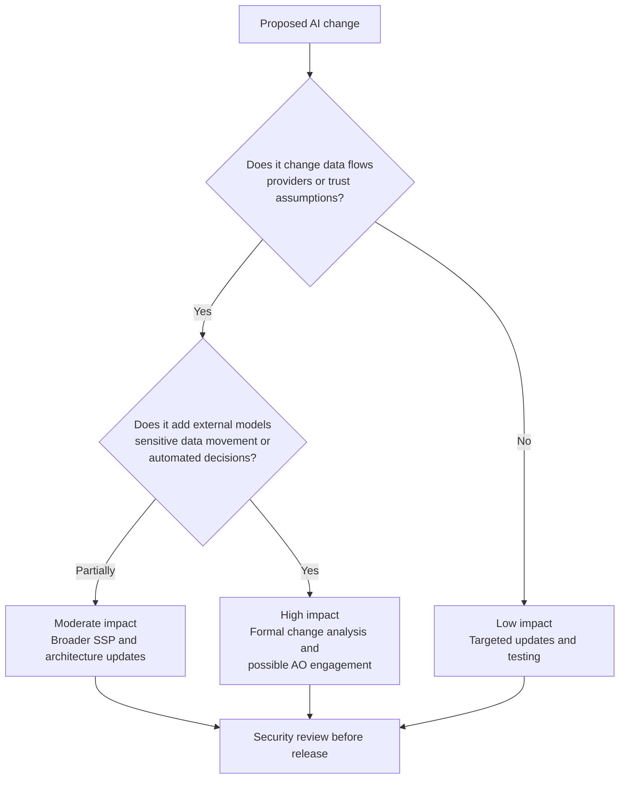

# Chapter 4: AI In-App Features in Existing FedRAMP-Authorized Systems

## Contents

- [Purpose](#purpose)
- [4.1 The first question: what exactly is changing?](#41-the-first-question-what-exactly-is-changing)
- [4.2 What an already authorized application must ensure](#42-what-an-already-authorized-application-must-ensure)
- [4.3 Extra documentation and process typically needed](#43-extra-documentation-and-process-typically-needed)
- [4.4 Scenarios that usually require special scrutiny](#44-scenarios-that-usually-require-special-scrutiny)
- [4.5 A practical decision model for change impact](#45-a-practical-decision-model-for-change-impact)
- [4.6 Common mistakes](#46-common-mistakes)
- [Salesforce example](#salesforce-example)
- [Chapter summary](#chapter-summary)

## Purpose

This chapter addresses the most common real-world scenario: a product is already FedRAMP authorized, and the team wants to add AI-driven functionality inside the application.

This is where many teams make a dangerous mistake. They assume the original authorization automatically covers the AI feature. In practice, the AI addition must be analyzed as a security-relevant system change.

## 4.1 The first question: what exactly is changing?

When adding AI to an authorized system, identify the change in concrete architectural terms:

- Is a new third-party model or provider being introduced?
- Is new data leaving the existing platform?
- Is a new database, vector store, cache, plugin, or orchestration layer being added?
- Are new administrative roles or privileged functions required?
- Are generated outputs used to make or recommend decisions?
- Will model behavior change independently of your normal application release cycle?

If the answer to any of these questions is yes, the authorization package likely needs review and updates.

## 4.2 What an already authorized application must ensure

At minimum, the provider should ensure the following before enabling AI features:

### Boundary clarity

The team must clearly document whether the AI components are inside or outside the authorization boundary, what interconnections exist, and what data crosses those boundaries.

### Data governance

The team must define whether prompts, retrieved content, outputs, logs, feedback loops, and tuning datasets contain sensitive information and what restrictions apply to each.

### Provider governance

The team must understand the AI provider's retention, training, logging, support access, model update cadence, and service location behavior.

### Security control impact

The team must reassess which existing controls are affected, including access control, audit logging, incident response, configuration management, vulnerability management, and system integrity.

### Operational controls

The team must implement rollback, kill-switches, moderation, alerting, and review workflows proportionate to the risk of the AI feature.

### Human oversight

If the feature can affect mission actions, citizen communications, or operational records, the team should define clear human-review rules and escalation conditions.

## 4.3 Extra documentation and process typically needed

FedRAMP does not provide a separate AI-only certification track. Instead, teams usually need to update existing FedRAMP package elements and related governance records.

Typical updates include:

- updated SSP narratives,
- updated system diagrams and data flow diagrams,
- updated inventory of components and external services,
- updated control implementation descriptions,
- updated risk assessment and threat model,
- updated contingency and incident handling procedures where AI-specific failure modes matter,
- updated test plans and assessment evidence,
- updated POA&M entries if new gaps are identified.

Depending on impact, the team may also need:

- change request records,
- agency/customer notification,
- 3PAO testing support,
- documented approval before production enablement,
- updated interconnection or dependency documentation.

## 4.4 Scenarios that usually require special scrutiny

The following AI changes deserve heightened review:

- sending federal customer data to an external foundation model API,
- fine-tuning a model on customer or regulated data,
- introducing retrieval over sensitive enterprise content,
- allowing generated content to trigger workflow actions,
- allowing model outputs to become part of official records,
- using AI for security-sensitive or mission-sensitive recommendations,
- relying on provider-side model updates outside your direct release process.

## 4.5 A practical decision model for change impact

Use this lightweight model before implementation:

### Low impact change

The AI capability is fully internal, uses already approved data, does not change external dependencies, and is restricted to low-risk assistive functions with strong human review.

Likely outcome:

- targeted documentation updates,
- targeted security testing,
- controlled release through normal governance.

### Moderate impact change

The AI capability adds a new inference component, a new data store, or new operational logic, but remains bounded and well controlled.

Likely outcome:

- broader SSP and architecture updates,
- expanded assessment evidence,
- possible formal change review.

### High impact change

The AI capability introduces new external providers, sensitive data movement, automated decisions, new privileged actions, or materially changes trust assumptions.

Likely outcome:

- formal change analysis,
- broader security assessment involvement,
- possible agency/AO engagement before production use.

## 4.6 Common mistakes

- Treating prompts as non-sensitive text.
- Assuming a provider contract automatically solves data retention risk.
- Failing to document model updates as managed configuration changes.
- Adding RAG without reassessing data access control and indexing exposure.
- Logging prompts and outputs without redaction strategy.
- Treating AI evaluation as product QA instead of security and compliance evidence.

## Salesforce example

Assume a FedRAMP-authorized Salesforce case management platform wants to add an embedded AI panel that:

- summarizes case history,
- drafts agent responses,
- recommends next actions,
- and retrieves related knowledge articles.

To remain in a defensible FedRAMP posture, the provider should at least:

- map the full data flow from Salesforce records to the AI component and back,
- determine whether case data is sent to an external model service,
- update the SSP and diagrams to reflect the new architecture,
- reassess access control for retrieved documents and generated outputs,
- test prompt injection through case comments and knowledge articles,
- define how model/provider version changes are approved,
- define when the AI feature must be disabled,
- and preserve evidence showing that the feature was reviewed, tested, and approved before release.

## Chapter summary

- Existing FedRAMP authorization does not automatically extend to new AI features.
- The core questions are boundary impact, data movement, external dependency risk, and control changes.
- Most AI additions require documentation updates, targeted testing, and formal change governance.
- Higher-risk AI features may require broader reassessment and stakeholder approval before release.

## Navigation

- Previous: [Chapter 3: AI Across the Secure SDLC](03-ai-across-the-secure-sdlc.md)
- Next: [Chapter 5: Documentation, Evidence, and Operational Checklists](05-documentation-evidence-and-checklists.md)