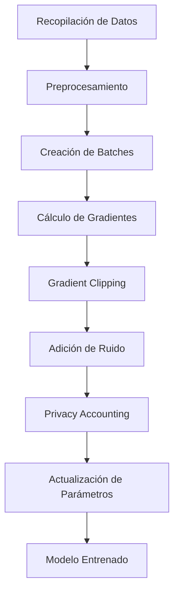
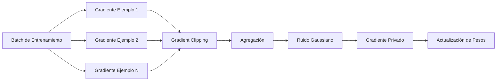
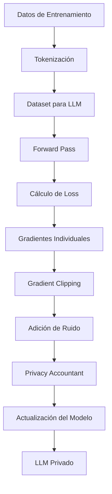

# Differential Privacy Applied to Large Language Models (LLMs)

# Parte 4 — Diagrams, Examples and References

---

# Visual Diagrams

Los siguientes diagramas utilizan sintaxis Mermaid compatible con GitHub y pueden visualizarse directamente en repositorios que soporten renderizado Mermaid.

---

# Diagram 1 — Differential Privacy Training Workflow



---

## Descripción

Este diagrama representa el flujo general de entrenamiento de un modelo utilizando Privacidad Diferencial.

Los pasos críticos son:

- Gradient Clipping.
- Adición de ruido.
- Control del presupuesto de privacidad.

Estos mecanismos limitan la influencia de ejemplos individuales durante el entrenamiento.

---

# Diagram 2 — DP-SGD Process



---

## Descripción

DP-SGD modifica el algoritmo SGD tradicional mediante:

1. Cálculo de gradientes individuales.
2. Limitación de la contribución de cada ejemplo.
3. Adición de ruido controlado.
4. Actualización privada del modelo.

---

# Diagram 3 — LLM Training Pipeline with Differential Privacy



---

## Descripción

Este flujo representa la incorporación de Differential Privacy dentro de un pipeline típico de entrenamiento de un Large Language Model.

---

# Practical Example

## Objetivo

El siguiente ejemplo muestra una implementación conceptual simplificada de entrenamiento privado utilizando la idea fundamental detrás de DP-SGD.

Importante: Este ejemplo tiene fines educativos y no debe utilizarse directamente en producción.

---

## Ejemplo en Python

```python
import numpy as np

# ----------------------------------
# Gradientes simulados de un batch
# ----------------------------------

gradients = np.array([
    [0.5, 0.2],
    [1.8, 0.9],
    [0.4, 0.3],
    [3.0, 2.5]
])

# ----------------------------------
# Parámetro de clipping
# ----------------------------------

clip_norm = 1.0

clipped_gradients = []

for grad in gradients:

    norm = np.linalg.norm(grad)

    if norm > clip_norm:
        grad = grad * clip_norm / norm

    clipped_gradients.append(grad)

clipped_gradients = np.array(clipped_gradients)

# ----------------------------------
# Agregación
# ----------------------------------

mean_gradient = np.mean(clipped_gradients, axis=0)

# ----------------------------------
# Adición de ruido gaussiano
# ----------------------------------

noise_multiplier = 0.2

noise = np.random.normal(
    loc=0,
    scale=noise_multiplier,
    size=mean_gradient.shape
)

private_gradient = mean_gradient + noise

print("Gradiente privado:")
print(private_gradient)
```

---

## Explicación paso a paso

### 1. Cálculo de gradientes

Cada ejemplo genera un gradiente independiente.

```
gradients 
```

---

### 2. Gradient Clipping

La norma de cada gradiente se limita a un valor máximo.

```
clip_norm = 1.0 
```

Esto evita que un único ejemplo tenga una influencia excesiva.

---

### 3. Agregación

Los gradientes se promedian.

```
mean_gradient 
```

---

### 4. Adición de ruido

Se añade ruido gaussiano.

```
private_gradient 
```

Este ruido proporciona las garantías de privacidad.

---

# Ejemplo Conceptual aplicado a un LLM

Supongamos que una organización quiere entrenar un asistente médico utilizando historiales clínicos.

Sin Differential Privacy:

```
Paciente → Gradiente → Modelo 
```

El modelo puede memorizar información específica.

Con Differential Privacy:

```
Paciente
    ↓
Gradiente
    ↓
Clipping
    ↓
Ruido
    ↓
Modelo
```

La contribución individual queda protegida por diseño.

---

# Key Takeaways

## Conceptos fundamentales

- La Privacidad Diferencial proporciona garantías matemáticas cuantificables.
- Permite limitar la influencia de individuos concretos en los resultados de un algoritmo.
- Es una de las técnicas más estudiadas en privacidad aplicada a Machine Learning.

---

## Sobre los LLMs

- Los LLMs pueden memorizar ejemplos específicos.
- La memorización puede derivar en filtraciones de información sensible.
- Differential Privacy ayuda a reducir este riesgo.

---

## Sobre DP-SGD

- Es la técnica más utilizada para entrenar modelos privados.
- Utiliza clipping y ruido gaussiano.
- Constituye la base de gran parte de la investigación actual.

---

## Beneficios

- Protección frente a ataques de inferencia.
- Reducción de filtraciones.
- Facilita el cumplimiento normativo.
- Incrementa la confianza en sistemas de IA.

---

## Limitaciones

- Puede reducir la precisión del modelo.
- Incrementa el coste computacional.
- Resulta difícil de escalar a Foundation Models extremadamente grandes.

---

## Estado actual de la investigación

- La privacidad en LLMs sigue siendo un área activa de investigación.
- No existe una solución universal.
- La tendencia actual consiste en combinar múltiples tecnologías de protección.

---

# References

# Academic Papers

## Differential Privacy

### Differential Privacy

Autores: Cynthia Dwork

Año: 2006

URL:

https://www.microsoft.com/en-us/research/publication/differential-privacy/

---

### Calibrating Noise to Sensitivity in Private Data Analysis

Autores: Cynthia Dwork, Frank McSherry, Kobbi Nissim, Adam Smith

Año: 2006

URL:

https://privacytools.seas.harvard.edu/publications/calibrating-noise-sensitivity-private-data-analysis

---

## Deep Learning and Differential Privacy

### Deep Learning with Differential Privacy

Autores: Martin Abadi, Andy Chu, Ian Goodfellow, H. Brendan McMahan, Ilya Mironov, Kunal Talwar, Li Zhang

Año: 2016

URL:

https://arxiv.org/abs/1607.00133

---

### The Algorithmic Foundations of Differential Privacy

Autores: Cynthia Dwork, Aaron Roth

Año: 2014

URL:

https://www.cis.upenn.edu/~aaroth/privacybook.html

---

## LLM Privacy

### Extracting Training Data from Large Language Models

Autores: Nicholas Carlini y colaboradores

Año: 2021

URL:

https://arxiv.org/abs/2012.07805

---

### Quantifying Memorization Across Neural Language Models

Autores: Nicholas Carlini y colaboradores

Año: 2023

URL:

https://arxiv.org/abs/2305.11169

---

### Scalable Extraction of Training Data from Production Language Models

Autores: Nicholas Carlini y colaboradores

Año: 2024

URL:

https://arxiv.org/abs/2403.00510

---

## Foundation Models and Privacy

### Privacy in the Age of Foundation Models

Autores: Diversos autores

Año: 2024

Nota:
Área de investigación activa con múltiples publicaciones emergentes.

---

# Official Documentation

## Google

### TensorFlow Privacy

URL:

https://github.com/tensorflow/privacy

---

### Google Differential Privacy

URL:

https://github.com/google/differential-privacy

---

## Apple

### Learning with Privacy at Scale

URL:

https://machinelearning.apple.com/research/learning-with-privacy-at-scale

---

## Microsoft

### Responsible AI Resources

URL:

https://www.microsoft.com/ai/responsible-ai

---

## OpenMined

### OpenMined

URL:

https://www.openmined.org

---

## OpenMined Courses

URL:

https://courses.openmined.org

---

## NIST

### Privacy Engineering Program

URL:

https://www.nist.gov/privacy-framework

---

# Books

## The Algorithmic Foundations of Differential Privacy

Autores: Cynthia Dwork, Aaron Roth

URL:

https://www.cis.upenn.edu/~aaroth/privacybook.html

---

## Privacy-Preserving Machine Learning

Autor: J. Vaidya y colaboradores

URL:

https://link.springer.com

---

## Data Privacy

Autor: Ninghui Li y colaboradores

URL:

https://www.morganclaypool.com

---

# Industry Reports

## NIST AI Risk Management Framework

Organización: NIST

URL:

https://www.nist.gov/itl/ai-risk-management-framework

---

## OECD Artificial Intelligence Reports

Organización: OECD

URL:

https://oecd.ai

---

## ENISA Reports on AI Security

Organización: ENISA

URL:

https://www.enisa.europa.eu

---

## AI Governance Alliance Publications

Organización: World Economic Forum

URL:

https://initiatives.weforum.org/ai-governance-alliance

---

# Conclusión General

La Privacidad Diferencial representa actualmente una de las aproximaciones más maduras para proteger datos sensibles en sistemas de aprendizaje automático. Su aplicación a Large Language Models permite reducir riesgos asociados a memorización, extracción de datos e inferencia de pertenencia, proporcionando garantías matemáticas que pocas tecnologías pueden ofrecer.

No obstante, los desafíos relacionados con escalabilidad, coste computacional y preservación del rendimiento continúan siendo áreas activas de investigación. En el contexto de los modelos fundacionales, la evidencia científica actual apunta hacia arquitecturas híbridas que combinan Differential Privacy con otras técnicas como Federated Learning, Confidential Computing, RAG seguro y mecanismos avanzados de gobernanza de datos.

La evolución futura de la Inteligencia Artificial Generativa dependerá en gran medida de la capacidad de integrar estas tecnologías de protección de forma eficiente, verificable y compatible con los requisitos regulatorios y éticos de una sociedad cada vez más dependiente de sistemas inteligentes.