# Uso de LLMs locales para privacidad de datos en empresas

## Índice
1. [Introducción a los LLMs y la privacidad de datos](#introducción-a-los-llms-y-la-privacidad-de-datos)
2. [¿Qué son los LLMs locales?](#qué-son-los-llms-locales)
3. [Beneficios de implementar LLMs locales en empresas](#beneficios-de-implementar-llms-locales-en-empresas)
4. [Principales riesgos de privacidad en el uso de LLMs en la nube](#principales-riesgos-de-privacidad-en-el-uso-de-llms-en-la-nube)
5. [Arquitecturas para desplegar LLMs locales](#arquitecturas-para-desplegar-llms-locales)
6. [Modelos populares de LLMs que se pueden implementar localmente](#modelos-populares-de-llms-que-se-pueden-implementar-localmente)
7. [Requisitos técnicos para la implementación](#requisitos-técnicos-para-la-implementación)
8. [Mejores prácticas de seguridad para LLMs locales](#mejores-prácticas-de-seguridad-para-llms-locales)
9. [Casos de uso empresariales](#casos-de-uso-empresariales)
10. [Consideraciones legales y cumplimiento normativo](#consideraciones-legales-y-cumplimiento-normativo)
11. [Análisis costo-beneficio](#análisis-costo-beneficio)
12. [Pasos para la implementación segura](#pasos-para-la-implementación-segura)
13. [Futuro de los LLMs locales y la privacidad empresarial](#futuro-de-los-llms-locales-y-la-privacidad-empresarial)
14. [Conclusiones](#conclusiones)

## Introducción a los LLMs y la privacidad de datos

Los Modelos de Lenguaje de Gran Escala (LLMs, por sus siglas en inglés) han revolucionado la forma en que las empresas procesan información, generan contenido y automatizan tareas. Sin embargo, su uso plantea importantes desafíos de privacidad cuando los datos sensibles de una empresa se envían a servicios externos.

**Conceptos clave:**
- **LLMs**: Modelos de inteligencia artificial entrenados con enormes cantidades de texto que pueden generar contenido, responder preguntas y procesar lenguaje natural.
- **Privacidad de datos**: Protección de la información sensible contra acceso no autorizado, uso indebido o filtración.
- **Datos empresariales sensibles**: Información confidencial como secretos comerciales, datos de clientes, propiedad intelectual e información financiera.

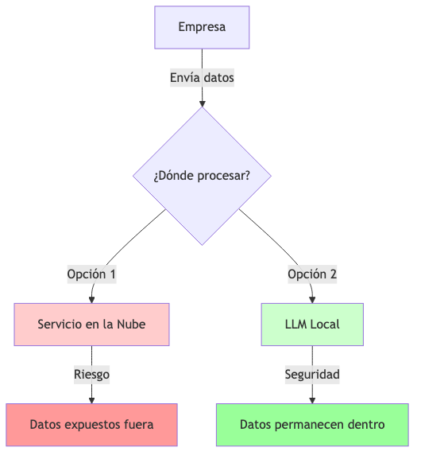

## ¿Qué son los LLMs locales?

Los LLMs locales son modelos de lenguaje que se implementan y ejecutan dentro de la infraestructura controlada por la empresa, sin necesidad de enviar datos a servicios externos.

**Conceptos clave:**
- **Despliegue on-premise**: Instalación del modelo en servidores físicos propiedad de la empresa.
- **Infraestructura privada**: Redes, servidores y sistemas controlados exclusivamente por la organización.
- **Procesamiento local**: Análisis y generación de texto sin salir del perímetro de seguridad de la empresa.

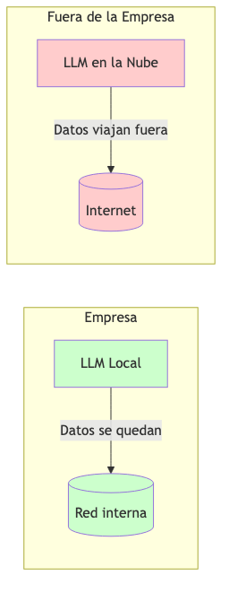

## Beneficios de implementar LLMs locales en empresas

La implementación de LLMs locales ofrece múltiples ventajas para las organizaciones preocupadas por la privacidad y seguridad de sus datos.

**Conceptos clave:**
- **Control total de los datos**: La empresa mantiene supervisión completa sobre dónde y cómo se procesan sus datos.
- **Confidencialidad garantizada**: No hay filtración de información sensible a terceros.
- **Cumplimiento normativo**: Facilita el cumplimiento de regulaciones como GDPR, HIPAA o CCPA.
- **Independencia operativa**: Funcionamiento sin depender de la disponibilidad de servicios externos.

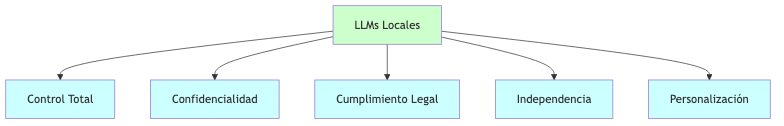

## Principales riesgos de privacidad en el uso de LLMs en la nube

Entender los riesgos que implica utilizar LLMs basados en la nube es fundamental para valorar la importancia de las alternativas locales.

**Conceptos clave:**
- **Exposición de datos sensibles**: Información confidencial expuesta a proveedores externos.
- **Memorización de datos**: Los LLMs pueden recordar información de entrenamiento o uso.
- **Transferencia internacional de datos**: Datos que cruzan fronteras con diferentes marcos legales.
- **Falta de transparencia**: Desconocimiento sobre quién tiene acceso a los datos enviados.

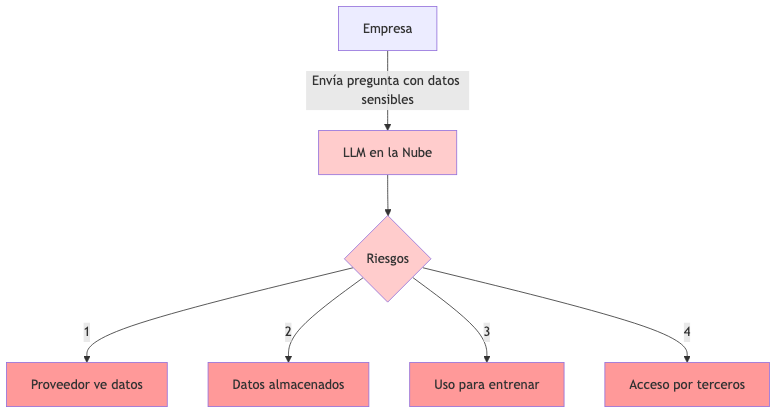

## Arquitecturas para desplegar LLMs locales

Existen diferentes configuraciones para implementar LLMs dentro del perímetro de seguridad empresarial.

**Conceptos clave:**
- **Infraestructura on-premise**: Servidores físicos en las instalaciones de la empresa.
- **Nube privada**: Recursos cloud dedicados exclusivamente a la organización.
- **Arquitectura híbrida**: Combinación de procesamiento local para datos sensibles y servicios en nube para datos no críticos.
- **Contenedores y virtualización**: Tecnologías que facilitan el despliegue y aislamiento de LLMs.

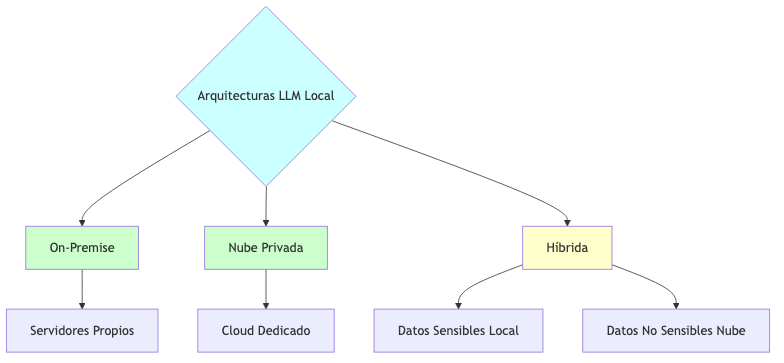

## Modelos populares de LLMs que se pueden implementar localmente

Existen diversos modelos que pueden funcionar dentro de la infraestructura empresarial con diferentes capacidades y requisitos.

**Conceptos clave:**
- **Modelos open-source**: LLMs con código abierto que pueden descargarse e implementarse libremente.
- **Modelos optimizados**: Versiones reducidas diseñadas para funcionar con menos recursos.
- **Modelos comerciales con licencia on-premise**: Soluciones empresariales para despliegue local.
- **Fine-tuning**: Adaptación de modelos pre-entrenados a necesidades específicas de la empresa.

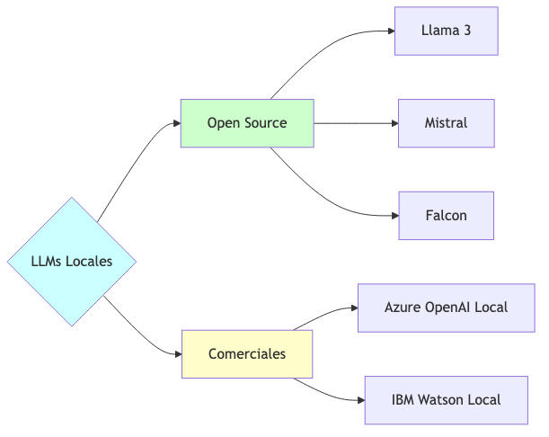

## Requisitos técnicos para la implementación

La instalación de LLMs locales requiere una infraestructura adecuada para su funcionamiento eficiente.

**Conceptos clave:**
- **Hardware especializado**: GPUs, TPUs o hardware optimizado para inferencia de IA.
- **Capacidad de almacenamiento**: Espacio para los modelos y datos asociados.
- **Ancho de banda interno**: Recursos de red para la comunicación con el modelo.
- **Sistemas de respaldo**: Redundancia para garantizar disponibilidad.

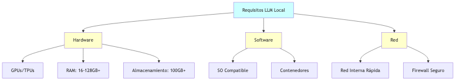

## Mejores prácticas de seguridad para LLMs locales

Aunque los LLMs locales ofrecen mayor privacidad, requieren medidas específicas de seguridad.

**Conceptos clave:**
- **Aislamiento de red**: Separación del sistema LLM de otras redes.
- **Control de acceso**: Limitación de quién puede interactuar con el modelo.
- **Auditoría de consultas**: Registro y monitoreo de todas las interacciones.
- **Sanitización de entrada/salida**: Filtrado de datos sensibles en las consultas y respuestas.

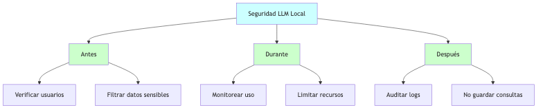

## Casos de uso empresariales

Los LLMs locales pueden aplicarse a numerosas necesidades empresariales que involucran datos sensibles.

**Conceptos clave:**
- **Análisis de documentos confidenciales**: Revisión automática de contratos, patentes o información financiera.
- **Atención al cliente interna**: Chatbots para empleados con acceso a información sensible.
- **Investigación y desarrollo**: Asistencia en la creación de nuevos productos o servicios.
- **Procesamiento de datos regulados**: Análisis de información médica, financiera o personal protegida.

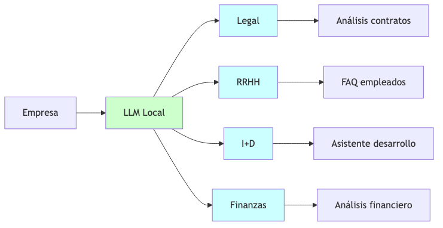

## Consideraciones legales y cumplimiento normativo

El uso de LLMs locales debe alinearse con el marco regulatorio aplicable a la empresa.

**Conceptos clave:**
- **Regulaciones de privacidad**: GDPR (Europa), CCPA (California), LGPD (Brasil), etc.
- **Normativas sectoriales**: HIPAA (salud), PCI-DSS (pagos), etc.
- **Requisitos de residencia de datos**: Obligación de mantener ciertos datos dentro de fronteras nacionales.
- **Políticas de retención**: Gestión del almacenamiento y eliminación de datos.

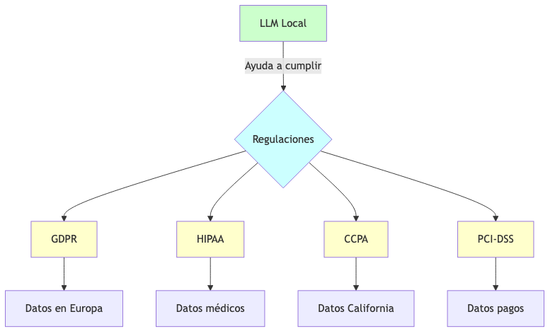

## Análisis costo-beneficio

La implementación de LLMs locales implica un balance entre inversión inicial y beneficios a largo plazo.

**Conceptos clave:**
- **Costos de implementación**: Hardware, software, instalación y configuración.
- **Costos operativos**: Mantenimiento, actualizaciones, consumo energético.
- **Ahorro en suscripciones**: Eliminación o reducción de pagos a proveedores de LLMs en la nube.
- **Valor de la privacidad**: Beneficios intangibles como la protección de propiedad intelectual y confianza.

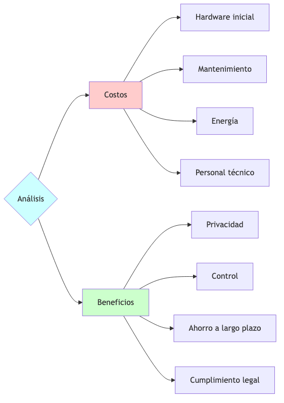

## Pasos para la implementación segura

Una hoja de ruta para desplegar LLMs locales de forma efectiva y segura.

**Conceptos clave:**
- **Evaluación de necesidades**: Identificación de casos de uso y requisitos específicos.
- **Selección de modelo**: Elección del LLM adecuado según capacidades y recursos disponibles.
- **Preparación de infraestructura**: Acondicionamiento del entorno técnico.
- **Despliegue por fases**: Implementación gradual empezando por áreas menos sensibles.
- **Monitoreo continuo**: Vigilancia permanente del rendimiento y la seguridad.

## Futuro de los LLMs locales y la privacidad empresarial

Tendencias emergentes y desarrollos futuros en el campo de los LLMs locales.

**Conceptos clave:**
- **Modelos más eficientes**: LLMs que requieren menos recursos para funcionar localmente.
- **Soluciones híbridas avanzadas**: Sistemas que combinan procesamiento local y en nube de forma inteligente.
- **Federación de modelos**: Colaboración entre empresas para entrenar modelos sin compartir datos sensibles.
- **Regulaciones emergentes**: Nuevos marcos legales específicos para IA y privacidad.

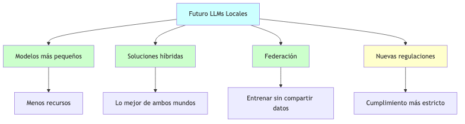

## Conclusiones

Los LLMs locales representan una solución efectiva para las empresas que necesitan aprovechar el poder de la IA generativa sin comprometer la privacidad de sus datos.

**Conceptos clave:**
- **Balance privacidad-funcionalidad**: Los LLMs locales ofrecen un equilibrio entre capacidades y protección de datos.
- **Inversión estratégica**: La implementación local representa un costo inicial que se traduce en beneficios a largo plazo.
- **Evolución constante**: El campo de los LLMs locales continúa desarrollándose con mejoras continuas.
- **Enfoque personalizado**: Cada empresa debe evaluar sus necesidades específicas para determinar la mejor estrategia de implementación.

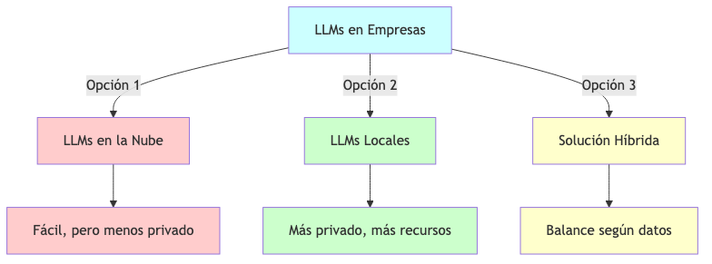
