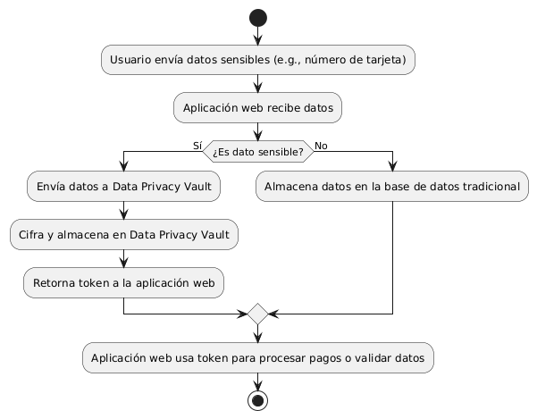

# Data Privacy Vault

## Breve descripción
Un **Data Privacy Vault** (bóveda de privacidad de datos) es un entorno seguro que almacena y gestiona datos sensibles, asegurando que estén protegidos y que su acceso esté estrictamente controlado. Funciona como un espacio seguro que cifra, anonimiza y audita el acceso a los datos críticos, minimizando los riesgos asociados con la exposición de datos personales o confidenciales.

## Descripción detallada
Un Data Privacy Vault es una solución diseñada para proteger información sensible en un entorno controlado y seguro. Almacena datos como números de tarjetas de crédito, información de identificación personal (PII) y cualquier otro dato confidencial que deba ser manejado con cuidado. Estas bóvedas emplean técnicas como cifrado, tokenización y controles de acceso estricto para proteger los datos desde el momento en que se capturan hasta que se destruyen.

En la arquitectura de aplicaciones modernas, un Data Privacy Vault se integra como una capa adicional entre la aplicación y la base de datos tradicional. Permite a las organizaciones cumplir con regulaciones de privacidad de datos (como GDPR o CCPA) al garantizar que los datos sensibles estén protegidos de accesos no autorizados. Las aplicaciones interactúan con el vault para leer, escribir o actualizar datos sensibles, pero nunca acceden a ellos directamente en su forma original.

## 5 riesgos que resuelve
1. **Filtración de datos sensibles:** Al cifrar y tokenizar los datos dentro del vault, se reduce la posibilidad de exposición en caso de un acceso no autorizado.
2. **Acceso no autorizado:** Los controles estrictos y auditados de acceso aseguran que solo los usuarios o servicios autorizados puedan interactuar con los datos sensibles.
3. **Cumplimiento de regulaciones:** Facilita el cumplimiento de normativas como GDPR, HIPAA o CCPA al manejar y proteger adecuadamente los datos personales y confidenciales.
4. **Minimización del impacto de ataques internos:** Los empleados con acceso privilegiado a sistemas no pueden acceder a los datos en su forma sin procesar, ya que estos permanecen cifrados o tokenizados.
5. **Reducción del riesgo de manipulación de datos:** Mediante registros de auditoría, se puede rastrear cualquier intento de acceso o manipulación no autorizada de los datos sensibles.

## Ejemplo de uso
Imagina una aplicación de e-commerce que maneja pagos de tarjetas de crédito. En lugar de almacenar directamente los números de las tarjetas en su base de datos, la aplicación utiliza un Data Privacy Vault. Cuando el usuario ingresa su número de tarjeta, la aplicación envía el dato al vault, donde se cifra y se reemplaza con un token. Este token es lo que se almacena en la base de datos de la aplicación y lo que se usa para futuras transacciones. Si un atacante compromete la base de datos de la aplicación, solo tendrá acceso a los tokens, no a los números reales de las tarjetas.

## Diagrama de flujo

# Ejemplo Detallado: Creación de un Data Privacy Vault en AWS

## Arquitectura Propuesta

1. **AWS API Gateway:** Exposición de una API para que la aplicación pueda interactuar con el vault.
2. **AWS Lambda:** Funciones sin servidor que gestionan la lógica de negocio para almacenar y recuperar los datos sensibles.
3. **AWS KMS (Key Management Service):** Para cifrado de los datos sensibles antes de almacenarlos.
4. **AWS DynamoDB:** Base de datos NoSQL donde se almacenan los datos cifrados o tokenizados.
5. **AWS Secrets Manager:** Almacenamiento seguro de las claves de cifrado y otros secretos que maneja la aplicación.

## Pasos para Implementar el Data Privacy Vault

### 1. Configurar KMS para Cifrado

AWS KMS te permite generar y gestionar las claves de cifrado. Configuraremos una clave específica para el vault.

- Navega a **AWS KMS** y crea una clave simétrica (AES-256).
- Asigna permisos a las funciones Lambda y servicios relevantes para usar esta clave.

### 2. Configurar DynamoDB para Almacenar los Datos

DynamoDB se utilizará para almacenar los datos cifrados y/o los tokens generados.

- Crea una tabla en **DynamoDB** con un esquema sencillo:
  - **Primary Key:** `DataID` (un identificador único para los datos sensibles).
  - **Attributes:** `EncryptedData` (el dato cifrado) y `Metadata` (información adicional).

### 3. Crear Funciones Lambda para la Lógica de Negocio

Desarrolla funciones Lambda para interactuar con los datos. La lógica se divide en dos funciones principales:

- **Función para almacenar datos sensibles (StoreSensitiveData):**
  - Recibe los datos sensibles desde la API.
  - Usa KMS para cifrar los datos.
  - Almacena los datos cifrados en DynamoDB.

- **Función para recuperar datos sensibles (RetrieveSensitiveData):**
  - Recibe una solicitud para acceder a los datos.
  - Busca en DynamoDB el dato cifrado.
  - Desencripta el dato usando KMS.
  - Devuelve el dato desencriptado.

### 4. Configurar API Gateway para Exponer la API
Crea un API en API Gateway con dos endpoints:
- POST /store-data: Invoca la función Lambda StoreSensitiveData.
- GET /retrieve-data: Invoca la función Lambda RetrieveSensitiveData.

### 5. Almacenar y Gestionar Claves de Cifrado con AWS Secrets Manager
Aunque KMS gestiona las claves de cifrado, puedes usar Secrets Manager para almacenar otros secretos, como tokens de API o credenciales, y asegurarte de que estén accesibles solo para los recursos autorizados.

## Indice
[vault-jaa](vault-jaa.md)

