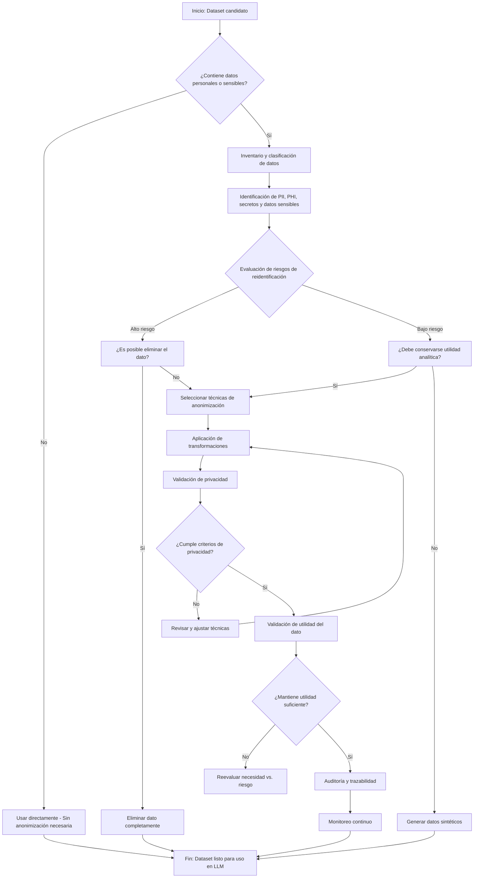

# Guía de Anonimización y De-identificación de Datos para Entrenamiento de LLMs

Como experto en ciberseguridad, privacidad de datos y desarrollo de software con IA, esta guía proporciona un enfoque práctico para anonimizar o de-identificar datos antes de utilizarlos en el entrenamiento, ajuste fino o evaluación de modelos de lenguaje grandes (LLMs). El objetivo es proteger la privacidad mientras se mantiene la utilidad de los datos para el desarrollo de IA.

## 1. Definición

La primera alternativa es utilizar la de-identificación de todo dato personal, confidencial o sensible en las interacciones con LLMs.

La de-identificación (o anonimización) es el proceso de eliminar o modificar [información personal identificable (PII)](https://en.wikipedia.org/wiki/Personal_data) de un conjunto de datos para proteger la privacidad de las personas. 

Esto se logra eliminando nombres, direcciones u otros datos sensibles que puedan identificar a individuos específicos.

### Diferencias clave entre conceptos relacionados:

- **Datos anonimizados**: Información que ha sido procesada de manera que no puede relacionarse razonablemente con un individuo identificado o identificable. Bajo regulaciones como [GDPR](https://gdpr-info.eu/), los datos anonimizados no se consideran datos personales y no están sujetos a las mismas restricciones.
  
- **Datos pseudonimizados**: Datos donde los identificadores directos (como nombres o números de identificación) se reemplazan por pseudónimos o códigos. Sin embargo, aún pueden ser reidentificables si se combina con información adicional. Bajo [GDPR](https://gdpr-info.eu/), los datos pseudonimizados siguen siendo considerados datos personales.

- **Datos enmascarados**: Técnica donde los datos sensibles se ocultan parcialmente (por ejemplo, mostrando solo los últimos cuatro dígitos de un número de tarjeta de crédito). Los datos originales pueden reconstruirse, por lo que no garantizan anonimato completo.

- **Datos sintéticos**: Datos generados artificialmente que imitan las características estadísticas de los datos reales sin contener información de individuos reales. No requieren anonimización adicional, ya que no derivan de fuentes personales.

La distinción es importante porque la anonimización completa libera los datos de restricciones regulatorias, mientras que la pseudonimización requiere controles adicionales.

## 2. Proceso de anonimización

A continuación, se describe un proceso recomendado paso a paso para anonimizar datos antes de su uso en LLMs. Este proceso debe ser iterativo y adaptado al contexto específico de la organización.

1. **Inventario y clasificación de datos**: Realiza un inventario completo de los datasets candidatos para entrenamiento. Clasifícalos por tipo (estructurados, no estructurados), fuente y sensibilidad.

2. **Identificación de PII, PHI, secretos, credenciales y datos sensibles**: Utiliza herramientas automatizadas (como modelos de [reconocimiento de entidades nombradas - NER](https://en.wikipedia.org/wiki/Named-entity_recognition)) y revisiones manuales para detectar información sensible, incluyendo nombres, direcciones, correos electrónicos, números de teléfono, historiales médicos, claves API, contraseñas, etc.

3. **Evaluación de riesgos de reidentificación**: Evalúa el riesgo de que un atacante pueda reidentificar individuos combinando datos anonimizados con información pública. Considera factores como unicidad de combinaciones de atributos, tamaño del dataset y contexto disponible.

4. **Selección de técnicas de anonimización**: Elige técnicas apropiadas basadas en el tipo de dato y el nivel de riesgo:
   - Eliminación/supresión
   - Generalización (agrupar valores en categorías más amplias)
   - Perturbación (agregar ruido)
   - Pseudonimización (reemplazo con tokens)
   - Enmascaramiento
   - Generación de datos sintéticos

5. **Aplicación de transformaciones**: Implementa las técnicas seleccionadas de manera consistente. Asegúrate de que las transformaciones sean reversibles solo bajo controles estrictos si es necesario para auditoría.

6. **Validación de privacidad**: Verifica que los datos transformados cumplan criterios de privacidad, como [k-anonimato](https://en.wikipedia.org/wiki/K-anonymity), [l-diversidad](https://en.wikipedia.org/wiki/L-diversity) o [diferencial privacidad](https://en.wikipedia.org/wiki/Differential_privacy). Realiza pruebas de reidentificación simuladas.

7. **Validación de utilidad del dato**: Confirma que los datos anonimizados mantengan suficiente utilidad para el entrenamiento del LLM. Evalúa métricas como coherencia semántica, diversidad y rendimiento en tareas downstream.

8. **Auditoría y trazabilidad**: Registra todas las transformaciones aplicadas, incluyendo quién las realizó, cuándo y por qué. Mantén logs auditables para cumplimiento.

9. **Monitoreo continuo**: Implementa monitoreo post-entrenamiento para detectar posibles fugas de información sensible en las salidas del modelo.

## 3. Diagrama de flujo

El siguiente diagrama de flujo ilustra el proceso completo de anonimización de datos para LLMs:

Este diagrama incluye las decisiones clave mencionadas y guía a través del proceso de toma de decisiones.

## 4. Escenarios donde es necesario aplicar anonimización

La anonimización es obligatoria o altamente recomendable en los siguientes casos, donde el riesgo de exposición de datos sensibles es significativo:

- **Entrenamiento o fine-tuning de LLMs con datos internos**: Logs de aplicaciones, correos electrónicos corporativos o documentos internos que contienen PII de empleados o clientes.
  
- **Logs de aplicaciones**: Registros que incluyen direcciones IP, identificadores de usuario o datos de sesión que podrían rastrearse a individuos.

- **Tickets de soporte**: Conversaciones con clientes que incluyen nombres, direcciones o detalles personales.

- **Chats con clientes**: Historiales de soporte al cliente con información confidencial.

- **Historial médico**: Cualquier dato relacionado con salud, sujeto a regulaciones como HIPAA.

- **Datos financieros**: Información bancaria, transacciones o datos crediticios.

- **Datos de empleados**: Información de RRHH, salarios o evaluaciones de rendimiento.

- **Código fuente con secretos o credenciales**: Repositorios que contienen claves API, contraseñas hardcodeadas o tokens de acceso.

- **Datasets compartidos con terceros**: Cualquier intercambio de datos con proveedores de IA o colaboradores externos.

En estos escenarios, la anonimización no solo cumple con regulaciones, sino que también reduce riesgos legales y de reputación.

## 5. Escenarios donde no es tan necesario

En situaciones de bajo riesgo, la anonimización puede ser menos crítica, aunque siempre se recomienda una evaluación de riesgos. Riesgos residuales incluyen exposición accidental o ataques avanzados.

- **Datos públicos sin información personal**: Contenido disponible públicamente, como artículos de Wikipedia o datasets de investigación académica ya anonimizados.

- **Datos sintéticos bien generados**: Datos creados artificialmente que no derivan de individuos reales.

- **Contenido técnico sin identificadores**: Documentación técnica, código abierto o especificaciones que no contienen PII.

- **Datasets ya anonimizados y validados**: Datos de fuentes confiables que han pasado por procesos de anonimización verificados.

- **Procesamiento local sin retención, bajo controles estrictos**: Uso temporal de datos en entornos controlados sin almacenamiento persistente.

Incluso en estos casos, considera controles adicionales como encriptación en tránsito y acceso restringido.

## 6. Relación con regulaciones y políticas

La anonimización está estrechamente ligada a marcos regulatorios y políticas internas. A continuación, se explica su relación con normativas clave:

- **[GDPR / RGPD](https://gdpr-info.eu/)**: Distingue entre anonimización (datos no personales) y pseudonimización (datos personales con controles adicionales). La anonimización completa permite procesamiento sin base legal específica.

- **[HIPAA](https://www.hhs.gov/hipaa/index.html)**: Requiere de-identificación para datos de salud protegidos (PHI), con estándares específicos para eliminación de 18 identificadores.

- **[CCPA / CPRA](https://oag.ca.gov/privacy/ccpa)**: Enfocado en datos personales de residentes de California, la anonimización puede ayudar a cumplir con derechos de eliminación y no venta.

- **[ISO 27001](https://www.iso.org/standard/54534.html)**: Incluye controles para protección de información sensible, incluyendo anonimización en procesos de gestión de riesgos.

- **[SOC 2](https://www.akamai.com/es/glossary/what-is-soc2)**: Para organizaciones de servicios, la anonimización soporta criterios de seguridad y privacidad.

**Aspectos clave a considerar**:
- **Principio de minimización de datos**: Recopila y procesa solo lo necesario; la anonimización ayuda a reducir el alcance.
- **Base legal para procesamiento**: Datos anonimizados requieren menos justificación legal.
- **Retención de datos**: Datos anonimizados pueden retenerse por más tiempo sin riesgos adicionales.
- **Derechos de los titulares**: Anonimización completa elimina la aplicabilidad de derechos como acceso o rectificación.
- **Transferencias a terceros o proveedores de IA**: Datos anonimizados facilitan transferencias internacionales sin restricciones adicionales.

Recuerda que esta no es asesoría legal definitiva. Consulta con tu equipo legal o Data Protection Officer (DPO) para validar interpretaciones regulatorias específicas.

## 7. Ejemplo práctico

**Texto original:**
"El paciente Juan Pérez, con DNI 12345678, residente en Calle Falsa 123, Madrid, y número de teléfono 600123456, fue atendido el 15/03/2023 por el Dr. García por hipertensión. Su historial incluye alergia a penicilina."

**Datos sensibles detectados:**
- Nombre: Juan Pérez
- DNI: 12345678
- Dirección: Calle Falsa 123, Madrid
- Teléfono: 600123456
- Fecha de atención: 15/03/2023
- Nombre del médico: Dr. García
- Condición médica: hipertensión, alergia a penicilina

**Texto anonimizado (usando pseudonimización y generalización):**
"El paciente ID-001, residente en Madrid, fue atendido en marzo de 2023 por un especialista por una condición cardiovascular. Su historial incluye una alergia común a antibióticos."

**Técnica aplicada:**
- Pseudonimización para identificadores directos (reemplazo con tokens como ID-001).
- Generalización para ubicación (ciudad en lugar de dirección exacta) y fechas (mes en lugar de día específico).
- Eliminación de detalles médicos específicos para reducir riesgo de reidentificación.

**Riesgos residuales:**
- Posible reidentificación si se combina con otros datasets que contengan ID-001.
- Información general sobre condición médica podría correlacionarse con registros públicos.
- Recomendación: Usar anonimización completa si el riesgo es alto.

## 8. Ejemplo visual

## 9. Soluciones para implantar el proceso

### A. Solución comercial

Una solución comercial típica para anonimización de datos en IA incluye plataformas especializadas como [Microsoft Presidio](https://microsoft.github.io/presidio/), [IBM Watson Knowledge Catalog](https://www.ibm.com/products/watson-knowledge-catalog) o soluciones de proveedores como [OneTrust](https://www.onetrust.com/) o [BigID](https://bigid.com/).

**Capacidades esperadas:**
- Detección automática de PII usando IA y reglas predefinidas.
- Aplicación de múltiples técnicas de anonimización.
- Integración con pipelines de MLOps para procesamiento automático.

**Integración con pipelines de datos o MLOps:**
- APIs para integración con herramientas como [Apache Airflow](https://airflow.apache.org/), [Kubeflow](https://www.kubeflow.org/) o [Azure ML](https://azure.microsoft.com/en-us/products/machine-learning/).
- Procesamiento en tiempo real o batch.

**Detección automática de PII:**
- Modelos NER entrenados en múltiples idiomas y dominios.

**Soporte para cumplimiento normativo:**
- Plantillas para GDPR, HIPAA, etc.
- Reportes de cumplimiento automatizados.

**Auditoría:**
- Logs detallados de todas las transformaciones.

**Ventajas:**
- Rapidez de implementación, soporte experto, actualizaciones continuas.

**Limitaciones:**
- Costos asociados, dependencia de proveedor, posibles restricciones de personalización.

**Criterios para seleccionar proveedor:**
- Compatibilidad con tu stack tecnológico, certificaciones de seguridad, escalabilidad y soporte para tus regulaciones específicas.

### B. Solución Develop Yourself/ interna

Para implementar una solución propia, adopta una arquitectura modular.

**Arquitectura recomendada:**
- Pipeline ETL con etapas de ingestión, procesamiento y validación.
- Componentes separados para detección, transformación y auditoría.

**Componentes principales:**
- **Detección:** Usa bibliotecas open source como [spaCy](https://spacy.io/) o [Hugging Face Transformers](https://huggingface.co/docs/transformers/index) para NER.
- **Transformación:** Scripts personalizados en Python con librerías como [Faker](https://faker.readthedocs.io/) para generación de datos falsos.
- **Validación:** Herramientas como [PySyft](https://github.com/OpenMined/PySyft) para privacidad diferencial.

**Herramientas open source o técnicas posibles:**
- [Expresiones regulares](https://docs.python.org/3/library/re.html) para patrones simples (ej. correos: \b[A-Za-z0-9._%+-]+@[A-Za-z0-9.-]+\.[A-Z|a-z]{2,}\b).
- Modelos NER para detección avanzada.
- Técnicas de hashing para pseudonimización.

**Validación humana:**
- Revisiones manuales aleatorias de muestras anonimizadas.

**Pruebas de reidentificación:**
- Simulaciones con ataques de linkage o inference.

**Registro de auditoría:**
- Logs en bases de datos seguras con timestamps y metadatos.

**Controles de acceso:**
- [RBAC (Role-Based Access Control)](https://en.wikipedia.org/wiki/Role-based_access_control) para acceso a datos sensibles.

**Integración con CI/CD, ETL o pipelines de entrenamiento:**
- Scripts en [GitHub Actions](https://github.com/features/actions) o [Jenkins](https://www.jenkins.io/) para automatización.
- Integración con frameworks como [TensorFlow](https://www.tensorflow.org/) o [PyTorch](https://pytorch.org/) para preprocesamiento.

**Buenas prácticas de seguridad:**
- Encriptación de datos en reposo y tránsito.
- Entornos aislados para procesamiento.
- Actualizaciones regulares de modelos y reglas.

## 10. Recomendaciones finales

Para equipos que deseen usar datos internos en LLMs de forma segura, sigue estas buenas prácticas:

- Realiza evaluaciones de riesgos regulares y documentadas.
- Involucra a equipos multidisciplinarios (ciberseguridad, legal, datos, desarrollo).
- Prioriza la anonimización completa sobre pseudonimización cuando sea posible.
- Implementa monitoreo continuo de modelos entrenados para detectar fugas.
- Capacita al equipo en privacidad y regulaciones relevantes.
- Mantén inventarios actualizados de datos y procesos de anonimización.
- Usa herramientas automatizadas para escalabilidad, pero incluye validación humana.
- Documenta todas las decisiones y justificaciones para auditorías.
- Revisa y actualiza procesos anualmente o ante cambios regulatorios.
- Considera el uso de datos sintéticos como alternativa cuando la anonimización sea compleja.

Esta guía proporciona un marco práctico, pero adapta los procesos a tu contexto específico y valida con expertos legales para cumplimiento normativo.

