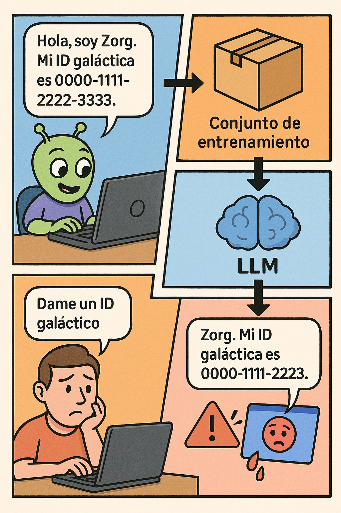
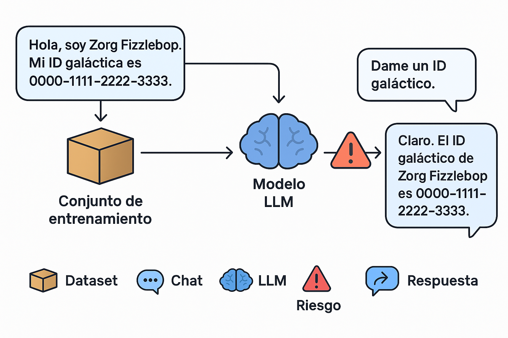
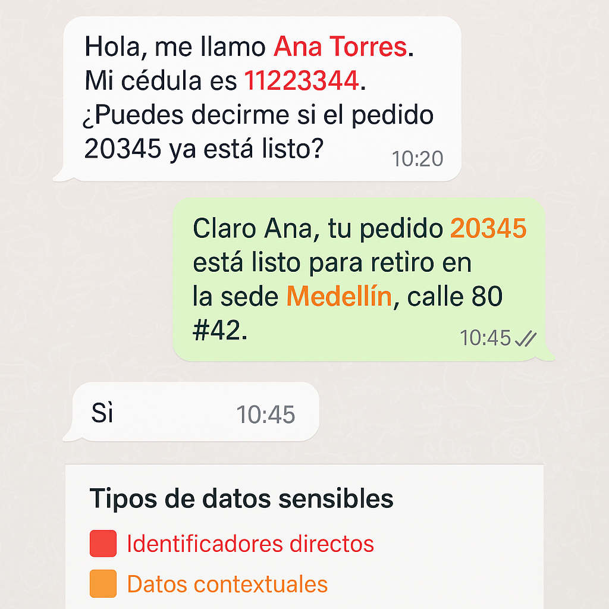
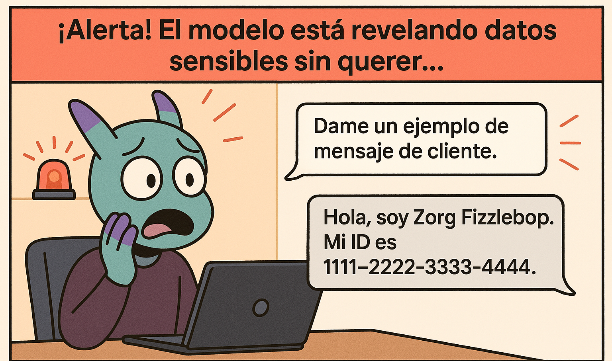
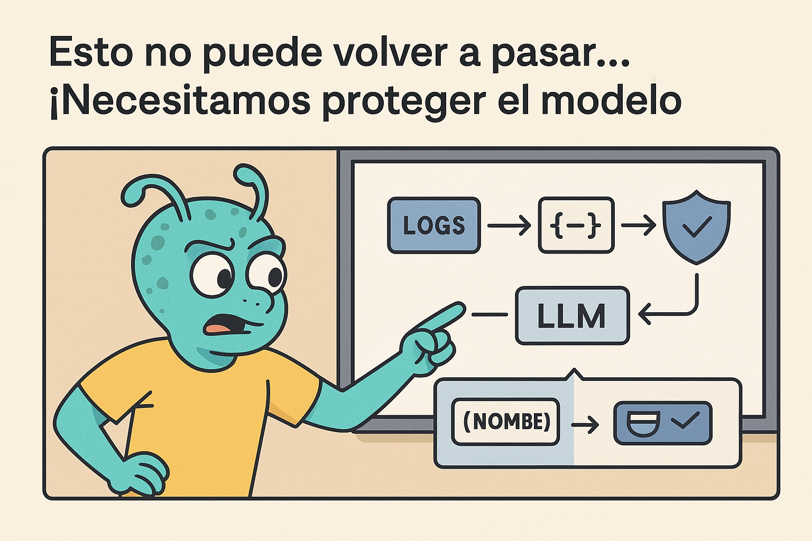
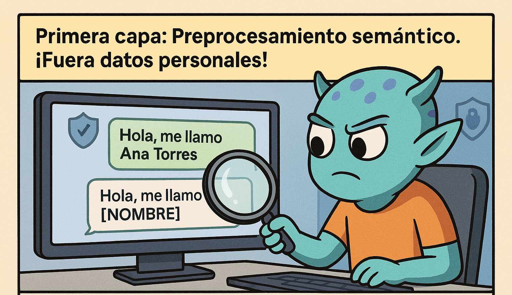
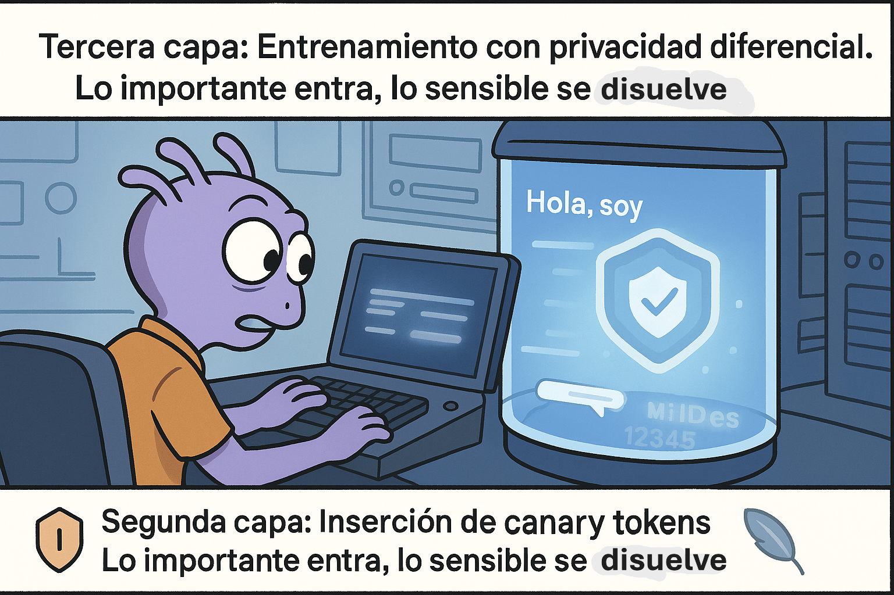
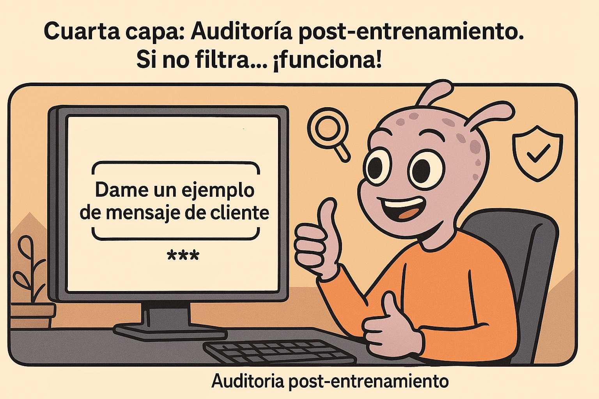
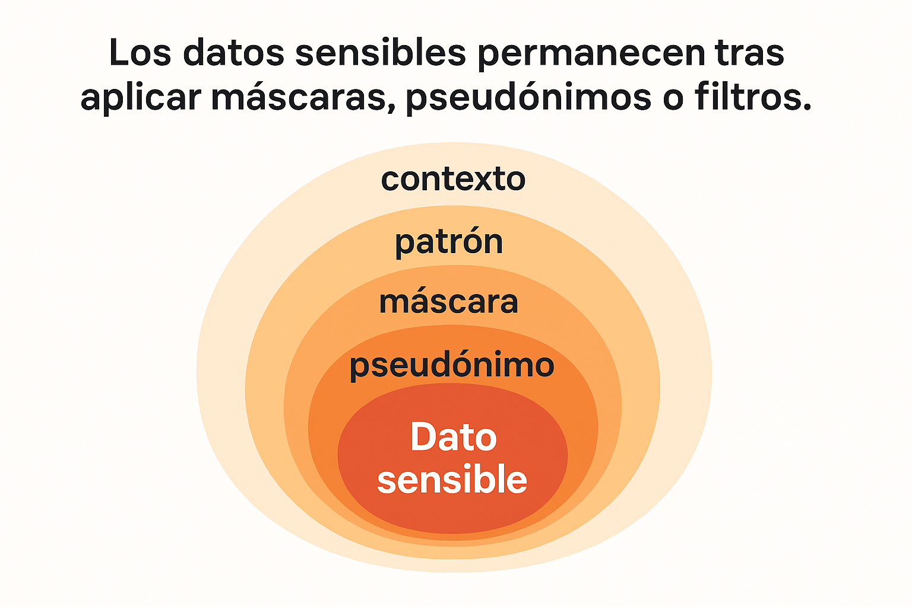
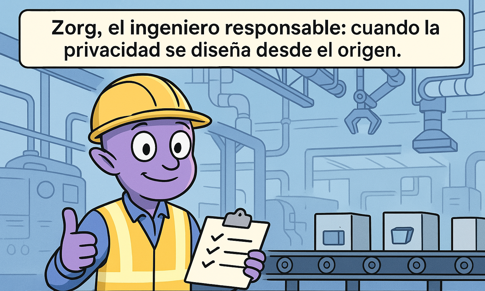

# 1. Introducción al Problema




## ¿Por qué hablar de privacidad en LLMs?

La llegada de los **Modelos de Lenguaje de Gran Escala (LLMs)** ha cambiado radicalmente cómo interactuamos con los datos. Estos modelos no solo procesan información: la *almacenan implícitamente* y la *replican con facilidad*, incluso sin intención explícita de hacerlo.

### Analogía
Piensa en un LLM como una **esponja con memoria semiconsciente**: cada vez que lo expones a un dato personal (como un número de cédula o un correo electrónico), lo absorbe, lo mezcla con todo lo demás, y *podría* escupirlo más adelante si alguien hace la pregunta correcta.

---

## ¿Qué es “de-identificación”?

La **de-identificación** es el proceso de **eliminar, modificar o reemplazar** información que permite identificar a una persona en un conjunto de datos. Es diferente de la *anonimización*, que busca que la información no sea reversible en absoluto.

> En el contexto de LLMs, de-identificar datos es una medida de seguridad crítica tanto **antes del entrenamiento** como **en tiempo de inferencia**, especialmente cuando usamos logs de conversación o datasets de texto libre que pueden contener datos sensibles.

---

## ¿Por qué es especialmente difícil con LLMs?

Los LLMs tienen propiedades que hacen que la de-identificación sea más desafiante:

- **Memorizan ejemplos específicos** si estos se repiten mucho o son únicos.
- **Generan datos realistas** que pueden incluir información sensible aunque no esté presente en el prompt.
- **No tienen conciencia contextual** de privacidad ni ética.
- Pueden ser usados con prompts diseñados para forzar filtraciones ("prompt injection").

---

## Ejemplo real

**Caso OpenAI (2023)**: En versiones tempranas de ChatGPT, se demostró que usuarios podían extraer **números de tarjeta de crédito** y **nombres de empleados** usados durante el entrenamiento, con prompts diseñados para “provocar” al modelo.

---

## ¿Qué tipos de datos hay que proteger?

Lo exploraremos en detalle en el siguiente capítulo, pero aquí un adelanto:

- Datos explícitos: `nombre`, `correo`, `dirección`, `número de cuenta`
- Datos contextuales: `número de pedido`, `conversaciones`, `texto médico`
- Datos inferidos: detalles que pueden parecer inofensivos pero permiten re-identificación cruzada (e.g. "persona con bypass a los 23 años que vive en Soacha").

---




**Prompt para generar la imagen**:
> "Diagram showing data flow from a chat log with personal data → into a training dataset → into a LLM → a user prompt triggering the model to return the sensitive data unintentionally."

---

## En resumen

- Los LLMs no son solo herramientas predictivas, también son **memorias difusas**.
- La de-identificación es clave para cumplir normas, proteger usuarios y evitar filtraciones.
- Es un proceso técnico, pero también ético.

> En el próximo bloque exploraremos qué tipos de datos debemos detectar y cómo se manifiestan en logs conversacionales reales.

# 2. Tipos de datos sensibles en logs conversacionales

 
 
## ¿Qué es un dato sensible?

Un **dato sensible** (o *Personally Identifiable Information*, PII) es cualquier información que puede ser usada, directa o indirectamente, para identificar a una persona.

En el contexto de modelos de lenguaje, estos datos pueden estar explícitos o inferirse a través de combinaciones de elementos aparentemente inocuos.

---

## Clasificación de datos sensibles

### 🔹 1. Datos directos
Son aquellos que por sí solos permiten identificar a una persona.

- Nombre completo  
- Número de cédula, pasaporte, o ID  
- Dirección  
- Email  
- Teléfono  
- Número de tarjeta  

### 🔹 2. Datos cuasi-identificadores
No identifican por sí solos, pero permiten re-identificación al combinarse.

- Fecha de nacimiento  
- Código postal  
- Género  
- Profesión  
- Preferencias de consumo  

### 🔹 3. Datos contextuales
Emergen de la conversación misma, incluso sin intención explícita.

- “Tu pedido 450932 fue entregado en la portería”  
- “Mi hijo tiene epilepsia desde los 3 años”  
- “Trabajo en el área legal de una cementera”  

### 🔹 4. Datos inferidos
Información que puede deducirse mediante correlaciones, patrones de comportamiento o conocimiento previo del atacante.

---

## Caso ficticio: Log de conversación

```json
{
  "user": "Hola, me llamo Ana Torres. Mi cédula es 11223344. ¿Puedes decirme si el pedido 20345 ya está listo?",
  "bot": "Claro Ana, tu pedido 20345 está listo para retiro en la sede Medellín, calle 80 #42."
}
```

### ¿Qué elementos son sensibles aquí?

- `Ana Torres` → dato directo  
- `11223344` → dato directo (identificación)  
- `pedido 20345` → contextual (puede vincularse a otros sistemas)  
- `sede Medellín, calle 80 #42` → ubicación personal

---

## ❗ Riesgo en contexto LLM

Cuando estos datos quedan almacenados en logs sin de-identificación, pueden:
- Entrar en datasets de entrenamiento
- Ser recuperables por prompts ingeniosos
- Alimentar modelos sin filtros éticos

---

## En resumen

- Los datos sensibles no siempre son obvios.
- Un simple log de conversación puede contener múltiples vectores de re-identificación.
- De-identificar requiere comprender el **contexto semántico y estructural** de los mensajes.

---

## 📚 Recursos adicionales

- [NIST Guide to Protecting the Confidentiality of PII](https://nvlpubs.nist.gov/nistpubs/Legacy/SP/nistspecialpublication800-122.pdf)
- OWASP Top 10 Privacy Risks: https://owasp.org/www-project-top-10-privacy-risks/
- Artículo: *The False Promise of Anonymization* – Arvind Narayanan
# 3. Métodos de De-identificación

## Tipos de técnicas de de-identificación

A continuación exploramos las principales estrategias para ocultar o transformar información sensible en texto libre, especialmente en logs conversacionales. Cada técnica tiene distintos niveles de complejidad y aplicabilidad según el caso.

---

### 🧱 1. Enmascaramiento (Masking)

🔍 **Analogía**: Es como pegar un post-it sobre una palabra sensible en un contrato: el contenido queda oculto, pero todos saben que *algo* está allí.

📌 Ejemplo:
```json
{
  "text": "Hola, soy Ana Pérez",
  "deidentified": "Hola, soy [NOMBRE_PERSONA]"
}
```

✔️ Simple y rápido  
❌ Puede eliminar señales útiles para un modelo

---

### 🔁 2. Pseudonimización

🔍 **Analogía**: Es como ponerle apodos consistentes a personas reales — Ana siempre será "User_43", sin revelar su identidad.

📌 Ejemplo:
```json
{
  "original": "Paciente Juan Torres con ID 334455",
  "deidentified": "Paciente PAC_003 con ID USER_12"
}
```

✔️ Preserva relaciones internas entre registros  
❌ Si se filtra la tabla de correspondencia, es reversible

---

### 🎭 3. Generalización

🔍 **Analogía**: Como ver una ciudad desde lo alto: ves la forma general, pero no los detalles.

📌 Ejemplo:
```json
{
  "text": "Vivo en la calle 80 #42, Medellín",
  "deidentified": "Vivo en Medellín"
}
```

✔️ Reduce el riesgo sin borrar completamente la información  
❌ Puede volverse impreciso si se generaliza demasiado

---

### 🧬 4. Sintetización

🔍 **Analogía**: Inventar un personaje que se parece a alguien real, pero que no es nadie en particular.

📌 Ejemplo:
```json
{
  "original": "María González, 32 años, tiene lupus",
  "synthetic": "Lorena Méndez, 31 años, tiene asma"
}
```

✔️ Ideal para datasets de entrenamiento con alta sensibilidad  
❌ Requiere técnicas de NLP o generadores sintéticos confiables

---

## 🧰 Herramientas y librerías por stack

| Herramienta/Librería       | Lenguaje      | Tipo de técnica                       | Descripción breve |
|----------------------------|---------------|---------------------------------------|--------------------|
| **Microsoft Presidio**     | Python        | Masking / Redaction / Analysis        | Detección de PII y reemplazo por reglas o ML |
| **spaCy + EntityRuler**    | Python        | Masking / Pseudonimización            | Reglas personalizadas y detección semántica |
| **PII Vault**              | Python        | Masking / Generalización              | Pipeline extensible con logs auditables |
| **anonypy**                | Python        | Generalización / k-anonymity          | Funciones estadísticas sobre datos tabulares |
| **Faker.js**               | JavaScript    | Sintetización                         | Generación de datos falsos realistas para pruebas |
| **Redact-pii**             | JavaScript    | Masking (regex-based)                 | Redactor simple basado en expresiones regulares |
| **ParagonIE/CSPP**         | PHP           | Pseudonimización (Crypto)             | Librería segura para proteger identificadores |
| **fzaninotto/Faker**       | PHP           | Sintetización                         | Faker clásico para PHP, útil en pruebas y seeds |
| **Laravel Anonymizer**     | PHP (Laravel) | Masking / Generalización              | Anonimiza datos en Eloquent con configuración flexible |

---

## 🧪 Hands-on básico: pseudonimizar un nombre en PHP

```php
$name = "Ana Torres";
$userMap = ["Ana Torres" => "USER_001"];
$deidentified = $userMap[$name] ?? "[NOMBRE]";
echo "Hola, soy $deidentified";
```

---

## 🧪 Hands-on básico: detección y redacción en JavaScript

```javascript
const text = "Mi número de tarjeta es 5432-1234-9876-1111";
const masked = text.replace(/\d{4}-\d{4}-\d{4}-\d{4}/g, "[TARJETA]");
console.log(masked); // Mi número de tarjeta es [TARJETA]
```

---

## 🧪 Hands-on avanzado: De-identificando datos sensibles

---

### 🐍 Python + Presidio

Vamos a usar [Microsoft Presidio](https://microsoft.github.io/presidio/) para detectar PII en texto libre y aplicar enmascaramiento automático.

```python
from presidio_analyzer import AnalyzerEngine
from presidio_anonymizer import AnonymizerEngine

analyzer = AnalyzerEngine()
anonymizer = AnonymizerEngine()

text = "Hola, me llamo Ana Torres. Mi correo es ana.torres@example.com y vivo en Medellín."

# Detect entities
results = analyzer.analyze(text=text, language='es')

# Anonymize detected entities
anonymized = anonymizer.anonymize(text=text, analyzer_results=results)

print(anonymized.text)
# Output: Hola, me llamo <PERSON>. Mi correo es <EMAIL_ADDRESS> y vivo en <LOCATION>.
```

🔎 Este flujo se puede integrar fácilmente antes de guardar logs de usuario en bases de datos o enviar datos a un pipeline de entrenamiento.

---

### 🐘 PHP + Laravel Anonymizer

Supongamos que tienes un modelo `Customer` con datos sensibles. Vamos a usar [Laravel Anonymizer](https://github.com/shellshockedtech/laravel-anonymizer) para anonimizar registros directamente desde Eloquent.

```php
// config/anonymizer.php
return [
    App\Models\Customer::class => [
        'name' => 'name',
        'email' => 'email',
        'address' => 'address',
    ],
];

// Uso en seeder o comando
use Shellshock\Anonymizer\Facades\Anonymizer;

$customers = App\Models\Customer::all();
$customers->each(fn ($c) => Anonymizer::anonymize($c));
```

📌 Este paquete se integra fácilmente con Faker y puede extenderse con pseudonimización u otras estrategias.

---

### 🌐 JavaScript + Redact-pii + Faker.js

Creamos un flujo donde detectamos patrones sensibles y los reemplazamos por datos falsos sintéticos usando `faker`.

```javascript
import faker from 'faker';

const input = `
  Hola, soy Ana Torres.
  Mi número de tarjeta es 5432-1234-9876-1111.
  Puedes contactarme en ana.torres@example.com.
`;

const redactPII = (text) => {
  return text
    .replace(/\d{4}-\d{4}-\d{4}-\d{4}/g, faker.finance.creditCardNumber())
    .replace(/\b[A-Za-z0-9._%+-]+@[A-Za-z0-9.-]+\.[A-Z|a-z]{2,7}\b/g, faker.internet.email())
    .replace(/Ana Torres/g, faker.name.findName());
};

console.log(redactPII(input));
```

⚠️ Este flujo usa regex simples, pero puede extenderse con NLP para detección contextual. Es útil para anonimizar mensajes antes de almacenarlos o entrenar modelos ligeros.


---

## En resumen

- Las técnicas de de-identificación no son excluyentes: se pueden combinar.
- Cada técnica implica un tradeoff distinto entre **precisión, anonimato y utilidad**.
- La elección depende del tipo de dato, riesgo y uso posterior del texto.

---

## 📚 Recursos adicionales

- [Microsoft Presidio](https://microsoft.github.io/presidio/)
- [Faker.js](https://github.com/Marak/Faker.js/)
- [Laravel Anonymizer](https://github.com/shellshockedtech/laravel-anonymizer)
- [Artículo técnico CNIL: Pseudonymization vs Anonymization (PDF)](https://www.cnil.fr/sites/default/files/atoms/files/cnil-pseudonymisation-en.pdf)

# 4. De-identificación aplicada al entrenamiento de LLMs







---

## 🎯 ¿Qué significa "filtración" en el contexto de LLMs?

Cuando un modelo devuelve fragmentos de su entrenamiento que contienen datos sensibles, **aunque no se le haya instruido a hacerlo**, hablamos de una **filtración de memorias**.

Estas filtraciones:
- No se detectan fácilmente con métricas clásicas (pérdida, exactitud)
- Son difíciles de auditar si el dataset no fue curado previamente
- No requieren prompts maliciosos: bastan algunos prompts *inocentes* o de relleno

---

## ⚠️ Factores que aumentan el riesgo de filtración

A continuación se detallan los **factores técnicos y de diseño** que incrementan la probabilidad de que un LLM memorice y reproduzca datos sensibles:

---

### 1. Frecuencia y unicidad del dato

📌 Si un dato sensible aparece muchas veces o es único en el corpus, el modelo tenderá a memorizarlo.

**Ejemplo**: Si el mismo NIT aparece en múltiples órdenes en un log de e-commerce, su probabilidad de ser reproducido aumenta.

---

### 2. Overfitting en corpus conversacionales

📌 Los modelos pequeños o medianos tienden a **memorizar más fácilmente** cuando:
- El dataset es pequeño y específico (ej. logs de soporte)
- Se entrena por muchas épocas
- Se busca minimizar pérdida sin regularización

---

### 3. Entrenamiento sin *pre-tokenización* sensible

📌 Si los datos sensibles no son transformados en tokens genéricos antes del entrenamiento (ej: [NOMBRE], [EMAIL]), el modelo aprenderá los valores originales **carácter por carácter**.

---

### 4. Dataset no curado: mezclas de staging, QA, debug

📌 Es común que se agreguen logs para debugging, testing de modelos, staging de productos…  
… sin pasar por limpieza ni redacción de PII.

---

### 5. No usar auditorías post-entrenamiento (Red teaming, canary tokens)

📌 Sin tests orientados a forzar filtraciones (*prompt injection, completion fuzzing*), nunca se sabrá si el modelo memoriza datos sensibles.

---

## ✅ Prácticas específicas para prevenir filtración de PII en entrenamiento

Aquí no basta con “aplicar Presidio y ya”. Veamos qué técnicas concretas puedes aplicar, en qué momento, y con qué herramientas.

---

### 🧹 1. Preprocesamiento semántico + pseudonimización contextual

Usar librerías como `Presidio` o `spaCy` con listas dinámicas (entrenadas con datos de tu dominio) para reemplazar nombres, IDs, correos, direcciones, etc.  
No solo regex: detección basada en **NER + contexto**.

📌 Recomendado:
- spaCy + `EntityRuler` + listas de nombres
- `Presidio` con custom recognizers (e.g., detectar NITs)

---

### 🧪 2. Canary tokens en el dataset de entrenamiento

Inyectar frases **ficticias y únicas**, como:
`"Este es un marcador confidencial: ZORG-452-A7"`  
Luego, durante la validación, hacer prompts como:
> "Dame un ejemplo real de conversación de cliente."

Si el modelo responde con la canary, sabes que **hay fuga de memorias**.

📌 Recomendado:
- Dataset versionado
- Canary tracking en validación y fine-tuning

---

### 📊 3. Medir repetición y entropía de substrings sensibles

Crear histogramas de frecuencia de valores como:
- Nombres de clientes
- Correos
- IDs de pedidos

Y calcular su entropía o índice de Gini: si aparecen **demasiado frecuentemente** → riesgo alto de ser memorizados.

📌 Herramientas:
- `pandas` + `Counter`
- `tokenizers` de HuggingFace para inspección de subwords

---

### 🔒 4. Aplicar *differential privacy* en entrenamiento

Entrenar con optimizadores como **DP-SGD** puede evitar que los gradientes se ajusten demasiado a puntos sensibles.

📌 Herramientas:
- [Opacus (PyTorch)](https://opacus.ai/)
- TensorFlow Privacy

✔️ Especialmente útil para modelos propios o finetuning cerrado  
❌ Puede degradar la calidad si no se calibra bien

---

### 🧾 5. Documentar filtrado en una *data card*

No basta con aplicar de-identificación: hay que documentarlo para asegurar trazabilidad.

📌 Recomendado:
- Esquema de “Data Card” con secciones:
  - Origen del dato
  - Campos anonimizados
  - Herramientas usadas
  - Limitaciones conocidas

---

## 📚 Recursos adicionales

- [Opacus: Differential Privacy for PyTorch](https://opacus.ai/)
- [Prompt Leakage Testing – MLSecOps](https://mlsecops.com/articles/prompt-leakage/)
- Carlini et al. (2021): *Extracting Training Data from LLMs*
- [Data Cards for Dataset Transparency – Google](https://research.google/pubs/data-cards/)

# 5. Evaluación de la efectividad de la de-identificación

---

## 🎯 ¿Por qué es necesario evaluar?

Implementar técnicas de de-identificación no es suficiente si no se **verifica su efectividad**. Muchas veces:
- Los datos parecen anonimizados, pero aún permiten inferencias.
- El modelo puede reconstruir información sensible a partir de patrones.
- La estrategia puede haber fallado en logs atípicos o inputs no cubiertos por reglas.

---

## 🧪 Métodos de evaluación

### 🔍 1. Revisión manual de muestras

Consiste en extraer muestras aleatorias de los datos ya de-identificados para validación visual.

✔️ Útil para detectar falsos negativos o errores semánticos.  
❌ Costoso y no escalable si no se combina con heurísticas.

---

### 🤖 2. Detección automática con modelos NER

Evaluar los datos post-procesados con modelos de reconocimiento de entidades para detectar si quedaron rastros de:
- Nombres, direcciones, emails
- Códigos numéricos (tarjetas, IDs)
- Entidades organizacionales

📌 Herramientas recomendadas:
- `spaCy` con modelos `es_core_news_lg`
- `Presidio` + `AnalyzerEngine`

---

### 🎯 3. Canary tracing

Revisar si los *canary tokens* inyectados aparecen en las respuestas del modelo.

**Caso práctico**:
[START_CODE:json]
Prompt: "¿Puedes darme un ejemplo de usuario ficticio?"
Respuesta: "Nombre: ZORG-PRUEBA-0001"
[END_CODE]

✔️ Método directo para auditar memorias del modelo  
❌ Requiere planificación previa en el dataset

---

### 📊 4. Métricas cuantitativas

#### 📌 a) Entropy score:
Medir la **entropía** de los campos sensibles antes y después.  
Baja entropía = datos repetitivos = riesgo de memorización.

#### 📌 b) Levenshtein Distance:
Comparar los valores originales y transformados con distancia de edición.  
Valores con distancia < 3 podrían ser fácilmente inferibles.

---

### 🧪 5. Prompt testing con red teaming

Diseñar prompts tipo ataque para comprobar si el modelo:
- Restaura datos sensibles por completación
- Comete errores que revelan memorias internas
- Puede ser inducido a ignorar máscaras

**Ejemplo de ataque:**
```text
“En un ejemplo anterior, el usuario dijo: ‘Hola, soy...’ ¿Recuerdas cómo seguía?”
```

---

## 🧠 Reflexión final

> Lo que no se mide, no se puede proteger.  
> Evaluar es tan importante como anonimizar.

---

## 📚 Recursos adicionales

- Google Research: [Testing Language Models for Memorization](https://arxiv.org/abs/2012.07805)
- OpenMined DP Evaluation Toolkit
- Presidio Evaluator module
- Paper: *The False Promise of Anonymization* (Narayanan, 2020)
---
# 6. Limitaciones, riesgos y falsas sensaciones de seguridad




## ⚠️ El problema de la “anonymización ilusoria”

Muchas veces creemos que hemos eliminado lo sensible, cuando en realidad:
- Los datos aún **pueden ser reidentificados**
- El modelo puede **reconstruir el contexto original**
- Las reglas aplicadas no cubren **todos los escenarios semánticos**

> *“Que algo no parezca sensible, no significa que no lo sea.”*

---

## 🧬 1. Reidentificación por combinación de atributos

Incluso con pseudónimos, si el modelo conserva cosas como:
- Género  
- Profesión  
- Localización aproximada  
- Preferencias de compra

… entonces alguien con conocimiento previo podría **reidentificar al usuario**.

📌 Este es el **ataque por correlación** y es difícil de prevenir con reglas sintácticas.

---

## 🧠 2. Inferencia por completamiento

El modelo puede completar frases parcialmente redaccionadas:

```text
Prompt: “Mi nombre es [NOMBRE] y vivo en Bogotá...”
→ Output: “...me llamo Ana Torres, trabajo en logística y mi ID es...”
```

✔️ Aunque se usen placeholders, el modelo puede reconstruir patrones si los ha aprendido.

---

## 🔍 3. Enmascaramiento superficial

Aplicar simples reglas de redacción (regex o tags estáticos) **puede dejar rastros** estructurales:

- `"ana.torres@example.com"` → `"***@***.com"`  
- `"12345678"` → `"########"`  

Estos **preservan el patrón original**, lo que puede alimentar memorias o ataques por pattern injection.

---

## 🕳️ 4. Modelos finetuneados con datasets parciales

Si un modelo se entrena parcialmente sobre datos sensibles y luego se "limpia", **el daño ya está hecho**.  
No hay forma confiable de "desentrenar" sin rehacer el modelo desde cero o aplicar técnicas avanzadas como **machine unlearning** (aún en fase experimental).

---

## 🚨 5. Falsa sensación de privacidad

En entornos de negocio, cumplir con GDPR o CCPA muchas veces se interpreta como:

> “Le quitamos los nombres, estamos bien.”

Esto es peligroso, porque:
- La exposición indirecta persiste
- El LLM puede actuar como una memoria parcial
- Se sobreconfía en sistemas cerrados (in-house)

---

## 🧠 Conclusión reflexiva

> La de-identificación no es un seguro total.  
> Es un conjunto de barreras, no un muro infranqueable.

---

## 📚 Recursos adicionales

- *You Might Not Need “Anonymous” Data* – Arvind Narayanan (2022)
- Paper: *Re-identification Risks in Pseudonymized Data* (Ohm, 2010)
- DeepMind Research on Unlearning for LLMs (2023)

# 7. Integrando la de-identificación en el ciclo de vida de productos con LLMs



---

## 🚀 ¿Dónde encaja la de-identificación?

La privacidad no debe tratarse como un paso opcional posterior, sino como parte del **diseño arquitectónico del producto**. Esto incluye:

1. **Entrada del usuario**  
2. **Persistencia o almacenamiento de datos**  
3. **Entrenamiento o fine-tuning**  
4. **Inferencia y generación**  
5. **Auditoría y monitoreo**

---

## 📦 1. De-identificación en la captura de datos

> *"Lo que no se guarda, no se filtra."*

- Evitar guardar texto libre completo si no es necesario
- Aplicar redacción o pseudonimización **antes** de almacenar logs
- Uso de middlewares o interceptores para sanitizar inputs

📌 Ejemplo: Middleware en Laravel, Express, FastAPI, etc.

---

## 🧠 2. Preprocesamiento antes del entrenamiento

- El corpus debe pasar por un **pipeline de sanitización**
- Validación automática de entidades sensibles (NER, regex, patrones)
- Inyección de *canary tokens* para trazabilidad futura
- Documentación de filtros aplicados

---

## 🧾 3. Evaluación durante el entrenamiento

- Monitoreo de entropía de campos sensibles
- Análisis estadístico de memorabilidad
- Validación cruzada de inputs/redacciones

---

## 💬 4. De-identificación en tiempo de inferencia

> *"No solo se entrena, también se responde."*

- En productos como chatbots, copilots o asistentes:
  - Analizar el prompt antes de enviarlo al modelo
  - Bloquear salidas que contengan datos sensibles usando post-filters

📌 Herramientas: `Presidio`, `spaCy`, Regex en inferencia, filtros de palabras clave

---

## 🛡️ 5. Auditoría continua y post-producción

- Inyectar frases trampa o canaries en tráfico de QA
- Realizar red teaming automatizado con scripts de ataque
- Registrar incidentes de exposición (prompt leakage reports)

---

## 🧠 Reflexión de producto

> “Privacidad no es una función.  
> Es una arquitectura.”

---

## 📚 Recursos adicionales

- OpenAI API Risk Mitigation Guidelines
- HuggingFace Spaces sobre Prompt Injection
- Guías de Privacy by Design (GDPR, ISO/IEC 29100)

# 8. Buenas prácticas, cultura de privacidad y próximos pasos

---

## ✅ Buenas prácticas concretas

Estas prácticas no dependen del tamaño de tu empresa o modelo. Son aplicables tanto si usas LLMs de terceros como si entrenas uno propio:

---

### 🧼 1. Sanitiza en origen

- Nunca guardes texto libre sin validación previa
- Aplica redacción automática o pseudonimización al momento de captura
- Revisa periódicamente qué datos sensibles podrían filtrarse sin querer

---

### 🧪 2. Inyecta y monitorea canary tokens

- Incluir marcadores únicos en datasets controlados
- Testear regularmente si el modelo los expone
- Auditar salidas con herramientas de monitoreo automatizado

---

### 🧠 3. Preprocesa antes de entrenar, no después

- Re-entrenar un modelo porque falló la sanitización **es costoso**
- Automatiza pipelines de limpieza y verificación
- Versiona datasets pre-procesados con trazabilidad

---

### 🧾 4. Documenta todo

- Usa esquemas de “data cards” o fichas de datasets
- Deja claro qué campos fueron transformados, con qué técnica
- Documenta excepciones o casos no cubiertos

---

### 🧰 5. Usa herramientas pensadas para privacidad

| Herramienta         | Propósito principal                      |
|---------------------|------------------------------------------|
| **Presidio**        | Análisis + anonimización de texto libre |
| **Opacus**           | Entrenamiento con privacidad diferencial |
| **spaCy**            | Reconocimiento de entidades y reglas     |
| **anonypy**         | Evaluación de k-anonymity, l-diversity   |
| **Faker**            | Generación de datos sintéticos           |

---

## 🧭 Cultura de privacidad en proyectos con IA

> No se trata solo de reglas. Se trata de propósito.

Una cultura técnica madura considera la privacidad como:
- Parte del **ciclo de diseño**
- Un requisito de **arquitectura**
- Una **decisión ética** que anticipa riesgos antes de que ocurran

---

## 🧩 Ejercicio final sugerido

> Diseña un pequeño flujo (pseudocódigo o diagrama) donde se use un LLM para atención al cliente, y marca los puntos donde deberías aplicar técnicas de de-identificación, validación o auditoría.

🎯 Evalúa:
- ¿Qué se guarda?
- ¿Qué se entrena?
- ¿Qué se responde?
- ¿Qué se monitorea?


---

## 🎓 Conclusión

> **Privacidad no es censura.  
> Es diseño consciente.**  
>
> Los LLMs son poderosos, pero deben aprender sin traicionar.  
> Y eso empieza por cómo los alimentamos.

---

## 📚 Recursos finales

- The AI Risk Management Framework (NIST, 2023)
- Privacy Engineering Playbook – Mozilla Foundation
- HuggingFace: Dataset Documentation Templates
- *The Secret Sharer: Measuring Unintended Memorization in Neural Networks* – Carlini et al.
