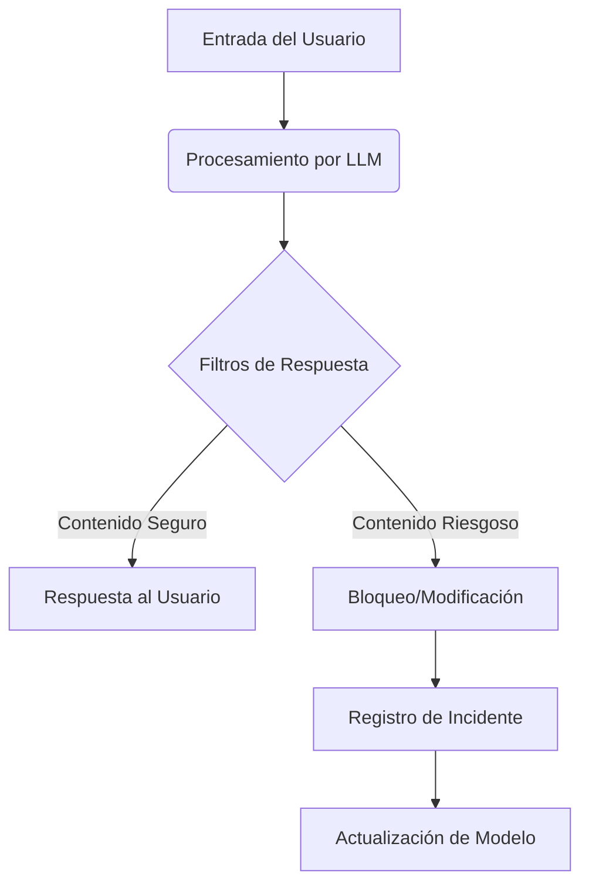
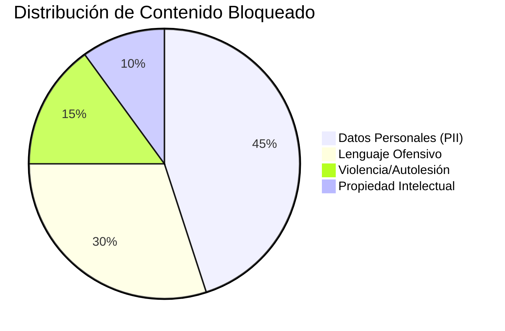
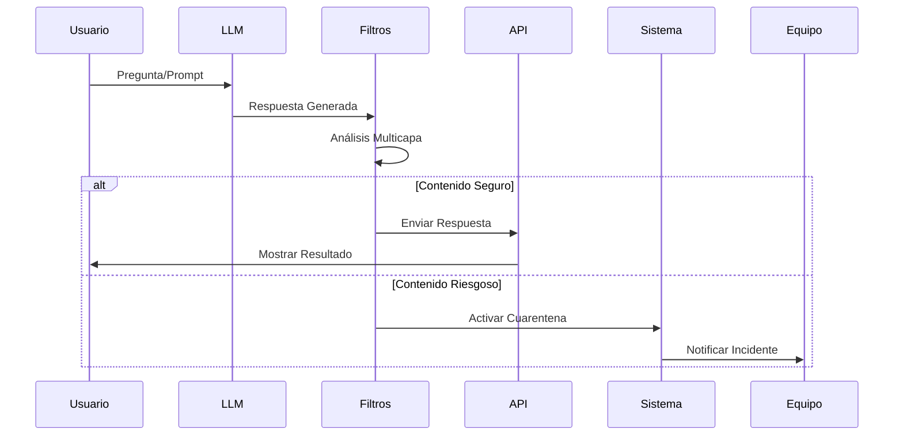
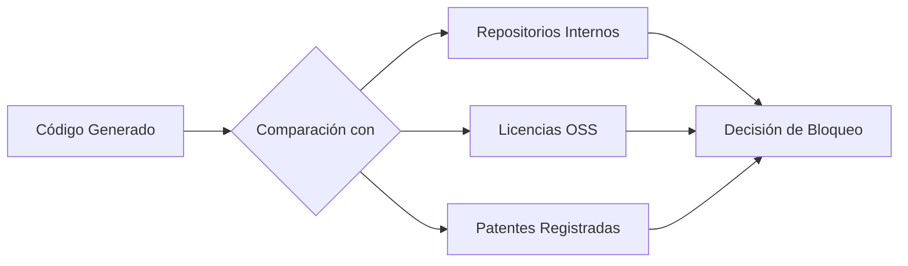
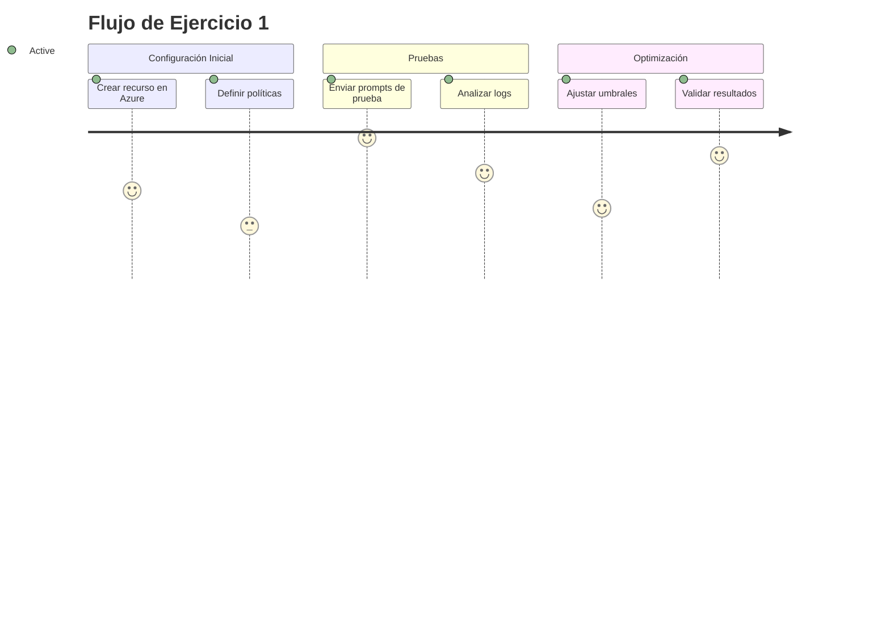
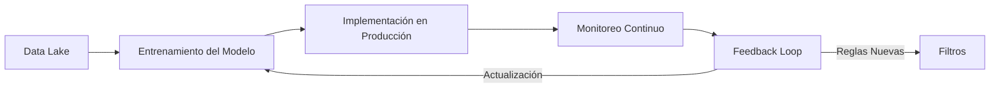
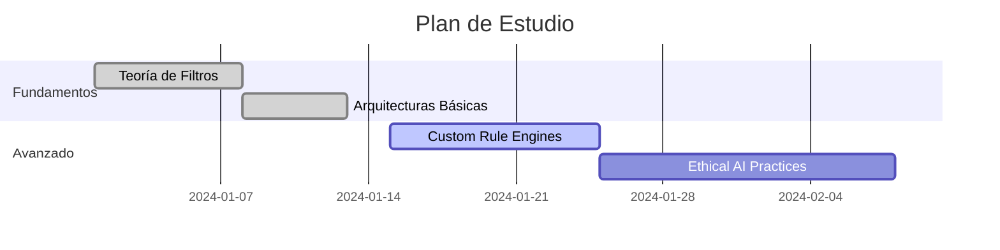

# Daniel Contreras Aladro - Filtros de Respuestas en LLMs



## 1. Fundamentos de los Filtros de Respuesta
### 1.1 ¿Qué son y por qué son esenciales?
Los filtros de respuesta son sistemas de control de calidad para salidas de IA que:
- Previenen fugas de información confidencial
- Mitigan sesgos y contenido ofensivo
- Cumplen regulaciones (GDPR, CCPA)
- Mantienen consistencia en respuestas

**Ejemplo visual**:


### 1.2 Componentes Técnicos Clave
| Componente | Función | Ejemplo |
|------------|---------|---------|
| Moderation API | Clasificación de contenido | OpenAI's text-moderation-latest |
| PII Detection | Detección de datos sensibles | Microsoft Presidio |
| Custom Rules Engine | Reglas de negocio específicas | Regex para números de tarjeta |
| Human-in-the-Loop | Revisión de casos dudosos | Plataformas como Scale AI |

## 2. Arquitectura de Implementación
### 2.1 Flujo de Procesamiento Estándar


### 2.2 Implementación en Azure OpenAI
**Configuración de políticas**:
```python
from azure.ai.contentsafety import ContentSafetyClient

client = ContentSafetyClient(endpoint, credential)
response = client.analyze_text(
    text=user_input,
    categories=["Hate", "Violence", "SelfHarm", "Sexual"],
    severity_levels=[2, 3]  # Medium to High risk
)
```

Parámetros clave:
- `blocklists`: Listas personalizadas de términos prohibidos
- `severity_threshold`: Umbral de bloqueo (0-7)
- `output_type`: `FourSeverityLevels` o `EightSeverityLevels`

## 3. Casos de Uso Avanzados
### 3.1 Protección de Propiedad Intelectual
**Ejemplo en GitHub Copilot**:


### 3.2 Filtrado Contextual en Asistentes Médicos
**Flujo de IBM Watson Health**:
1. Detección de términos médicos
2. Verificación de certificaciones del usuario
3. Consulta a bases de conocimiento aprobadas
4. Aplicación de disclaimer regulatorio

**Ejemplo bloqueado**:
> **Usuario**: ¿Cómo tratar una fractura abierta?
> **Sistema**: [BLOQUEADO] Consulte a un profesional médico certificado

## 4. Ejercicios Prácticos
### 4.1 Laboratorio: Configurar Filtros por Severidad


### 4.2 Análisis de Falsos Positivos
**Dataset de prueba**:
| Texto | Categoría Esperada | Resultado del Filtro |
|-------|--------------------|----------------------|
| "Odio cuando llueve" | Safe | Hate: Medium |
| "Cómo hacer una dieta" | Safe | SelfHarm: Low |
| "Actualizar configuración" | Safe | Violence: High |

**Objetivo**: Identificar 3 patrones de clasificación errónea y proponer reglas de ajuste

## 5. Herramientas y Comparativas
### 5.1 Matriz de Soluciones
| Herramienta | Custom Rules | ML-Based | Soporte Multilenguaje | Latencia |
|-------------|--------------|----------|------------------------|----------|
| Azure Content Safety | ✓ | ✓ | 15 idiomas | <300ms |
| OpenAI Moderation | ✗ | ✓ | 8 idiomas | <500ms |
| AWS Comprehend | ✓ | ✓ | 7 idiomas | <400ms |
| Google Perspective | ✗ | ✓ | 5 idiomas | <600ms |

### 5.2 Integración con MLOps


## 6. Desafíos y Mejoras Continuas
### 6.1 Problemas Comunes
- **Sesgo en clasificaciones**: Ej: Términos médicos detectados como sexuales
- **Evasión de filtros**: Técnicas como:
  - Misspelling (Ej: "v1olenc1a")
  - Metáforas complejas
  - Codificación en otros lenguajes

### 6.2 Estrategias de Mitigación
1. **Aprendizaje Adversario**: Generar ataques sintéticos para entrenamiento
2. **Análisis de Contexto**: Usar embeddings semánticos
3. **Actualización Dinámica**: Sistemas como Security Copilot aprenden de:
   - Reportes de usuarios
   - Tendencias globales de ataques
   - Cambios regulatorios

## 7. Recursos y Próximos Pasos
### 7.1 Kit de Implementación
1. [OpenAI Moderation Playground](https://platform.openai.com/playground/moderation)
2. [PII Detection Toolkit](https://github.com/microsoft/presidio)

### 7.2 Referencias Adicionales
1. [Protecto - Filtros de Privacidad de IA](https://www.protecto.ai/ai-privacy-filters)
2. [Documentación de Seguridad de Microsoft Copilot](https://learn.microsoft.com/en-us/microsoft-copilot/security)
3. [Investigación de Moderación de Contenido de OpenAI](https://openai.com/research)

### 7.3 Roadmap de Aprendizaje
