# Curso: Generación de Datos Sintéticos y su Aplicación en el Entrenamiento de Modelos LLM para IA

## Índice

1. [Introducción al Curso](#1-introducción-al-curso)
    1. [Objetivos del curso](#11-objetivos-del-curso)
    2. [Audiencia objetivo](#12-audiencia-objetivo)
    3. [Prerrequisitos](#13-prerrequisitos)
2. [Conceptos Fundamentales](#2-conceptos-fundamentales)
   1. [¿Qué son los Datos Sintéticos?](#21-qué-son-los-datos-sintéticos)
   2. [Importancia de los Datos Sintéticos en la IA](#22-importancia-de-los-datos-sintéticos-en-la-ia)
   3. [Desafíos en la Recolección de Datos Reales](#23-desafíos-en-la-recolección-de-datos-reales)
3. [Generación de Datos Sintéticos](#3-generación-de-datos-sintéticos)
   1. [Métodos de Generación de Datos Sintéticos](#31-métodos-de-generación-de-datos-sintéticos)
      1. [Modelos Basados en Regla](#311-modelos-basados-en-regla)
      2. [Modelos Estadísticos](#312-modelos-estadísticos)
      3. [Redes Generativas Antagónicas (GANs)](#313-redes-generativas-antagónicas-gans)
      4. [Variational Autoencoders (VAEs)](#314-variational-autoencoders-vaes)
   2. [Herramientas y Bibliotecas Populares](#32-herramientas-y-bibliotecas-populares)
      1. [SDV (Synthetic Data Vault)](#321-sdv-synthetic-data-vault)
      2. [CTGAN](#322-ctgan)
      3. [DataSynthesizer](#323-datasynthesizer)
      4. [Otros Frameworks y Herramientas](#324-otros-frameworks-y-herramientas)
4. [Privacidad y Ética en la Generación de Datos Sintéticos](#4-privacidad-y-ética-en-la-generación-de-datos-sintéticos)
   1. [Preservación de la Privacidad](#41-preservación-de-la-privacidad)
   2. [Privacidad Diferencial](#42-privacidad-diferencial)
   3. [Consideraciones Éticas](#43-consideraciones-éticas)
   4. [Cumplimiento con Normativas de Protección de Datos](#44-cumplimiento-con-normativas-de-protección-de-datos)
5. [Entrenamiento de Modelos LLM con Datos Sintéticos](#5-entrenamiento-de-modelos-llm-con-datos-sintéticos)
   1. [Beneficios y Limitaciones del Uso de Datos Sintéticos](#51-beneficios-y-limitaciones-del-uso-de-datos-sintéticos)
   2. [Comparación con Datos Reales](#52-comparación-con-datos-reales)
   3. [Implementación en Modelos LLM](#53-implementación-en-modelos-llm)
      1. [Preprocesamiento de Datos Sintéticos](#531-preprocesamiento-de-datos-sintéticos)
      2. [Entrenamiento y Ajuste de Modelos](#532-entrenamiento-y-ajuste-de-modelos)
      3. [Validación y Evaluación del Modelo](#533-validación-y-evaluación-del-modelo)
6. [Casos de Estudio y Aplicaciones Prácticas](#6-casos-de-estudio-y-aplicaciones-prácticas)
   1. [Caso de Estudio 1: Generación de Datos Sintéticos para Diagnósticos Médicos](#61-caso-de-estudio-1-generación-de-datos-sintéticos-para-diagnósticos-médicos)
   2. [Caso de Estudio 2: Mejorando la Privacidad en Modelos Financieros](#62-caso-de-estudio-2-mejorando-la-privacidad-en-modelos-financieros)
   3. [Caso de Estudio 3: Datos Sintéticos en Procesamiento de Lenguaje Natural (NLP)](#63-caso-de-estudio-3-datos-sintéticos-en-procesamiento-de-lenguaje-natural-nlp)
7. [Herramientas y Frameworks para Implementación](#7-herramientas-y-frameworks-para-implementación)
   1. [Entornos de Desarrollo](#71-entornos-de-desarrollo)
   2. [Integración con Infraestructuras de Datos](#72-integración-con-infraestructuras-de-datos)
   3. [Automatización y MLOps](#73-automatización-y-mlops)
8. [Prácticas de Seguridad en la Gestión de Datos Sintéticos](#8-prácticas-de-seguridad-en-la-gestión-de-datos-sintéticos)
   1. [Seguridad en el Almacenamiento y Procesamiento](#81-seguridad-en-el-almacenamiento-y-procesamiento)
   2. [Mitigación de Riesgos](#82-mitigación-de-riesgos)
   3. [Auditoría y Monitoreo](#83-auditoría-y-monitoreo)
9. [Proyecto Final](#9-proyecto-final)
   1. [Descripción del Proyecto](#91-descripción-del-proyecto)
   2. [Requerimientos Técnicos](#92-requerimientos-técnicos)
   3. [Evaluación y Presentación](#93-evaluación-y-presentación)
10. [Recursos Adicionales y Lecturas Recomendadas](#10-recursos-adicionales-y-lecturas-recomendadas)
    1. [Libros Recomendados](#101-libros-recomendados)
    2. [Artículos y Publicaciones Académicas](#102-artículos-y-publicaciones-académicas)
    3. [Herramientas y Recursos en Línea](#101-herramientas-y-recursos-en-línea)

# 1. Introducción al Curso

¡Bienvenidos al curso sobre **Generación de Datos Sintéticos y su Aplicación en el Entrenamiento de Modelos LLM para IA**! En esta introducción, te explicaremos qué aprenderás en este curso, a quién está dirigido, y qué conocimientos previos se recomiendan. ¡Empecemos!

## 1.1 Objetivos del Curso

El objetivo principal de este curso es que aprendas a generar datos sintéticos, es decir, datos que no provienen del mundo real, sino que son creados artificialmente mediante diversas técnicas. Además, aprenderás cómo estos datos pueden ser utilizados para entrenar **Modelos de Lenguaje a Gran Escala (LLMs)**, que son modelos de inteligencia artificial capaces de comprender y generar texto en lenguaje natural.

Al final del curso, podrás:

- **Entender** qué son los datos sintéticos y por qué son importantes en el campo de la inteligencia artificial.
- **Conocer** las diferentes técnicas para generar datos sintéticos.
- **Aplicar** estos datos en el entrenamiento de modelos LLM, mejorando la capacidad de la inteligencia artificial para trabajar con grandes volúmenes de información.
- **Considerar** aspectos éticos y de privacidad al trabajar con datos sintéticos.

## 1.2 Audiencia Objetivo

Este curso está diseñado para:

- **Estudiantes** y **profesionales** de la informática, ciencia de datos, y campos relacionados que desean aprender más sobre datos sintéticos y su aplicación en IA.
- **Desarrolladores** que buscan mejorar sus habilidades en la generación de datos para el entrenamiento de modelos de IA.
- **Científicos de datos** que quieren explorar nuevas técnicas para mejorar el rendimiento de sus modelos.
- **Personas interesadas en IA**, aunque no tengan un conocimiento profundo previo sobre LLMs o datos sintéticos.

No necesitas ser un experto en modelos de lenguaje o en inteligencia artificial para tomar este curso. Explicaremos los conceptos desde lo más básico hasta los detalles más técnicos, asegurándonos de que todo sea comprensible.

## 1.3 Prerrequisitos

Aunque no es necesario tener conocimientos avanzados en IA, es recomendable que tengas una comprensión básica de los siguientes temas:

- **Programación básica**: Saber cómo escribir y ejecutar código, preferiblemente en Python.
- **Fundamentos de inteligencia artificial**: Entender conceptos básicos como lo que es un modelo de IA y cómo se entrena.
- **Manipulación de datos**: Familiaridad con la manipulación de datos en tablas o conjuntos de datos (por ejemplo, usando Pandas en Python).

Si no tienes experiencia en alguno de estos temas, ¡no te preocupes! A lo largo del curso, incluiremos recursos y explicaciones adicionales para ayudarte a ponerte al día.

### Diagrama: Visión General del Curso

Aquí tienes una visión general de cómo se organiza el curso:

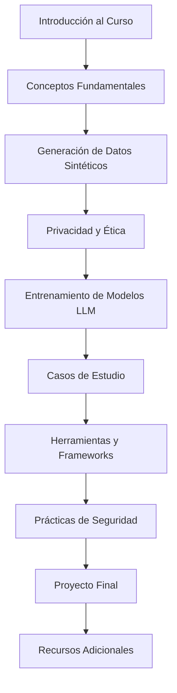

# 2. Conceptos Fundamentales

En esta sección, vamos a explorar los conceptos básicos que necesitas comprender antes de sumergirte en la generación de datos sintéticos y su aplicación en modelos de lenguaje a gran escala (LLMs). Esta sección se divide en tres partes clave: qué son los datos sintéticos, por qué son importantes para la inteligencia artificial, y los desafíos asociados a la recolección de datos reales.

## 2.1 ¿Qué son los Datos Sintéticos?

### Definición y Características

Los **datos sintéticos** son datos que se generan de manera artificial en lugar de ser capturados directamente del mundo real. Estos datos pueden parecerse mucho a los datos reales, pero no representan ninguna entidad o suceso real.

Imagina que tienes un conjunto de datos con la edad y el salario de muchas personas. Si creas un nuevo conjunto de datos con edades y salarios que parecen reales pero que fueron generados por un programa de computadora, estás creando datos sintéticos.

### Diferencias con Datos Reales

A continuación, se presentan algunas diferencias clave entre los datos reales y los sintéticos:

- **Origen**: Los datos reales provienen de observaciones o mediciones del mundo real, mientras que los datos sintéticos son generados por algoritmos y reglas predefinidas.
- **Privacidad**: Los datos reales pueden contener información sensible, mientras que los datos sintéticos, al no estar basados en personas reales, ayudan a preservar la privacidad.
- **Control**: Con datos sintéticos, puedes controlar exactamente qué tipo de datos se generan, lo que es útil para probar situaciones específicas que pueden ser raras en los datos reales.

### Diagrama: Comparación entre Datos Reales y Sintéticos

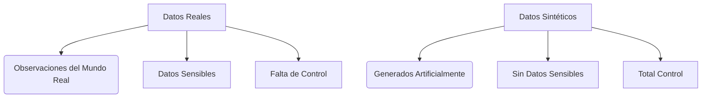

## 2.2 Importancia de los Datos Sintéticos en la IA

### Aplicaciones Clave

Los datos sintéticos son especialmente valiosos en el desarrollo de inteligencia artificial (IA) por varias razones:

1. **Entrenamiento de Modelos**: Los modelos de IA, como los modelos de lenguaje a gran escala (LLMs), necesitan grandes cantidades de datos para aprender. A veces, obtener suficientes datos reales es difícil o costoso, y aquí es donde los datos sintéticos pueden ayudar.
   
2. **Pruebas y Validación**: Los datos sintéticos permiten a los desarrolladores probar sus modelos en diferentes escenarios antes de usarlos con datos reales, ayudando a mejorar la robustez del modelo.

3. **Privacidad y Seguridad**: Cuando los datos reales no se pueden compartir debido a regulaciones de privacidad, los datos sintéticos ofrecen una alternativa segura para entrenar y probar modelos sin comprometer la privacidad de los individuos.

### Ventajas en el Desarrollo de IA

A continuación, se enumeran algunas de las ventajas clave de utilizar datos sintéticos en el desarrollo de inteligencia artificial:

- **Escalabilidad**: Puedes generar tantos datos como necesites, lo que es ideal para entrenar modelos grandes.
- **Variedad**: Puedes crear datos con diferentes características para asegurarte de que tu modelo pueda manejar una amplia gama de situaciones.
- **Reducción de Sesgos**: Al generar datos, puedes introducir variaciones deliberadas para reducir sesgos presentes en los datos reales.

### Diagrama: Importancia de los Datos Sintéticos en la IA

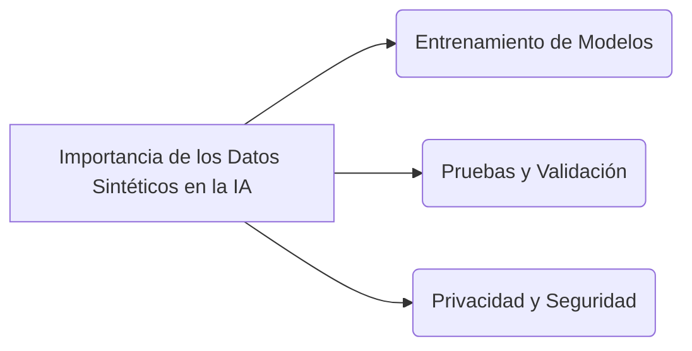

## 2.3 Desafíos en la Recolección de Datos Reales

Aunque los datos reales son esenciales, hay varios desafíos asociados con su recolección:

### Costos y Limitaciones

- **Costos Altos**: Recolectar, limpiar y almacenar grandes volúmenes de datos reales puede ser costoso.
- **Acceso Limitado**: No siempre es fácil acceder a los datos que se necesitan, especialmente si son datos sensibles o privados.
- **Tiempo**: La recolección de datos reales puede llevar mucho tiempo, lo que retrasa el desarrollo de modelos de IA.

### Problemas de Privacidad

Uno de los mayores problemas al trabajar con datos reales es la **privacidad**. Muchas veces, los datos contienen información sensible, como nombres, direcciones o números de identificación, que no pueden compartirse libremente debido a regulaciones como el GDPR en Europa o el CCPA en California. Esto limita el uso de estos datos para entrenar modelos de IA.

### Diagrama: Desafíos en la Recolección de Datos Reales

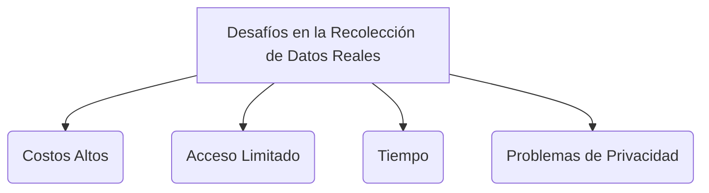

## Resumen de la Sección

En resumen, los datos sintéticos son una herramienta poderosa en el desarrollo de inteligencia artificial. Nos permiten entrenar y probar modelos con grandes volúmenes de datos mientras preservamos la privacidad y reducimos los costos. Sin embargo, es importante entender las diferencias entre los datos sintéticos y los reales, y estar al tanto de los desafíos asociados con la recolección de datos del mundo real. Con estos conceptos fundamentales claros, estarás listo para profundizar en las técnicas de generación de datos sintéticos y su aplicación en el entrenamiento de modelos LLM.

¡Vamos al siguiente paso!

# 3. Generación de Datos Sintéticos

En esta sección, profundizaremos en cómo se generan los datos sintéticos, los diferentes métodos que se pueden utilizar, y las herramientas y bibliotecas más populares que facilitan este proceso. Al final de esta sección, tendrás una comprensión clara de cómo crear datos sintéticos y cómo puedes utilizarlos en diferentes aplicaciones.

## 3.1 Métodos de Generación de Datos Sintéticos

Existen varias técnicas para generar datos sintéticos. A continuación, exploramos cuatro de los métodos más comunes: modelos basados en reglas, modelos estadísticos, redes generativas antagónicas (GANs), y autoencoders variacionales (VAEs).

### 3.1.1 Modelos Basados en Regla

**Descripción y Ejemplos**

Los modelos basados en reglas generan datos sintéticos siguiendo un conjunto de reglas predefinidas. Estas reglas están diseñadas para simular patrones específicos que se observan en datos reales.

Imagina que quieres generar datos de clientes, como su edad, salario, y profesión. Puedes crear reglas simples, como:

- Las edades deben estar entre 18 y 70 años.
- Los salarios deben estar entre $20,000 y $150,000.
- La profesión puede ser "Ingeniero", "Profesor", "Médico", etc.

Con estas reglas, un programa puede generar un conjunto de datos que cumple con estos criterios.

**Ventajas y Desventajas**

- **Ventajas**: Simplicidad, control total sobre las reglas.
- **Desventajas**: Puede ser difícil capturar patrones complejos o correlaciones presentes en datos reales.

### 3.1.2 Modelos Estadísticos

**Introducción y Técnicas**

Los modelos estadísticos utilizan distribuciones matemáticas para generar datos que imitan la distribución de los datos reales. Por ejemplo, si sabes que los ingresos de una población siguen una distribución normal (campana de Gauss), puedes usar esa distribución para generar nuevos ingresos sintéticos que sigan el mismo patrón.

**Ejemplo:**

Supongamos que conoces la media y la desviación estándar de los ingresos en una población. Usando estas estadísticas, puedes generar nuevos ingresos sintéticos que se distribuyen de manera similar a los ingresos reales.

**Ventajas y Desventajas**

- **Ventajas**: Captura bien las propiedades estadísticas de los datos reales.
- **Desventajas**: Puede no capturar patrones más complejos o dependencias entre múltiples variables.

### 3.1.3 Redes Generativas Antagónicas (GANs)

**Funcionamiento y Casos de Uso**

Las **Redes Generativas Antagónicas (GANs)** son un enfoque más avanzado y poderoso para generar datos sintéticos. Una GAN consiste en dos redes neuronales que compiten entre sí:

1. **Generador**: Crea datos sintéticos.
2. **Discriminador**: Evalúa si los datos generados son reales o sintéticos.

Estas dos redes se entrenan juntas. El generador intenta crear datos que engañen al discriminador, mientras que el discriminador mejora para identificar los datos falsos. Este proceso iterativo resulta en un generador que produce datos sintéticos muy realistas.

**Ejemplo de Aplicación:**

Las GANs se utilizan mucho en la generación de imágenes sintéticas, como rostros humanos que no existen en la realidad pero que parecen muy reales.

**Ventajas y Desventajas**

- **Ventajas**: Capacidad para generar datos sintéticos muy realistas, especialmente útil en imágenes y audio.
- **Desventajas**: Requiere mucho poder computacional y tiempo para entrenar, y puede ser difícil de implementar correctamente.

### 3.1.4 Variational Autoencoders (VAEs)

**Concepto y Aplicaciones**

Los **Autoencoders Variacionales (VAEs)** son otro tipo de red neuronal que se utiliza para generar datos sintéticos. Un VAE consiste en dos partes:

1. **Codificador**: Convierte los datos de entrada en una representación comprimida (latente).
2. **Decodificador**: Toma la representación latente y genera datos sintéticos similares a los datos de entrada.

A diferencia de un autoencoder normal, un VAE introduce un componente aleatorio que permite generar nuevas variantes de los datos de entrada, no solo réplicas exactas.

**Ejemplo de Aplicación:**

Los VAEs se utilizan para generar nuevas imágenes basadas en un conjunto de imágenes existentes, como generar nuevas versiones de fotos de paisajes.

**Ventajas y Desventajas**

- **Ventajas**: Buena para capturar la variabilidad en los datos, útil para generar variaciones de un conjunto de datos.
- **Desventajas**: Menos realista en algunos casos que las GANs, y requiere un conocimiento técnico más avanzado para implementarse.

### Diagrama: Comparación de Métodos de Generación de Datos Sintéticos

```mermaid
graph TB;
    A[Métodos de Generación de Datos Sintéticos] --> B[Modelos Basados en Regla]
    A --> C[Modelos Estadísticos]
    A --> D[Redes Generativas Antagónicas &#40;GANs&#41;]
    A --> E[Variational Autoencoders &#40;VAEs&#41;]
    B --> F(Simplicidad)
    B --> G(Control total)
    C --> H(Captura propiedades estadísticas)
    C --> I(Limitaciones en patrones complejos)
    D --> J(Generación de datos realistas)
    D --> K(Requiere poder computacional)
    E --> L(Buena captura de variabilidad)
    E --> M(Menos realismo que GANs)
```

## 3.2 Herramientas y Bibliotecas Populares

Hay varias herramientas y bibliotecas que te pueden ayudar a generar datos sintéticos de manera eficiente. Aquí te presentamos algunas de las más populares:

### 3.2.1 SDV (Synthetic Data Vault)

**Introducción y Características Principales**

**SDV** es una biblioteca de Python diseñada para la generación de datos sintéticos. Ofrece varios modelos, incluyendo GANs y modelos probabilísticos, para crear datos sintéticos que imitan los datos reales.

**Características:**

- Fácil de usar con conjuntos de datos tabulares.
- Soporta la generación de datos sintéticos basados en varias técnicas avanzadas.
- Incluye herramientas para evaluar la calidad de los datos sintéticos generados.

### 3.2.2 CTGAN

**Descripción y Ventajas**

**CTGAN** es una herramienta específica basada en GANs para generar datos tabulares. Es particularmente útil cuando los datos tienen características que son difíciles de modelar, como variables categóricas con muchas clases.

**Características:**

- Excelente para manejar datos tabulares complejos.
- Diseñado para capturar mejor la distribución de los datos reales en comparación con otros métodos.

### 3.2.3 DataSynthesizer

**Funcionalidades y Usos**

**DataSynthesizer** es otra herramienta popular para la generación de datos sintéticos, especialmente diseñada para proteger la privacidad. Implementa técnicas de privacidad diferencial para asegurar que los datos generados no revelen información sensible.

**Características:**

- Enfoque en la privacidad y protección de datos.
- Fácil de usar para generar datos sintéticos a partir de datos tabulares.

### 3.2.4 Otros Frameworks y Herramientas

**Breve Descripción de Herramientas Adicionales**

Además de las herramientas mencionadas, existen otros frameworks y bibliotecas que puedes explorar:

- **scikit-learn**: Incluye algunos métodos básicos para la generación de datos sintéticos, como la generación de datos para pruebas de clasificación y regresión.
- **TensorFlow** y **PyTorch**: Aunque son frameworks de machine learning, puedes usarlos para implementar GANs y VAEs personalizados.
- **Faker**: Una biblioteca para generar datos sintéticos simples como nombres, direcciones y correos electrónicos, muy útil para pruebas rápidas.

### Diagrama: Herramientas Populares para la Generación de Datos Sintéticos

```mermaid
graph LR
    A[Herramientas Populares] --> B[SDV &#40;Synthetic Data Vault&#41;]
    A --> C[CTGAN]
    A --> D[DataSynthesizer]
    A --> E[Otros: scikit-learn, TensorFlow, PyTorch, Faker]
```

## Resumen de la Sección

En esta sección, hemos cubierto las principales técnicas y herramientas para la generación de datos sintéticos. Ya sea que uses métodos basados en reglas simples o técnicas avanzadas como GANs, la generación de datos sintéticos ofrece una forma poderosa de entrenar y probar modelos de inteligencia artificial sin necesidad de depender exclusivamente de datos reales.

Las herramientas como SDV, CTGAN y DataSynthesizer simplifican mucho este proceso, permitiéndote centrarte en mejorar tus modelos y no en los detalles de cómo crear los datos. Al avanzar en el curso, aprenderás a aplicar estas técnicas en proyectos reales, aprovechando todo el potencial de los datos sintéticos.

¡Estás un paso más cerca de convertirte en un experto en la generación de datos sintéticos!

# 4. Privacidad y Ética en la Generación de Datos Sintéticos

La generación de datos sintéticos no solo es una herramienta poderosa, sino también una responsabilidad. Al trabajar con datos, especialmente cuando contienen información sensible, es crucial entender las implicaciones de privacidad y ética. En esta sección, exploraremos cómo preservar la privacidad, el concepto de privacidad diferencial, las consideraciones éticas y el cumplimiento con normativas de protección de datos.

## 4.1 Preservación de la Privacidad

### Técnicas y Mejores Prácticas

Cuando se generan datos sintéticos, es esencial garantizar que los datos originales no puedan ser reconstruidos o identificados. Aquí te presentamos algunas técnicas y mejores prácticas para preservar la privacidad:

- **Anonimización**: Antes de generar datos sintéticos, se eliminan o enmascaran los identificadores personales (como nombres, direcciones, números de identificación) de los datos originales.
  
- **Generalización**: Agrupa datos en categorías más amplias para evitar que se puedan identificar individuos. Por ejemplo, en lugar de almacenar la edad exacta de una persona, puedes agruparla en un rango de edades como "30-40 años".

- **Agregar Ruido**: Añadir pequeñas variaciones aleatorias (ruido) a los datos sintéticos para hacer más difícil identificar información precisa de una persona.

### Diagrama: Técnicas de Preservación de la Privacidad

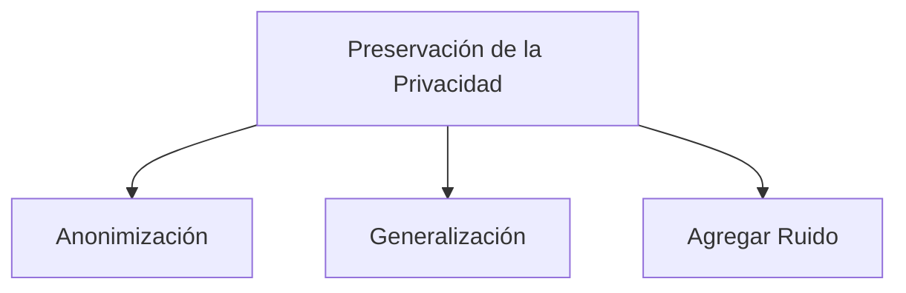

Estas técnicas ayudan a asegurar que, aunque los datos sintéticos se parezcan a los reales, no puedan ser usados para identificar a individuos específicos.

## 4.2 Privacidad Diferencial

### Conceptos y Aplicaciones en Datos Sintéticos

**Privacidad diferencial** es un enfoque matemático que busca asegurar que la salida de un análisis o un conjunto de datos sintéticos no revele información sobre individuos específicos.

Imagina que tienes un conjunto de datos con información sensible. La privacidad diferencial permite añadir suficiente ruido a los datos para que los análisis hechos sobre los datos sintéticos sean precisos en general, pero sin comprometer la privacidad de ninguna persona en particular.

**Cómo Funciona:**

- **Mecanismo de Ruido**: Se agrega ruido calculado matemáticamente a los resultados o datos, lo que hace improbable deducir información sobre un individuo específico.

- **Garantía de Privacidad**: La privacidad diferencial garantiza que si alguien intentara deducir información de un individuo específico, los resultados no serían confiables.

### Ejemplo de Uso

Supongamos que estás generando datos sintéticos sobre la salud de una población. Con la privacidad diferencial, puedes asegurarte de que nadie pueda identificar si una persona específica tiene o no una enfermedad, incluso si conocen algo sobre esa persona.

### Diagrama: Privacidad Diferencial

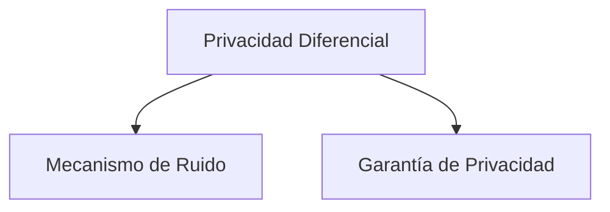

## 4.3 Consideraciones Éticas

### Principios Éticos y Dilemas

Cuando trabajamos con datos, siempre debemos tener en cuenta principios éticos, especialmente cuando los datos sintéticos se derivan de datos reales:

- **Justicia**: Asegúrate de que los datos sintéticos no introduzcan sesgos que puedan afectar negativamente a ciertos grupos de personas. Por ejemplo, si los datos originales tienen un sesgo racial o de género, los datos sintéticos no deberían perpetuar o amplificar ese sesgo.

- **Transparencia**: Debes ser transparente sobre cómo se generaron los datos sintéticos y cómo se utilizan. Esto es crucial para mantener la confianza de quienes confían en los análisis basados en esos datos.

- **Consentimiento**: Siempre que sea posible, debes obtener el consentimiento de las personas cuyos datos fueron utilizados para generar los datos sintéticos, especialmente si los datos originales contenían información sensible.

### Diagrama: Principios Éticos en la Generación de Datos Sintéticos

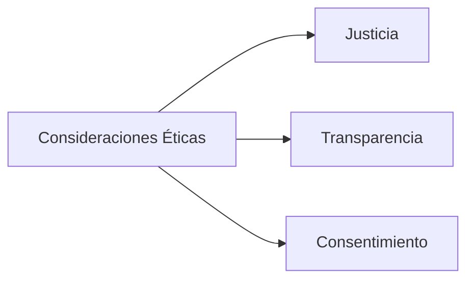

### Dilemas Éticos

- **Uso Inapropiado de Datos**: Aunque los datos sintéticos están diseñados para proteger la privacidad, podrían ser mal utilizados para intentar inferir información sobre grupos específicos, lo que plantea dilemas éticos sobre su uso.
  
- **Generación de Contenidos Engañosos**: Existen preocupaciones sobre la generación de datos sintéticos que puedan ser utilizados para crear información falsa o engañosa, como en la creación de deepfakes.

## 4.4 Cumplimiento con Normativas de Protección de Datos

### GDPR, CCPA y Otras Regulaciones

Las normativas de protección de datos, como el **Reglamento General de Protección de Datos (GDPR)** en Europa y la **Ley de Privacidad del Consumidor de California (CCPA)** en Estados Unidos, establecen reglas estrictas sobre cómo se deben manejar los datos personales. Aquí te explicamos cómo estas leyes afectan la generación de datos sintéticos:

- **GDPR**: Establece que cualquier tratamiento de datos personales debe ser legítimo y proteger la privacidad de los individuos. Los datos sintéticos que se generan a partir de datos personales deben cumplir con estas normativas para asegurarse de que no se pueda identificar a una persona a partir de los datos generados.

- **CCPA**: Similar al GDPR, el CCPA otorga a los consumidores el derecho a saber qué datos personales se recopilan sobre ellos y cómo se utilizan. Al generar datos sintéticos en California, debes asegurarte de que estos datos no infringen los derechos de privacidad establecidos por la ley.

### Buenas Prácticas para el Cumplimiento

- **Documentación**: Mantén una documentación clara sobre cómo se generan los datos sintéticos y cómo se asegura la privacidad.
  
- **Auditorías**: Realiza auditorías periódicas para verificar que los datos sintéticos cumplen con las normativas de privacidad.

- **Consentimiento Informado**: Siempre que sea posible, informa y solicita el consentimiento de los individuos antes de utilizar sus datos para generar datos sintéticos.

### Diagrama: Cumplimiento con Normativas

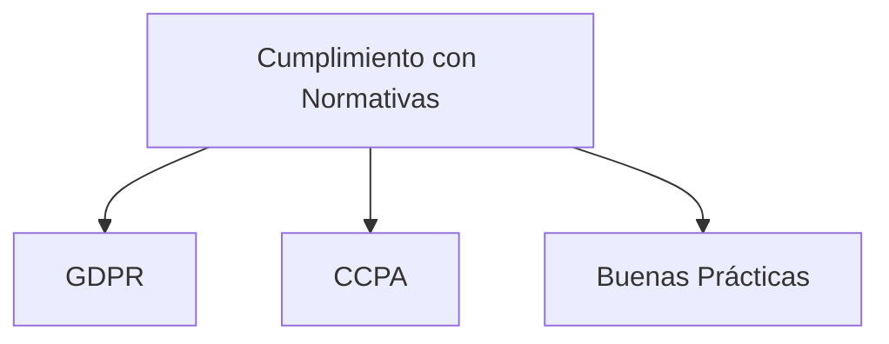

## Resumen de la Sección

En esta sección, hemos cubierto los aspectos cruciales de privacidad y ética al trabajar con datos sintéticos. Desde las técnicas para preservar la privacidad hasta la comprensión de la privacidad diferencial, hemos visto cómo proteger la información sensible mientras se generan datos útiles para la inteligencia artificial. También hemos abordado las consideraciones éticas y el cumplimiento de normativas como el GDPR y el CCPA, que son esenciales para asegurarnos de que los datos sintéticos se utilizan de manera responsable.

Al comprender y aplicar estos principios, puedes generar datos sintéticos que no solo sean útiles, sino también éticos y seguros, respetando la privacidad y los derechos de las personas.

¡Sigamos adelante con el próximo tema del curso!

# 5. Entrenamiento de Modelos LLM con Datos Sintéticos

En esta sección, exploraremos cómo los datos sintéticos pueden ser utilizados para entrenar **Modelos de Lenguaje a Gran Escala (LLMs)**. Veremos los beneficios y limitaciones de usar datos sintéticos, compararemos estos datos con los reales y aprenderemos cómo implementar estos datos en el entrenamiento de modelos LLM. También cubriremos el preprocesamiento, el entrenamiento y la evaluación de estos modelos.

## 5.1 Beneficios y Limitaciones del Uso de Datos Sintéticos

### Beneficios

El uso de datos sintéticos para entrenar modelos LLM ofrece varias ventajas importantes:

- **Acceso a Grandes Volúmenes de Datos**: Los modelos LLM requieren una enorme cantidad de datos para entrenarse eficazmente. Los datos sintéticos permiten generar grandes volúmenes de datos de manera rápida y económica, lo cual sería costoso o difícil de obtener si solo se usaran datos reales.

- **Protección de la Privacidad**: Cuando se trabaja con datos sensibles (como datos médicos o financieros), los datos sintéticos son una excelente manera de preservar la privacidad de los individuos, ya que no contienen información real pero aún así pueden imitar las características esenciales de los datos reales.

- **Flexibilidad y Control**: Con datos sintéticos, tienes el control total sobre los tipos de datos que generas. Esto es útil para crear escenarios específicos que podrían ser raros o inexistentes en los datos reales, lo que ayuda a que el modelo LLM sea más robusto.

- **Mitigación de Sesgos**: Los datos sintéticos pueden ayudar a corregir sesgos en los datos reales. Por ejemplo, si tus datos reales tienen un sesgo de género, puedes generar datos sintéticos equilibrados para compensar ese sesgo.

### Limitaciones

Sin embargo, el uso de datos sintéticos también tiene algunas limitaciones:

- **Calidad del Modelo**: Si los datos sintéticos no se generan adecuadamente, pueden introducir errores o sesgos en el modelo LLM. La calidad de los datos sintéticos es crucial para obtener buenos resultados.

- **Falta de Realismo Completo**: Aunque los datos sintéticos pueden imitar bien los datos reales, no siempre capturan todas las complejidades del mundo real. Esto puede limitar la capacidad del modelo para generalizar bien en situaciones del mundo real.

- **Necesidad de Conocimiento Técnico**: Generar datos sintéticos de alta calidad puede requerir un conocimiento técnico avanzado, especialmente cuando se utilizan técnicas complejas como GANs o VAEs.

### Diagrama: Beneficios y Limitaciones de los Datos Sintéticos

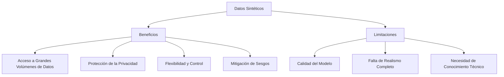

## 5.2 Comparación con Datos Reales

### Calidad y Representatividad

Los datos reales tienen la ventaja de representar con precisión el mundo real, lo que es crucial para entrenar modelos LLM que se usarán en aplicaciones prácticas. Sin embargo, los datos reales pueden estar limitados en cantidad y pueden contener sesgos o información sensible.

Por otro lado, los datos sintéticos, aunque más fáciles de obtener y más seguros, pueden no capturar todos los matices de los datos reales. La clave es equilibrar el uso de ambos tipos de datos para obtener un modelo LLM robusto y fiable.

### Casos en los que los Datos Sintéticos son Preferibles

- **Protección de la Privacidad**: En casos donde la privacidad es una preocupación importante, los datos sintéticos son preferibles.
- **Escenarios de Prueba**: Para probar modelos en situaciones raras o extremas que no están bien representadas en los datos reales.
- **Complemento de Datos Reales**: Cuando los datos reales son insuficientes, los datos sintéticos pueden complementar para mejorar el entrenamiento del modelo.

### Diagrama: Comparación entre Datos Reales y Sintéticos

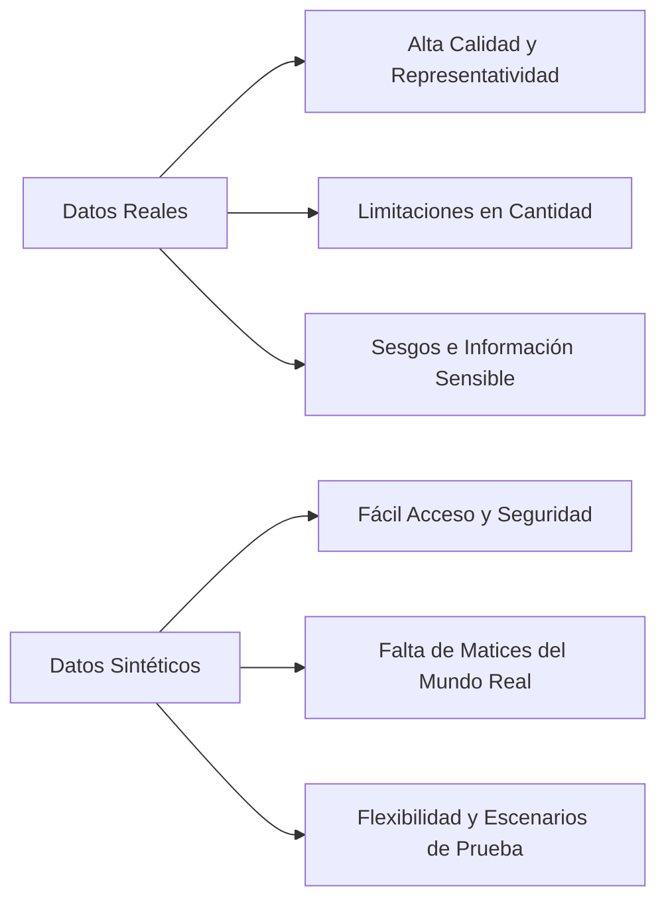

## 5.3 Implementación en Modelos LLM

### 5.3.1 Preprocesamiento de Datos Sintéticos

Antes de usar datos sintéticos para entrenar un modelo LLM, es importante preprocesarlos de manera adecuada. El preprocesamiento incluye las siguientes etapas:

- **Limpieza de Datos**: Asegúrate de que los datos sintéticos no contengan errores o inconsistencias que puedan afectar el rendimiento del modelo.
  
- **Estandarización**: Normaliza los datos para que sigan un formato coherente. Esto incluye asegurar que todas las variables estén en las mismas unidades y rangos.

- **Ajuste de la Varianza**: Si los datos sintéticos no tienen suficiente variabilidad, es posible que debas introducir variaciones adicionales para evitar que el modelo se sobreajuste a patrones demasiado específicos.

### 5.3.2 Entrenamiento y Ajuste de Modelos

Una vez que los datos sintéticos han sido preprocesados, puedes usarlos para entrenar el modelo LLM. Aquí hay algunos pasos clave en este proceso:

- **División de Datos**: Divide los datos sintéticos en conjuntos de entrenamiento, validación y prueba. Esto te permitirá evaluar el rendimiento del modelo en datos que no ha visto antes.

- **Entrenamiento Inicial**: Comienza entrenando el modelo en el conjunto de datos sintéticos. Este proceso puede ser iterativo, ajustando hiperparámetros como la tasa de aprendizaje o el tamaño del lote para mejorar el rendimiento.

- **Ajuste Fino con Datos Reales**: Una estrategia común es entrenar inicialmente con datos sintéticos y luego hacer un ajuste fino (fine-tuning) con un conjunto más pequeño de datos reales. Esto combina los beneficios de ambos tipos de datos.

### 5.3.3 Validación y Evaluación del Modelo

Después del entrenamiento, es crucial validar y evaluar el modelo para asegurarse de que funcione bien en datos reales. Aquí te mostramos cómo hacerlo:

- **Evaluación en Datos Sintéticos**: Primero, evalúa el modelo en un conjunto de datos sintéticos que no se utilizó durante el entrenamiento. Esto te dará una idea inicial de su rendimiento.

- **Evaluación en Datos Reales**: Luego, prueba el modelo en datos reales para ver cómo se comporta en situaciones del mundo real. Esto es crucial para asegurarte de que el modelo no solo funcione bien en datos sintéticos, sino que también sea útil en la práctica.

- **Métricas de Evaluación**: Utiliza métricas como la precisión, la exactitud, la recuperación y la puntuación F1 para evaluar el rendimiento del modelo. Estas métricas te ayudarán a identificar áreas en las que el modelo necesita mejoras.

### Diagrama: Proceso de Entrenamiento y Validación de un Modelo LLM con Datos Sintéticos

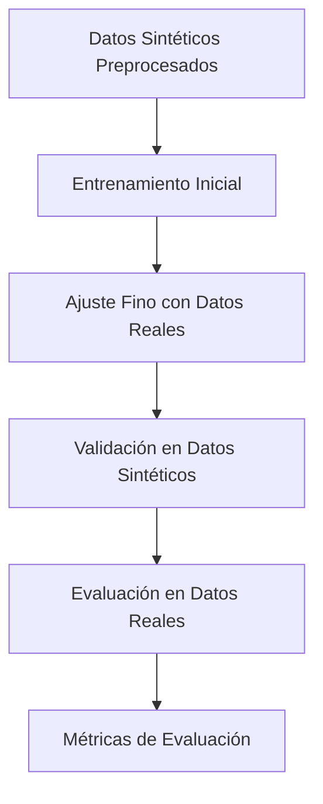

## Resumen de la Sección

En esta sección, hemos cubierto cómo los datos sintéticos pueden ser utilizados para entrenar Modelos de Lenguaje a Gran Escala (LLMs). Hemos visto los beneficios, como el acceso a grandes volúmenes de datos y la protección de la privacidad, así como las limitaciones, como la falta de realismo completo. Además, hemos explorado cómo comparar datos sintéticos con datos reales y cómo implementar estos datos en el proceso de entrenamiento de modelos LLM.

El uso de datos sintéticos en el entrenamiento de LLMs es una herramienta poderosa, especialmente cuando se combina con datos reales. Te permite entrenar modelos más robustos y versátiles, al mismo tiempo que proteges la privacidad y reduces costos. Al seguir las mejores prácticas de preprocesamiento, entrenamiento, y evaluación, puedes maximizar los beneficios de los datos sintéticos en tus proyectos de inteligencia artificial.

¡Ahora estás listo para aplicar estos conceptos en proyectos reales y seguir explorando el emocionante mundo de los modelos de lenguaje y los datos sintéticos!

# 6. Casos de Estudio y Aplicaciones Prácticas

En esta sección, exploraremos cómo los datos sintéticos se utilizan en situaciones reales. Veremos tres casos de estudio que muestran cómo estos datos pueden ser aplicados en áreas clave como la salud, las finanzas y el procesamiento de lenguaje natural (NLP). Estos ejemplos te ayudarán a entender el valor práctico de los datos sintéticos y cómo se pueden utilizar en diferentes industrias.

## 6.1 Caso de Estudio 1: Generación de Datos Sintéticos para Diagnósticos Médicos

### Descripción

El primer caso de estudio se centra en el uso de datos sintéticos en el ámbito médico, específicamente para el diagnóstico de enfermedades. En el sector de la salud, los datos de los pacientes son extremadamente sensibles, lo que hace que compartir estos datos para investigación o desarrollo de modelos de IA sea complicado debido a preocupaciones de privacidad.

### Aplicación de Datos Sintéticos

Para superar este desafío, se pueden generar datos sintéticos basados en datos reales de pacientes, que mantienen las mismas características estadísticas pero no representan a ninguna persona real. Estos datos sintéticos pueden ser utilizados para:

- **Entrenar modelos de diagnóstico**: Al entrenar modelos de IA con datos sintéticos, los investigadores pueden desarrollar herramientas de diagnóstico más precisas sin comprometer la privacidad de los pacientes.
- **Simulación y Pruebas**: Los hospitales y centros de investigación pueden utilizar datos sintéticos para simular diferentes escenarios clínicos, permitiendo a los médicos probar diferentes enfoques de tratamiento en un entorno seguro.

### Resultados y Beneficios

- **Privacidad Preservada**: Los datos sintéticos permiten que la investigación avance sin exponer la información sensible de los pacientes.
- **Mayor Acceso a Datos**: Investigadores de todo el mundo pueden acceder a grandes volúmenes de datos sintéticos para mejorar sus modelos sin necesidad de obtener permisos complicados.

### Diagrama: Uso de Datos Sintéticos en Diagnósticos Médicos

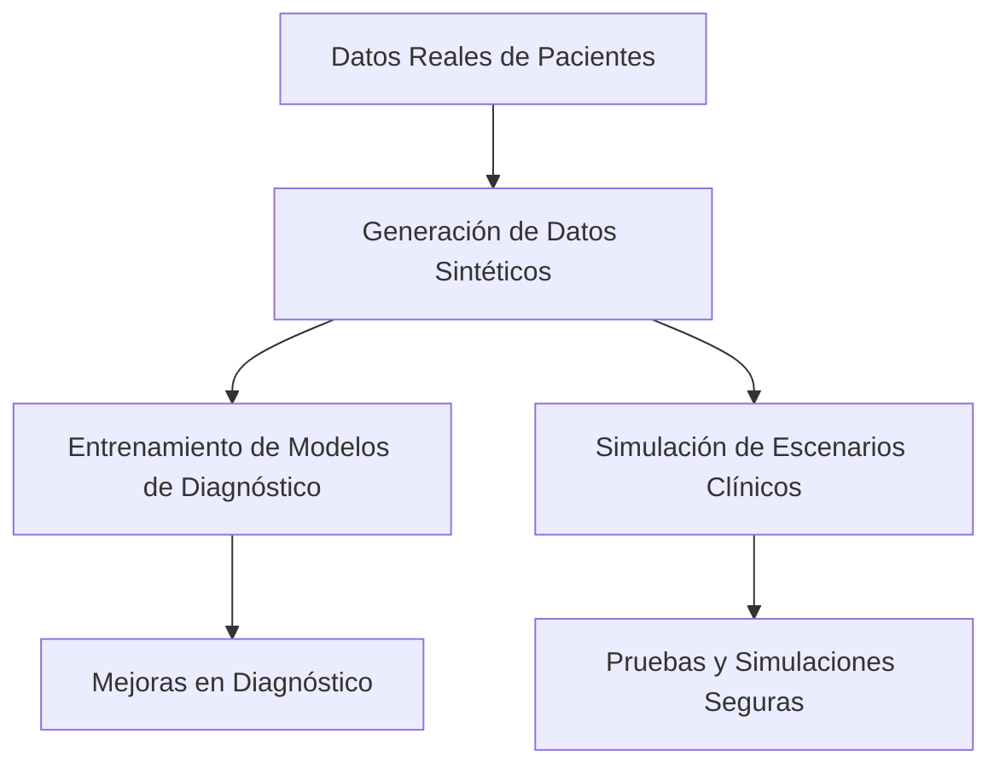

## 6.2 Caso de Estudio 2: Mejorando la Privacidad en Modelos Financieros

### Descripción

El segundo caso de estudio se enfoca en el sector financiero, donde la privacidad y la seguridad de los datos son esenciales. Las instituciones financieras, como bancos y aseguradoras, manejan una gran cantidad de datos sensibles sobre transacciones, clientes y cuentas. Compartir estos datos para desarrollar modelos de predicción y análisis puede ser riesgoso.

### Aplicación de Datos Sintéticos

Para proteger la privacidad, las instituciones financieras pueden generar datos sintéticos que imiten las transacciones reales. Estos datos pueden ser usados para:

- **Desarrollo de Modelos de Riesgo**: Los modelos que predicen el riesgo de crédito o fraude pueden ser entrenados utilizando datos sintéticos, asegurando que los datos reales de los clientes no se expongan.
- **Análisis de Tendencias Financieras**: Los analistas pueden usar datos sintéticos para identificar patrones y tendencias en el mercado sin comprometer la privacidad de los datos originales.

### Resultados y Beneficios

- **Reducción del Riesgo**: Al usar datos sintéticos, las empresas reducen el riesgo de violaciones de datos o mal uso de la información sensible.
- **Innovación en el Sector Financiero**: Los datos sintéticos permiten a las empresas experimentar con nuevos modelos y enfoques sin necesidad de preocuparse por la privacidad de los datos reales.

### Diagrama: Uso de Datos Sintéticos en Modelos Financieros

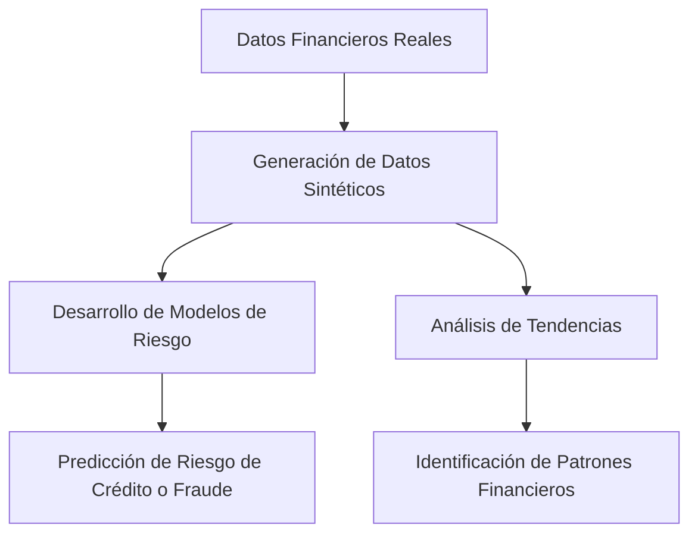

## 6.3 Caso de Estudio 3: Datos Sintéticos en Procesamiento de Lenguaje Natural (NLP)

### Descripción

El tercer caso de estudio se centra en el uso de datos sintéticos en el procesamiento de lenguaje natural (NLP), una rama de la inteligencia artificial que se ocupa de la interacción entre las computadoras y el lenguaje humano. Para que los modelos de NLP funcionen bien, necesitan ser entrenados con grandes volúmenes de datos de texto. Sin embargo, recolectar datos de calidad y variados puede ser un desafío.

### Aplicación de Datos Sintéticos

Los datos sintéticos pueden ser generados para crear conjuntos de datos de texto que imiten conversaciones, documentos, o cualquier otra forma de lenguaje escrito o hablado. Esto puede ayudar en:

- **Entrenamiento de Chatbots**: Los chatbots necesitan ser entrenados con una amplia variedad de preguntas y respuestas. Los datos sintéticos pueden generar innumerables ejemplos de interacciones para mejorar la capacidad del chatbot de entender y responder de manera efectiva.
- **Desarrollo de Traductores Automáticos**: Los modelos de traducción automática pueden beneficiarse de datos sintéticos que incluyen frases y oraciones en múltiples idiomas, ayudando a mejorar la precisión de las traducciones.

### Resultados y Beneficios

- **Mejora en la Comprensión del Lenguaje**: Al utilizar datos sintéticos, los modelos NLP pueden ser entrenados para entender mejor el contexto y las sutilezas del lenguaje humano.
- **Acceso a Datos Multilingües**: Los datos sintéticos permiten crear conjuntos de datos en múltiples idiomas sin la necesidad de recopilar manualmente grandes volúmenes de texto.

### Diagrama: Uso de Datos Sintéticos en NLP

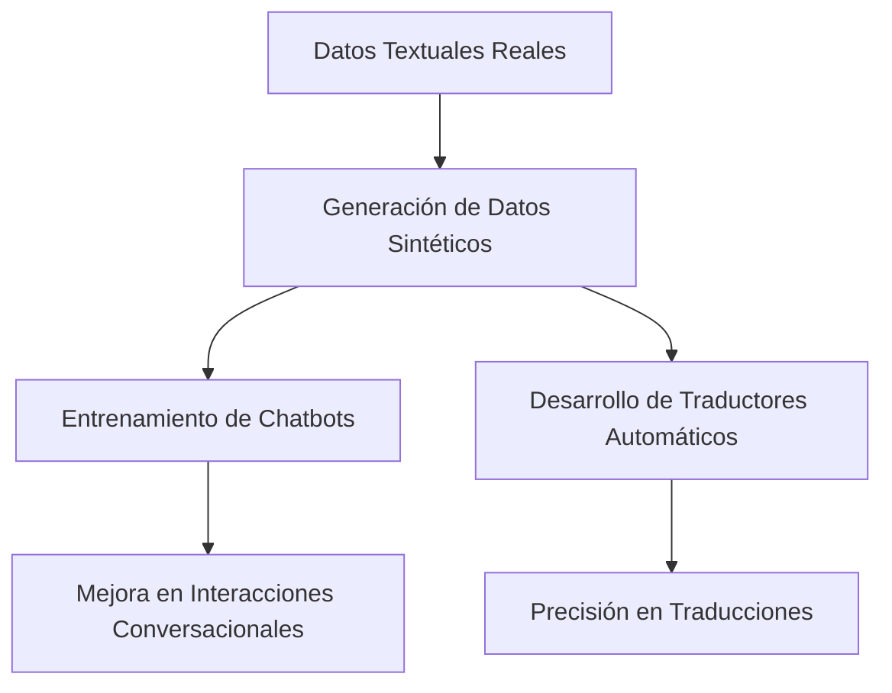

## Resumen de la Sección

En esta sección, hemos explorado cómo los datos sintéticos se aplican en diferentes industrias a través de tres casos de estudio:

1. **Diagnósticos Médicos**: Los datos sintéticos permiten entrenar modelos de diagnóstico sin comprometer la privacidad de los pacientes.
2. **Modelos Financieros**: Se utilizan para desarrollar modelos de riesgo y analizar tendencias, manteniendo la seguridad de los datos financieros.
3. **Procesamiento de Lenguaje Natural (NLP)**: Ayudan a entrenar chatbots y traductores automáticos, mejorando su rendimiento sin la necesidad de grandes volúmenes de datos reales.

Estos ejemplos muestran cómo los datos sintéticos no solo preservan la privacidad y seguridad, sino que también permiten innovar y mejorar los modelos en diferentes sectores. Con esta comprensión, ahora estás mejor equipado para aplicar datos sintéticos en tus propios proyectos, utilizando las mejores prácticas para maximizar su impacto y efectividad.

¡Adelante, a seguir aprendiendo y explorando nuevas aplicaciones!

# 7. Herramientas y Frameworks para Implementación

En esta sección, exploraremos las herramientas y frameworks más utilizados para la implementación de datos sintéticos en proyectos de inteligencia artificial, especialmente en modelos de lenguaje a gran escala (LLMs). Aprenderemos sobre los entornos de desarrollo más comunes, cómo integrar estas herramientas con infraestructuras de datos existentes y la automatización mediante MLOps (Machine Learning Operations).

## 7.1 Entornos de Desarrollo

### Introducción a los Entornos de Desarrollo

Un entorno de desarrollo es un espacio donde puedes escribir, probar y ejecutar código. Cuando trabajas con datos sintéticos y modelos de inteligencia artificial, elegir el entorno adecuado es crucial para facilitar el trabajo y mejorar la eficiencia.

### Herramientas Populares

1. **Jupyter Notebooks**:
   - **Descripción**: Jupyter Notebooks es una de las herramientas más populares para desarrollar proyectos de datos y aprendizaje automático. Te permite escribir código, ejecutar análisis de datos y visualizar resultados en un formato interactivo.
   - **Ventajas**: Es fácil de usar, especialmente para prototipos rápidos y exploración de datos. Además, puedes integrar gráficos y texto explicativo junto con tu código.
   - **Uso en Datos Sintéticos**: Puedes generar datos sintéticos, entrenar modelos y visualizar resultados, todo en un mismo lugar.

2. **Google Colab**:
   - **Descripción**: Google Colab es una plataforma gratuita basada en la nube que te permite ejecutar Jupyter Notebooks sin necesidad de configurar nada en tu computadora.
   - **Ventajas**: Ofrece acceso a GPUs (unidades de procesamiento gráfico) para entrenar modelos más rápido. Es ideal para aquellos que no tienen acceso a hardware potente.
   - **Uso en Datos Sintéticos**: Puedes trabajar con grandes volúmenes de datos sintéticos y entrenar modelos en un entorno que ya está configurado con muchas de las bibliotecas necesarias.

3. **VS Code (Visual Studio Code)**:
   - **Descripción**: VS Code es un editor de código fuente muy popular que soporta una amplia gama de lenguajes de programación y tiene muchas extensiones para desarrollo de IA.
   - **Ventajas**: Es altamente personalizable y tiene una fuerte integración con sistemas de control de versiones como Git.
   - **Uso en Datos Sintéticos**: Puedes gestionar grandes proyectos, escribir código complejo y utilizar las extensiones de Python para generar y analizar datos sintéticos.

### Diagrama: Entornos de Desarrollo para Datos Sintéticos

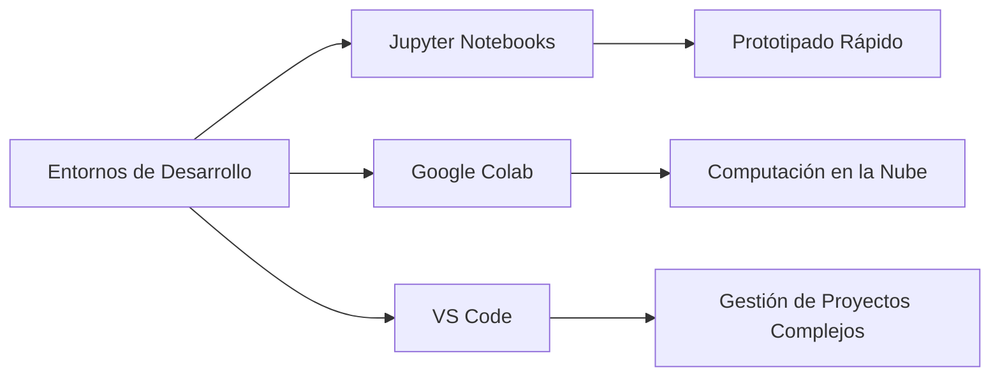

## 7.2 Integración con Infraestructuras de Datos

### Importancia de la Integración

Cuando trabajas con datos sintéticos y modelos LLM, es fundamental que los datos fluyan sin problemas entre las diferentes herramientas y sistemas que utilizas. La integración de estas herramientas con infraestructuras de datos existentes asegura que los procesos sean eficientes y escalables.

### Métodos Comunes de Integración

1. **Bases de Datos Relacionales**:
   - **Descripción**: Las bases de datos relacionales (como MySQL, PostgreSQL) son sistemas donde los datos se almacenan en tablas con relaciones bien definidas.
   - **Integración**: Puedes almacenar datos sintéticos en bases de datos relacionales y luego acceder a ellos desde tus herramientas de desarrollo.
   - **Ejemplo de Uso**: Almacenar grandes volúmenes de datos sintéticos generados para su posterior análisis o entrenamiento de modelos.

2. **Data Lakes**:
   - **Descripción**: Un Data Lake es un sistema de almacenamiento que permite almacenar datos en su formato original, ya sean estructurados o no estructurados.
   - **Integración**: Es ideal para proyectos de big data donde necesitas almacenar y procesar grandes volúmenes de datos sintéticos.
   - **Ejemplo de Uso**: Usar un Data Lake para almacenar tanto los datos sintéticos como los reales, y luego utilizar herramientas de big data para analizarlos conjuntamente.

3. **APIs (Interfaces de Programación de Aplicaciones)**:
   - **Descripción**: Las APIs permiten que diferentes aplicaciones se comuniquen entre sí y compartan datos de manera eficiente.
   - **Integración**: Puedes utilizar APIs para enviar y recibir datos sintéticos entre diferentes sistemas, como bases de datos, herramientas de análisis y aplicaciones de IA.
   - **Ejemplo de Uso**: Crear una API que genere datos sintéticos en tiempo real para alimentar un modelo LLM.

### Diagrama: Integración con Infraestructuras de Datos

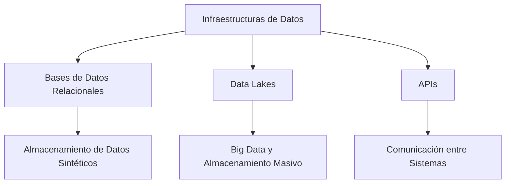

## 7.3 Automatización y MLOps

### ¿Qué es MLOps?

**MLOps** (Machine Learning Operations) es la práctica de automatizar y gestionar el ciclo de vida de los modelos de aprendizaje automático, desde el desarrollo hasta la producción. Al implementar MLOps, puedes asegurar que los modelos de IA se entrenen, desplieguen y mantengan de manera eficiente.

### Beneficios de MLOps

- **Automatización**: MLOps permite automatizar tareas repetitivas, como el entrenamiento de modelos y la generación de datos sintéticos, lo que ahorra tiempo y reduce errores.
- **Escalabilidad**: Puedes escalar tus modelos y datos sintéticos para manejar volúmenes de datos más grandes o para desplegar modelos en múltiples entornos.
- **Monitoreo Continuo**: MLOps facilita el monitoreo continuo del rendimiento del modelo, permitiendo detectar y corregir problemas de manera rápida.

### Herramientas de MLOps

1. **Kubeflow**:
   - **Descripción**: Kubeflow es una plataforma de MLOps que se ejecuta sobre Kubernetes, permitiendo orquestar y gestionar el ciclo de vida de los modelos de machine learning.
   - **Ventajas**: Facilita la gestión de experimentos, entrenamiento y despliegue de modelos en la nube.
   - **Uso en Datos Sintéticos**: Puedes automatizar la generación y el uso de datos sintéticos en tus flujos de trabajo de machine learning.

2. **MLflow**:
   - **Descripción**: MLflow es una plataforma de código abierto para gestionar el ciclo de vida completo de los modelos de machine learning.
   - **Ventajas**: Ofrece seguimiento de experimentos, gestión de modelos y despliegue.
   - **Uso en Datos Sintéticos**: MLflow puede ser utilizado para gestionar experimentos donde se usan datos sintéticos, asegurando que todos los pasos del proceso estén documentados.

3. **TensorFlow Extended (TFX)**:
   - **Descripción**: TFX es una plataforma de producción para el machine learning en TensorFlow. Ofrece herramientas para la preparación de datos, entrenamiento, evaluación y despliegue de modelos.
   - **Ventajas**: Está completamente integrada con TensorFlow, lo que facilita la creación de flujos de trabajo complejos.
   - **Uso en Datos Sintéticos**: Puedes integrar la generación de datos sintéticos como parte del flujo de trabajo de TFX, automatizando todo el proceso.

### Diagrama: Componentes de MLOps

```mermaid
graph TD;
    A[MLOps] --> B[Automatización]
    A --> C[Escalabilidad]
    A --> D[Monitoreo Continuo]
    B --> E[Kubeflow]
    C --> F[MLflow]
    D --> G[TensorFlow Extended &#40;TFX&#41;]
```

## Resumen de la Sección

En esta sección, hemos explorado las herramientas y frameworks más importantes para la implementación de datos sintéticos en proyectos de inteligencia artificial:

1. **Entornos de Desarrollo**: Herramientas como Jupyter Notebooks, Google Colab y VS Code son esenciales para escribir y probar código de manera eficiente.
2. **Integración con Infraestructuras de Datos**: Es importante asegurarse de que los datos sintéticos fluyan de manera efectiva entre diferentes sistemas utilizando bases de datos relacionales, data lakes y APIs.
3. **Automatización y MLOps**: MLOps es clave para automatizar, escalar y monitorear el ciclo de vida de los modelos, utilizando herramientas como Kubeflow, MLflow y TensorFlow Extended.

Con este conocimiento, puedes implementar datos sintéticos en tus proyectos de manera más eficiente, asegurando que los modelos se desarrollen, desplieguen y mantengan con las mejores prácticas de la industria.

¡Ahora estás listo para aplicar estas herramientas en tus proyectos de inteligencia artificial!

# 8. Prácticas de Seguridad en la Gestión de Datos Sintéticos

El manejo de datos sintéticos, aunque más seguro que el manejo de datos reales, sigue requiriendo una atención cuidadosa a la seguridad. En esta sección, exploraremos cómo asegurar los datos sintéticos en cada etapa de su ciclo de vida, desde el almacenamiento y procesamiento hasta la mitigación de riesgos y la auditoría continua. Estas prácticas de seguridad son fundamentales para proteger tanto los datos como la infraestructura que los maneja.

## 8.1 Seguridad en el Almacenamiento y Procesamiento

### Almacenamiento Seguro

Incluso los datos sintéticos necesitan ser almacenados de manera segura para prevenir accesos no autorizados y evitar que se utilicen con fines malintencionados. Aquí te presentamos algunas prácticas clave:

- **Cifrado de Datos**: Asegúrate de que todos los datos sintéticos estén cifrados tanto en reposo (cuando están almacenados) como en tránsito (cuando se están transfiriendo). El cifrado es como ponerle una cerradura a tus datos, de modo que solo las personas con la "llave" correcta puedan acceder a ellos.

- **Control de Acceso**: Implementa controles de acceso estrictos para asegurar que solo las personas autorizadas puedan acceder a los datos sintéticos. Esto incluye configurar permisos adecuados y utilizar la autenticación multifactor (MFA) para agregar una capa adicional de seguridad.

- **Copias de Seguridad Seguras**: Realiza copias de seguridad de los datos sintéticos regularmente, y asegúrate de que estas copias también estén cifradas y almacenadas en un lugar seguro. Las copias de seguridad son cruciales en caso de pérdida de datos o ataques cibernéticos.

### Procesamiento Seguro

El procesamiento de datos sintéticos debe realizarse de manera que minimice los riesgos de seguridad. Aquí te mostramos cómo:

- **Entornos Aislados**: Siempre que sea posible, realiza el procesamiento de datos sintéticos en entornos aislados o en contenedores (como Docker). Esto evita que los datos se mezclen con otros procesos y reduce el riesgo de filtraciones.

- **Monitorización de Actividades**: Implementa herramientas de monitorización para rastrear quién accede a los datos y cómo se utilizan. Si se detecta alguna actividad inusual, se puede responder rápidamente para prevenir daños.

### Diagrama: Seguridad en el Almacenamiento y Procesamiento de Datos Sintéticos

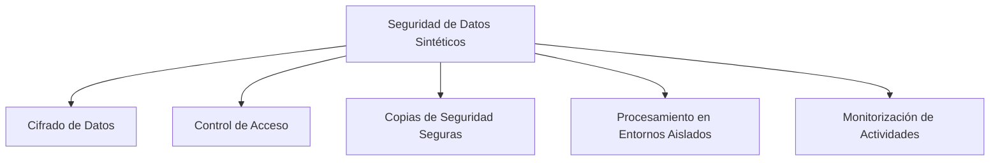

## 8.2 Mitigación de Riesgos

### Identificación y Evaluación de Riesgos

Mitigar riesgos implica identificar posibles amenazas antes de que ocurran y establecer medidas para reducir su impacto. Aquí te explicamos cómo:

- **Evaluación de Riesgos**: Realiza una evaluación periódica de riesgos para identificar posibles vulnerabilidades en la gestión de datos sintéticos. Esto incluye revisar los procedimientos de almacenamiento, procesamiento y acceso.

- **Modelado de Amenazas**: Crea un modelo de amenazas que considere todos los posibles vectores de ataque, como accesos no autorizados, filtraciones de datos, y ataques internos. Este modelo te ayudará a anticipar problemas y prepararte mejor.

### Estrategias de Mitigación

Una vez identificados los riesgos, puedes aplicar estrategias de mitigación como:

- **Reducción de Acceso**: Limita el acceso a los datos sintéticos solo a aquellos que realmente lo necesitan para su trabajo. Menos personas con acceso significa menos oportunidades de riesgo.

- **Pruebas de Penetración**: Realiza pruebas de penetración regulares (penetration testing) para identificar y corregir posibles vulnerabilidades en tus sistemas.

- **Actualizaciones y Parcheo**: Asegúrate de que todos los sistemas y herramientas utilizadas para manejar datos sintéticos estén actualizados con los últimos parches de seguridad. Esto reduce la probabilidad de que un atacante explote vulnerabilidades conocidas.

### Diagrama: Mitigación de Riesgos

```mermaid
graph LR;
    A[Mitigación de Riesgos] --> B[Evaluación de Riesgos]
    A --> C[Modelado de Amenazas]
    A --> D[Estrategias de Mitigación]
    D --> E[Reducción de Acceso]
    D --> F[Pruebas de Penetración]
    D --> G[Actualizaciones y Parcheo]
```

## 8.3 Auditoría y Monitoreo

### Importancia de la Auditoría

La auditoría continua es esencial para asegurar que las prácticas de seguridad sean efectivas y que se cumplan con las políticas establecidas. Esto es lo que debes tener en cuenta:

- **Auditorías Regulares**: Programa auditorías regulares para revisar los procedimientos de seguridad, identificar posibles brechas y asegurarte de que los datos sintéticos estén protegidos adecuadamente.

- **Revisión de Accesos**: Durante las auditorías, revisa quién ha accedido a los datos sintéticos, cuándo y con qué propósito. Esto ayuda a identificar cualquier acceso no autorizado o mal uso de los datos.

### Herramientas de Monitoreo

El monitoreo continuo te permite detectar y responder a problemas de seguridad en tiempo real. Algunas herramientas útiles incluyen:

- **SIEM (Security Information and Event Management)**: Las herramientas SIEM recopilan y analizan datos de eventos de seguridad en tiempo real, ayudándote a detectar y responder rápidamente a incidentes.

- **DLP (Data Loss Prevention)**: Las soluciones DLP monitorean el uso de los datos y previenen que se transmitan o se compartan de manera insegura.

### Diagrama: Auditoría y Monitoreo

```mermaid
graph TD;
    A[Auditoría y Monitoreo] --> B[Auditorías Regulares]
    A --> C[Revisión de Accesos]
    A --> D[SIEM]
    A --> E[DLP]
```

## Resumen de la Sección

En esta sección, hemos cubierto las prácticas esenciales de seguridad para la gestión de datos sintéticos. Asegurar el almacenamiento y procesamiento de estos datos, mitigar los riesgos potenciales, y realizar auditorías y monitoreo continuos son pasos clave para proteger tanto los datos como la infraestructura que los maneja.

Estas prácticas te ayudarán a minimizar los riesgos y asegurar que los datos sintéticos se utilicen de manera segura y responsable. Al implementar estas estrategias, puedes estar seguro de que estás tomando todas las precauciones necesarias para proteger los datos y mantener la confianza en tus proyectos de inteligencia artificial.

¡Sigamos avanzando hacia una gestión segura y eficaz de los datos sintéticos!

# 9. Proyecto Final

El proyecto final es una oportunidad para aplicar todo lo que has aprendido a lo largo del curso sobre generación de datos sintéticos y su aplicación en modelos de lenguaje a gran escala (LLMs). Este proyecto te permitirá experimentar con la creación, uso y evaluación de datos sintéticos en un contexto práctico, desarrollando habilidades que serán valiosas en proyectos reales.

## 9.1 Descripción del Proyecto

### Objetivo del Proyecto

El objetivo del proyecto final es generar un conjunto de datos sintéticos y usarlo para entrenar un modelo de lenguaje (LLM) en una tarea específica, como la clasificación de texto, la generación de respuestas automáticas, o cualquier otra aplicación que elijas. Luego, deberás evaluar el rendimiento del modelo y reflexionar sobre las ventajas y limitaciones de usar datos sintéticos en lugar de datos reales.

### Pasos del Proyecto

A continuación, se describen los pasos generales que deberás seguir para completar el proyecto:

1. **Elección del Caso de Uso**:
   - Escoge un caso de uso para tu proyecto. Puede ser algo como entrenamiento de un chatbot, clasificación de correos electrónicos, o análisis de sentimiento en reseñas de productos.
   
2. **Generación de Datos Sintéticos**:
   - Utiliza las herramientas y técnicas aprendidas en el curso para crear un conjunto de datos sintéticos que imite los datos reales relacionados con tu caso de uso.
   
3. **Entrenamiento del Modelo LLM**:
   - Entrena un modelo LLM usando los datos sintéticos que generaste. Puedes utilizar plataformas como TensorFlow, PyTorch, o cualquier otra herramienta con la que te sientas cómodo.
   
4. **Evaluación del Modelo**:
   - Evalúa el rendimiento del modelo en términos de precisión, exactitud, recuperación y otras métricas relevantes. Si es posible, compara el rendimiento con un modelo entrenado en datos reales, si tienes acceso a ellos.
   
5. **Reflexión y Documentación**:
   - Reflexiona sobre el proceso, identificando las ventajas y desventajas de usar datos sintéticos. Documenta tus hallazgos y prepara un informe final que incluya tus observaciones y conclusiones.

### Diagrama: Pasos del Proyecto Final

```mermaid
graph TD;
    A[Proyecto Final] --> B[Elección del Caso de Uso]
    A --> C[Generación de Datos Sintéticos]
    A --> D[Entrenamiento del Modelo LLM]
    A --> E[Evaluación del Modelo]
    A --> F[Reflexión y Documentación]
```

## 9.2 Requerimientos Técnicos

### Herramientas Necesarias

Para completar el proyecto, necesitarás las siguientes herramientas:

- **Lenguaje de Programación**: Python es altamente recomendado debido a su amplio soporte para bibliotecas de IA y manejo de datos.
- **Bibliotecas de IA**: Utiliza TensorFlow, PyTorch, o cualquier otra biblioteca con la que estés familiarizado para entrenar el modelo.
- **Herramientas de Generación de Datos Sintéticos**: Herramientas como SDV (Synthetic Data Vault), CTGAN, o Faker serán útiles para generar los datos necesarios.
- **Entorno de Desarrollo**: Puedes usar Jupyter Notebooks, Google Colab, o VS Code según tu preferencia.

### Requisitos del Informe

El informe final debe incluir:

1. **Descripción del Caso de Uso**: Explica brevemente el caso de uso seleccionado y su relevancia.
2. **Proceso de Generación de Datos**: Describe cómo generaste los datos sintéticos, incluyendo cualquier técnica o herramienta utilizada.
3. **Detalles del Entrenamiento del Modelo**: Explica cómo entrenaste el modelo, incluyendo la arquitectura del modelo y los hiperparámetros clave.
4. **Resultados de la Evaluación**: Presenta las métricas de evaluación y analiza el rendimiento del modelo.
5. **Reflexión Final**: Discute las ventajas y limitaciones de los datos sintéticos en tu proyecto, y cómo podrías mejorar el enfoque en futuros trabajos.

## 9.3 Evaluación y Presentación

### Criterios de Evaluación

Tu proyecto será evaluado en función de los siguientes criterios:

- **Complejidad del Caso de Uso**: Se valorará la relevancia y el desafío que presenta el caso de uso elegido.
- **Calidad de los Datos Sintéticos**: Se evaluará la adecuación de los datos sintéticos generados y cómo estos se ajustan a la tarea elegida.
- **Entrenamiento y Rendimiento del Modelo**: Se revisará cómo fue entrenado el modelo y qué tan bien se desempeña en la tarea específica.
- **Reflexión Crítica**: Se considerará la profundidad y claridad de la reflexión sobre el uso de datos sintéticos, incluyendo cualquier identificación de limitaciones o posibles mejoras.
- **Claridad del Informe**: El informe debe ser claro, coherente y bien organizado, con explicaciones detalladas y bien fundamentadas.

### Presentación del Proyecto

- **Formato de Entrega**: Debes entregar el proyecto en un formato digital, preferiblemente como un archivo Jupyter Notebook (.ipynb) o un informe en PDF.
- **Plazo de Entrega**: Asegúrate de entregar el proyecto dentro del plazo establecido para su evaluación.

### Diagrama: Criterios de Evaluación del Proyecto

```mermaid
graph TD;
    A[Criterios de Evaluación] --> B[Complejidad del Caso de Uso]
    A --> C[Calidad de los Datos Sintéticos]
    A --> D[Entrenamiento y Rendimiento del Modelo]
    A --> E[Reflexión Crítica]
    A --> F[Claridad del Informe]
```

## Resumen de la Sección

El proyecto final es una excelente oportunidad para consolidar tu aprendizaje sobre datos sintéticos y modelos LLM. Siguiendo los pasos descritos, generarás un conjunto de datos sintéticos, entrenarás un modelo y reflexionarás sobre los resultados. Este proyecto no solo te permitirá aplicar tus conocimientos, sino también explorar las ventajas y desafíos del uso de datos sintéticos en un entorno controlado.

¡Es hora de poner en práctica todo lo que has aprendido y llevar tu proyecto al siguiente nivel!

# 10. Recursos Adicionales y Lecturas Recomendadas

En esta última sección, te proporcionaremos una lista de recursos adicionales y lecturas recomendadas para que puedas profundizar en los temas de generación de datos sintéticos, modelos de lenguaje a gran escala (LLMs), y prácticas de seguridad en la inteligencia artificial. Estos recursos incluyen libros, artículos académicos, y herramientas en línea que te ayudarán a seguir aprendiendo y mejorando tus habilidades.

## 10.1 Libros Recomendados

### 1. **"Generative Deep Learning: Teaching Machines to Paint, Write, Compose, and Play"** por David Foster

Este libro es una excelente introducción a las técnicas de aprendizaje profundo generativo, incluyendo Generative Adversarial Networks (GANs) y otras metodologías utilizadas para crear datos sintéticos. Es ideal para aquellos que desean aprender cómo estas técnicas pueden aplicarse para generar texto, imágenes y otros tipos de datos.

- **Enlace para Comprar**: [Generative Deep Learning en Amazon](https://www.amazon.com/Generative-Deep-Learning-Teaching-Machines/dp/1492041947)

### 2. **"Hands-On Machine Learning with Scikit-Learn, Keras, and TensorFlow"** por Aurélien Géron

Este libro es una referencia esencial para aprender a implementar modelos de machine learning utilizando herramientas populares como Scikit-Learn, Keras y TensorFlow. Aunque no se centra exclusivamente en datos sintéticos, ofrece una base sólida en el aprendizaje automático que es crucial para trabajar con LLMs.

- **Enlace para Comprar**: [Hands-On Machine Learning en Amazon](https://www.amazon.com/Hands-Machine-Learning-Scikit-Learn-TensorFlow/dp/1492032646)

### 3. **"Artificial Intelligence: A Guide for Thinking Humans"** por Melanie Mitchell

Este libro ofrece una visión accesible pero profunda de la inteligencia artificial en general, incluyendo los desafíos y oportunidades que presenta. Es ideal para obtener una comprensión más amplia del contexto en el que se desarrollan y utilizan los datos sintéticos y los modelos LLM.

- **Enlace para Comprar**: [Artificial Intelligence en Amazon](https://www.amazon.com/Artificial-Intelligence-Guide-Thinking-Humans/dp/0374257833)

## 10.2 Artículos y Publicaciones Académicas

### 1. **"The Case for Synthetic Data"** por Andrew Ng y otros

Este artículo analiza las ventajas y desafíos del uso de datos sintéticos en la inteligencia artificial, con un enfoque en cómo pueden complementar los datos reales en el entrenamiento de modelos de machine learning.

- **Enlace para Leer**: [The Case for Synthetic Data](https://www.deeplearning.ai/the-batch/the-case-for-synthetic-data/)

### 2. **"Synthetic Data for Deep Learning"** por Fábio Pérez y otros

Este artículo académico ofrece una visión técnica sobre cómo se pueden utilizar datos sintéticos para entrenar modelos de deep learning, con ejemplos y casos de estudio.

- **Enlace para Leer**: [Synthetic Data for Deep Learning](https://arxiv.org/abs/1812.04784)

### 3. **"Privacy-Preserving Machine Learning by Generative Adversarial Networks"** por Lin et al.

Este artículo explora cómo se pueden utilizar las GANs para crear datos sintéticos que preserven la privacidad, un tema crucial para aquellos que trabajan con datos sensibles.

- **Enlace para Leer**: [Privacy-Preserving Machine Learning by GANs](https://arxiv.org/abs/1802.08908)

## 10.3 Herramientas y Recursos en Línea

### 1. **Kaggle**

Kaggle es una plataforma de ciencia de datos que ofrece datasets, competencias y notebooks en línea para experimentar con modelos de machine learning. Puedes encontrar datasets sintéticos y competir en desafíos que utilizan estos datos.

- **Enlace a Kaggle**: [Kaggle](https://www.kaggle.com/)

### 2. **TensorFlow Documentation**

La documentación de TensorFlow es un recurso esencial para aprender cómo implementar modelos de aprendizaje profundo, incluyendo la generación de datos sintéticos utilizando TensorFlow Extended (TFX).

- **Enlace a la Documentación**: [TensorFlow Documentation](https://www.tensorflow.org/)

### 3. **Synthetic Data Vault (SDV)**

SDV es una biblioteca de Python que permite generar datos sintéticos a partir de datasets reales. Es una herramienta poderosa para aquellos que desean implementar lo aprendido en este curso.

- **Enlace a SDV**: [Synthetic Data Vault](https://sdv.dev/)

### 4. **Google Colab**

Google Colab es una plataforma gratuita en la nube que permite ejecutar código Python en un entorno Jupyter Notebook, con acceso a GPUs para acelerar el entrenamiento de modelos. Es ideal para practicar la generación de datos sintéticos y el entrenamiento de LLMs.

- **Enlace a Google Colab**: [Google Colab](https://colab.research.google.com/)

## Resumen de la Sección

En esta sección, hemos recopilado una serie de recursos adicionales que te permitirán profundizar en los temas tratados a lo largo del curso. Los libros, artículos académicos y herramientas en línea que te hemos proporcionado son excelentes puntos de partida para continuar tu aprendizaje y aplicar los conocimientos adquiridos en proyectos reales.

No dudes en explorar estos recursos y seguir expandiendo tus habilidades en inteligencia artificial, datos sintéticos y modelos de lenguaje. ¡El aprendizaje no termina aquí!
