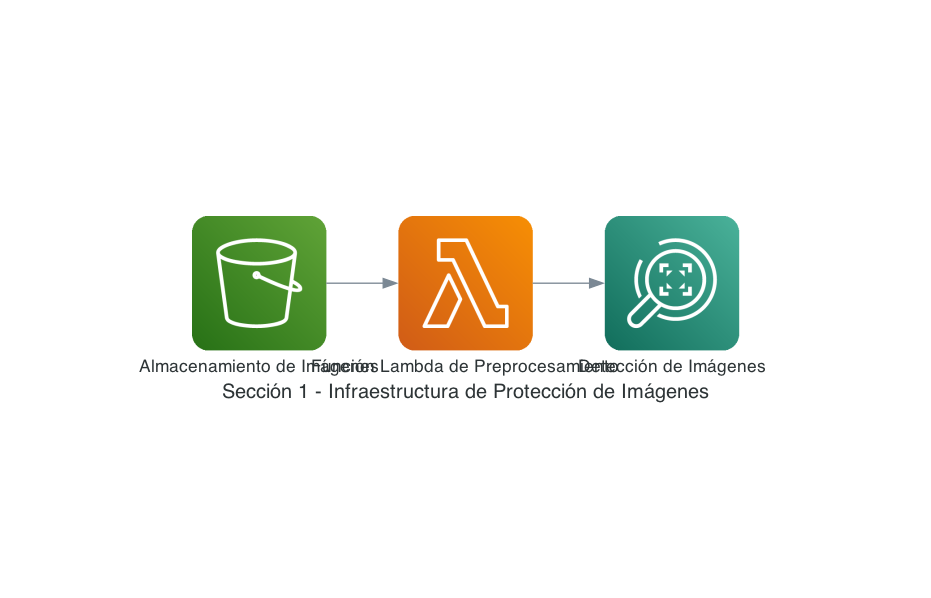
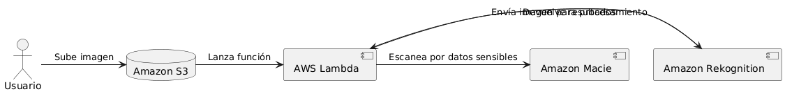
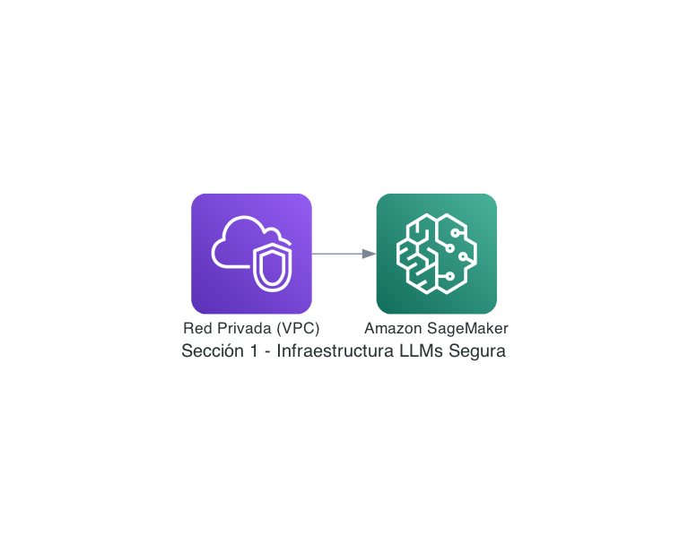
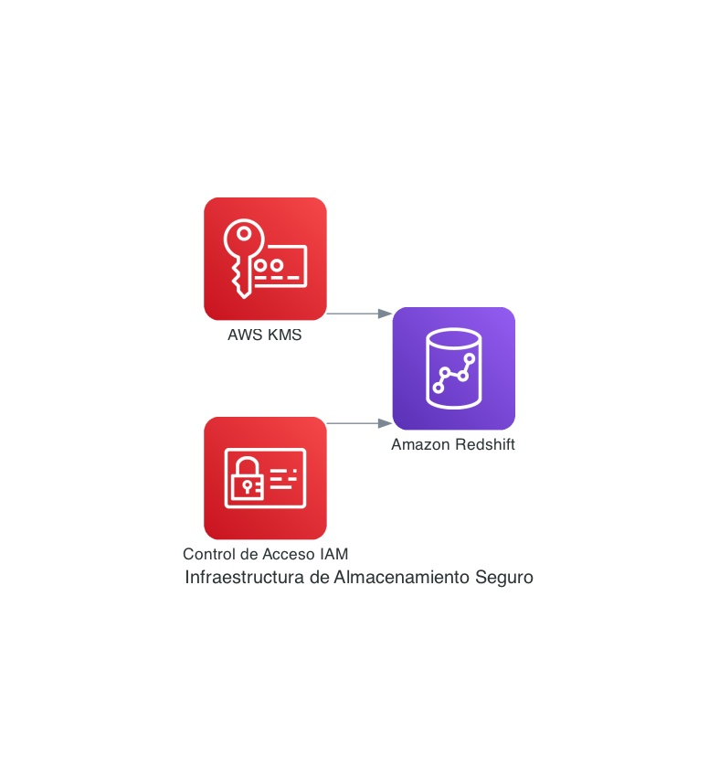
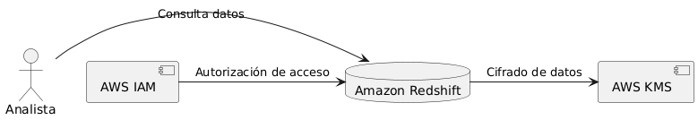

### Curso: **Salvaguarda de la Privacidad y Seguridad en Deep Learning y LLMs para Procesos de Seguros**

#### Descripción del Curso:
En este curso, aprenderás cómo salvaguardar la privacidad y seguridad de la información en proyectos tecnológicos avanzados que utilizan algoritmos de deep learning basados en imágenes y modelos de lenguaje natural para optimizar ciclos de desarrollo. Este curso aborda en profundidad las mejores prácticas para proteger tanto la información personal de usuarios como la propiedad intelectual de la empresa, en un contexto de seguros de motor. Nos centraremos en las regulaciones europeas (GDPR y directivas complementarias), junto con ejemplos de implementación práctica en AWS.

---

#### **Índice de Contenidos:**
1. **Protección de Datos en Algoritmos de Deep Learning Basados en Imágenes**
   - Descripción del caso de uso
   - Regulaciones y riesgos
   - Técnicas recomendadas
   - Ejemplo implementado en AWS

2. **Salvaguarda de la Privacidad en Modelos de Lenguaje Natural (LLMs) para Optimización de Ciclo de Desarrollo**
   - Descripción del caso de uso
   - Regulaciones y riesgos
   - Técnicas recomendadas
   - Ejemplo implementado en AWS

3. **Seguridad de Datos en un Data Warehouse para Análisis y Almacenamiento de Resultados**
   - Descripción del caso de uso
   - Regulaciones y riesgos
   - Técnicas recomendadas
   - Ejemplo implementado en AWS

---

### **Sección 1: Protección de Datos en Algoritmos de Deep Learning Basados en Imágenes**

#### a) **Descripción del Caso de Uso**
Los algoritmos de deep learning basados en imágenes se utilizan para reconocer vehículos, matrículas, y a veces, personas en el contexto del seguro de motor. La empresa extrae información de imágenes para optimizar la gestión de reclamaciones y evaluación de daños en vehículos. La información procesada incluye matrículas, números de bastidores y posibles imágenes de personas.

#### b) **Marco Regulatorio y Principales Riesgos**
**Marco Regulatorio:**
- **Reglamento General de Protección de Datos (GDPR):** Es clave para la protección de datos personales en la UE. Aplicable en este caso al procesamiento de imágenes que contienen datos de identificación de personas y vehículos.
  
**Principales Riesgos:**
- **Exposición de datos personales no anonimizada:** Imágenes que puedan incluir rostros o matrículas sin protección.
- **Violaciones de privacidad por procesamiento sin consentimiento adecuado.**
- **Fuga de información sensible e identificación indirecta de personas.**
- **Propiedad intelectual de los modelos desarrollados para análisis de imágenes.**

#### c) **Técnicas Recomendadas:**
- **Anonimización y seudonimización de imágenes:** Técnicas de desenfoque para ocultar rostros y matrículas.
- **Cifrado en tránsito y en reposo:** Usar cifrado para asegurar que los datos de imágenes están protegidos tanto durante la transferencia como en el almacenamiento.
- **Generative Adversarial Networks (GANs) para generación de datos sintéticos:** Generar imágenes que simulen los datos originales sin exponer datos reales.
- **Differential Privacy:** Aplicación de ruido a los resultados para evitar la reidentificación de personas.
- **IAM y Control de Acceso:** Definir roles estrictos para el acceso a imágenes procesadas y resultados derivados.

#### d) **Ejemplo Implementado en AWS**
Se puede utilizar un servicio como **Amazon Rekognition** para el procesamiento inicial de las imágenes, aplicando un flujo de trabajo basado en **Amazon S3** (almacenamiento seguro de imágenes), **AWS Lambda** (procesamiento serverless de imágenes), y **Amazon Macie** para identificar y proteger datos personales.

**Diagrama de Infraestructura:**

**Diagrama del Flujo de Información:**

---

### **Sección 2: Salvaguarda de la Privacidad en Modelos de Lenguaje Natural (LLMs) para Optimización del Ciclo de Desarrollo**

#### a) **Descripción del Caso de Uso**
Los modelos de lenguaje natural (LLMs) se utilizan en la optimización del ciclo de desarrollo en la empresa, lo que incluye la generación automatizada de código, análisis de documentación técnica, y predicción de problemas de desarrollo de software.

#### b) **Marco Regulatorio y Principales Riesgos**
**Marco Regulatorio:**
- **GDPR:** Si los modelos se entrenan o afinan con datos de usuarios, estos datos deben estar anonimizados o sujetos a su regulación.

**Principales Riesgos:**
- **Fugas de datos confidenciales a través de respuestas generadas por LLMs.**
- **Bias en los modelos entrenados con datos no controlados, lo que puede generar discriminación.**
- **Exposición no intencionada de propiedad intelectual a través de las predicciones del modelo.**

#### c) **Técnicas Recomendadas:**
- **Filtrado y anonimización de datos de entrenamiento:** Garantizar que los datos utilizados para entrenar modelos estén anonimizados.
- **Differential Privacy para entrenar LLMs:** Minimizar la posibilidad de que los datos de entrenamiento originales puedan ser extraídos del modelo.
- **Técnicas de Enmascaramiento de Entidades:** Asegurar que las entidades sensibles (nombres, números de matrícula) estén enmascaradas antes de ser procesadas.
- **Modelos locales o de confianza:** Evitar usar servicios de LLMs que requieran transferir datos fuera de la infraestructura propia.

#### d) **Ejemplo Implementado en AWS**
AWS proporciona servicios como **Amazon SageMaker** para el entrenamiento de LLMs, junto con la opción de habilitar **Amazon VPC** para asegurar que el procesamiento y acceso a datos sea completamente privado dentro de la infraestructura de la empresa.

**Diagrama de Infraestructura:**

**Diagrama del Flujo de Información:**

---

### **Sección 3: Seguridad de Datos en un Data Warehouse para Análisis y Almacenamiento de Resultados**

#### a) **Descripción del Caso de Uso**
El data warehouse almacena tanto los resultados de los algoritmos como la información sobre los procesos de seguros, que incluye datos personales, reclamaciones de clientes, y análisis de los modelos.

#### b) **Marco Regulatorio y Principales Riesgos**
**Marco Regulatorio:**
- **GDPR:** Almacenar datos de usuarios y análisis derivados implica cumplir con los requisitos de protección de datos personales.

**Principales Riesgos:**
- **Acceso no autorizado a datos personales o empresariales almacenados.**
- **Pérdida de integridad de los datos durante el análisis.**
- **Fuga de información sensible a través de accesos no controlados.**

#### c) **Técnicas Recomendadas:**
- **Cifrado de datos en reposo y en tránsito:** Asegurar que toda la información dentro del data warehouse está cifrada.
- **Control de Acceso Basado en Roles (RBAC):** Limitar quién puede acceder y modificar datos en función de su rol.
- **Monitoreo continuo con herramientas como Amazon GuardDuty.**
- **Tokenización:** Aplicar técnicas de tokenización para datos altamente sensibles.

#### d) **Ejemplo Implementado en AWS**
Se puede utilizar **Amazon Redshift** como data warehouse, aplicando cifrado con **AWS Key Management Service (KMS)**, junto con control de acceso a través de **AWS IAM**.

**Diagrama de Infraestructura:**

**Diagrama del Flujo de Información:**
